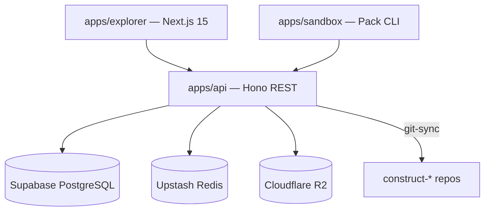

<!-- AGENT-CONTEXT
name: loa-constructs
type: monorepo
purpose: Marketplace and registry for AI agent constructs — distributes expert packs via git-sourced repos with identity, licensing, and CLAUDE.md injection
key_files: [CLAUDE.md, .claude/loa/CLAUDE.loa.md, .loa.config.yaml, apps/api/, apps/explorer/, apps/sandbox/, scripts/seed-forge-packs.ts, .claude/scripts/constructs-install.sh]
interfaces: [/auditing-security, /bridgebuilder-review, /browsing-constructs, /implementing-tasks, /reviewing-code, /planning-sprints]
dependencies: [git, jq, yq, node, pnpm, turbo]
capability_requirements:
  - filesystem: read
  - filesystem: write (scope: state)
  - filesystem: write (scope: app)
  - git: read_write
  - shell: execute
  - github_api: read_write (scope: external)
version: v2.0.0
trust_level: L2-verified
-->

# loa-constructs

<!-- provenance: DERIVED -->
Marketplace and registry for AI agent constructs (expert packs). Monorepo with Hono API, Next.js 15 explorer, and sandbox CLI. Constructs are distributed as standalone GitHub repos with identity schemas, CLAUDE.md injection, and licensing.

## Architecture
<!-- provenance: DERIVED -->
Turbo + pnpm monorepo with 3 apps and 2 packages. Constructs (formerly embedded in `apps/sandbox/packs/`) now live in standalone GitHub repos under `0xHoneyJar/construct-{slug}`. The API's git-sync service clones, validates, and snapshots construct repos into the database. The installer (`constructs-install.sh`) clones git-sourced packs at install time.



### Apps
| App | Stack | Purpose |
|-----|-------|---------|
| `apps/api` | Hono + Node.js (Railway) | REST API, git-sync, licensing |
| `apps/explorer` | Next.js 15 (Vercel) | Marketplace at constructs.network |
| `apps/sandbox` | CLI + Node.js | Pack development and publishing |

### Construct Repos (v2.0.0 — Extracted)
| Repo | Skills | URL |
|------|--------|-----|
| `construct-observer` | 6 | github.com/0xHoneyJar/construct-observer |
| `construct-crucible` | 5 | github.com/0xHoneyJar/construct-crucible |
| `construct-artisan` | 14 | github.com/0xHoneyJar/construct-artisan |
| `construct-beacon` | 6 | github.com/0xHoneyJar/construct-beacon |
| `construct-gtm-collective` | 8 | github.com/0xHoneyJar/construct-gtm-collective |
| `construct-template` | 0 | github.com/0xHoneyJar/construct-template |

Each construct repo contains: `construct.yaml`, `identity/` (persona + expertise), `skills/`, `commands/`, `CLAUDE.md`, `README.md`.

### Directory Structure
```
apps/api/          — Hono REST API (Railway)
apps/explorer/     — Next.js marketplace (Vercel)
apps/sandbox/      — Pack development CLI
packages/          — Shared packages
scripts/           — Seed, validate, extract utilities
docs/              — Architecture, guides, schemas
evals/             — Benchmarking and regression
grimoires/         — Project state and documentation
```

## Interfaces
<!-- provenance: DERIVED -->
### API Endpoints (apps/api)
- `POST /v1/packs/:slug/sync` — Trigger git-sync for a construct repo
- `GET /v1/packs/:slug/download` — Download pack (returns `source_type: "git"` + `git_url` for git-sourced packs)
- `GET /v1/packs` — List all available packs
- `GET /v1/health` — Health check

### Construct Installation
- `constructs-install.sh` — Installer with git clone support (`source_type: "git"` branch)
- `constructs-loader.sh` — Pack discovery, skill loading, license validation
- `constructs-lib.sh` — Shared utilities (registry config, API key management)

### Loa Framework Skills (30 installed)

- **/auditing-security** — Security audit gate (OWASP, secrets, auth)
- **/bridgebuilder-review** — Autonomous PR review with enriched findings
- **/browsing-constructs** — Multi-select UI for pack installation
- **/bug-triaging** — Bug triage and root cause analysis
- **/butterfreezone-gen** — Agent-grounded README generation
- **/designing-architecture** — SDD creation from PRD
- **/discovering-requirements** — PRD discovery with codebase grounding
- **/implementing-tasks** — Sprint task implementation
- **/planning-sprints** — Sprint plan generation
- **/reviewing-code** — Senior tech lead code review
- **/riding-codebase** — Codebase analysis and reality mapping
- **/run-bridge** — Autonomous excellence loop
- **/run-mode** — Autonomous sprint execution with circuit breaker
- **/simstim-workflow** — HITL accelerated development workflow
- **/flatline-reviewer** — Multi-model adversarial review (Opus + GPT)
- **/red-teaming** — Attack scenario generation
- **/managing-credentials** — Credential management
- **/rtfm-testing** — Documentation drift detection

## Module Map
<!-- provenance: DERIVED -->
| Module | Purpose | Key Files |
|--------|---------|-----------|
| `apps/api/` | Hono REST API — git-sync, licensing, pack CRUD | `src/services/git-sync.ts`, `src/routes/packs.ts` |
| `apps/explorer/` | Next.js 15 marketplace — 38 routes | `app/(marketing)/`, `lib/data/` |
| `apps/sandbox/` | Pack development CLI | `cli/`, `packs/` (source of truth) |
| `packages/` | Shared config (ESLint, TypeScript) | `eslint-config/`, `typescript-config/` |
| `scripts/` | Seed, validate, extract utilities | `seed-forge-packs.ts`, `validate-topology.sh` |
| `docs/` | Architecture, guides, schemas | `architecture/`, `guides/`, `schemas/` |
| `evals/` | Benchmarking and regression | `suites/`, `graders/`, `harness/` |
| `grimoires/` | Project state and memory | `loa/`, `artisan/`, `bridgebuilder/` |
| `tests/` | Unit and integration tests (bats + vitest) | `unit/`, `integration/` |

## Verification
<!-- provenance: CODE-FACTUAL -->
- Trust Level: **L2 — CI Verified**
- CI/CD: GitHub Actions (10 workflows) — schema validation, topology checks, skill audit
- Tests: bats (shell), vitest (TypeScript)
- Linting: ESLint + Prettier configured
- Security: SECURITY.md present, OWASP audit gate, CLAUDE.md injection hardening

## Construct Distribution Model
<!-- provenance: DERIVED -->
### v2.0.0 — Git-Sourced Constructs

Constructs are standalone GitHub repos (`0xHoneyJar/construct-{slug}`) with this structure:

```
construct.yaml          # Pack manifest (schema_version 3)
identity/
  persona.yaml          # Cognitive frame, voice, principles
  expertise.yaml        # Domains with depth 1-5
skills/                 # Skill directories with SKILL.md + index.yaml
commands/               # Slash command markdown files
CLAUDE.md               # Auto-injected into consumer projects
README.md               # Human-readable documentation
```

**Installation flow**: API returns `source_type: "git"` + `git_url` → `constructs-install.sh` shallow-clones → validates (HTTPS-only, no symlinks, no traversal) → symlinks skills/commands → injects CLAUDE.md sentinel block → writes `.constructs-meta.json`.

**Sync flow**: `POST /v1/packs/:slug/sync` → API's `git-sync.ts` clones repo → validates against ALLOWED_DIRS → snapshots to DB + R2.

### 5 Packs = 39 Skills
| Pack | Skills | Domain |
|------|--------|--------|
| Observer | 6 | User research, pattern surveying, journey validation |
| Crucible | 5 | Design decomposition, physics, material styling |
| Artisan | 14 | Taste synthesis, feedback analysis, content auditing |
| Beacon | 6 | Developer education, narrative crafting, GTM review |
| GTM-Collective | 8 | Market analysis, positioning, pricing, partnerships |

## Infrastructure
<!-- provenance: OPERATIONAL -->
| Component | Provider | Notes |
|-----------|----------|-------|
| API | Railway | Dockerfile with git, node:20-alpine |
| Database | Supabase | PostgreSQL, pooled connection (`prepare: false`) |
| Cache | Upstash | Redis |
| Storage | Cloudflare R2 | Pack snapshots |
| Frontend | Vercel | Next.js 15 |
| Auth | JWT RS256 + OAuth | API key + user tokens |

## Ecosystem
<!-- provenance: OPERATIONAL -->
### Runtime Dependencies
- `hono` — API framework
- `next` — Frontend framework
- `postgres` — Database client
- `@upstash/redis` — Cache client
- `turbo` — Monorepo orchestration
- `pnpm` — Package manager
- `tsx` — TypeScript execution

### Agents
| Agent | Identity |
|-------|----------|
| Bridgebuilder | Senior engineering mentor — warm, precise, rich with analogy |

## Quick Start
<!-- provenance: OPERATIONAL -->
```bash
pnpm install                    # Install dependencies
pnpm --filter api dev           # Start API locally
pnpm --filter explorer dev      # Start marketplace locally
pnpm --filter sandbox dev       # Start sandbox CLI

# Seed packs to local DB
npx tsx scripts/seed-forge-packs.ts

# Install a construct
.claude/scripts/constructs-install.sh artisan

# Validate topology
scripts/validate-topology.sh --strict --verbose
```
<!-- ground-truth-meta
head_sha: 30ffe624bb4205b9db117894a77aafee11d05f3f
generated_at: 2026-02-17T08:02:34Z
generator: butterfreezone-gen v1.0.0 + manual enrichment (construct extraction v2.0.0)
-->
