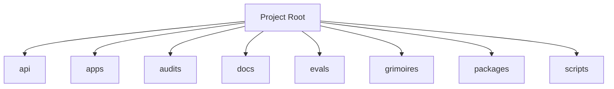

<!-- AGENT-CONTEXT
name: loa-constructs
type: framework
purpose: SaaS platform for distributing, licensing, and monetizing AI agent constructs
key_files: [CLAUDE.md, .claude/loa/CLAUDE.loa.md, .loa.config.yaml, .claude/scripts/, .claude/skills/, package.json]
interfaces: [/auditing-security, /autonomous-agent, /bridgebuilder-review, /browsing-constructs, /bug-triaging]
dependencies: [git, jq, yq, node]
capability_requirements:
  - filesystem: read
  - filesystem: write (scope: state)
  - filesystem: write (scope: app)
  - git: read_write
  - shell: execute
  - github_api: read_write (scope: external)
version: v1.6.0
trust_level: L2-verified
-->

# loa-constructs

<!-- provenance: DERIVED -->
SaaS platform for distributing, licensing, and monetizing AI agent constructs

The framework provides 30 specialized skills, built with TypeScript/JavaScript, Python, Shell.

## Architecture
<!-- provenance: DERIVED -->
The architecture follows a three-zone model: System (`.claude/`) contains framework-managed scripts and skills, State (`grimoires/`, `.beads/`) holds project-specific artifacts and memory, and App (`src/`, `lib/`) contains developer-owned application code. The framework orchestrates       30 specialized skills through slash commands.

Directory structure:
```
./api
./api/checkout
./api/subscription
./api/webhook
./apps
./apps/api
./apps/explorer
./apps/sandbox
./apps/web
./audits
./docs
./docs/architecture
./docs/archive
./docs/guides
./docs/integration
./docs/mockups
./docs/schemas
./docs/screenshots
./docs/tutorials
./evals
./evals/baselines
./evals/fixtures
./evals/graders
./evals/harness
./evals/results
./evals/suites
./evals/tasks
./evals/tests
./grimoires
./grimoires/artisan
```

## Interfaces
<!-- provenance: DERIVED -->
### Skill Commands

- **/auditing-security** — Paranoid Cypherpunk Auditor
- **/autonomous-agent** — Uautonomous agent
- **/bridgebuilder-review** — Bridgebuilder — Autonomous PR Review
- **/browsing-constructs** — Provide a multi-select UI for browsing and installing packs from the Loa Constructs Registry. Enables composable skill installation per-repo.
- **/bug-triaging** — Bug Triage Skill
- **/butterfreezone-gen** — BUTTERFREEZONE Generation Skill
- **/continuous-learning** — Continuous Learning Skill
- **/deploying-infrastructure** — Udeploying infrastructure
- **/designing-architecture** — Architecture Designer
- **/discovering-requirements** — Discovering Requirements
- **/enhancing-prompts** — Uenhancing prompts
- **/eval-running** — Ueval running
- **/finding-constructs** — Ufinding constructs
- **/flatline-knowledge** — Provides optional NotebookLM integration for the Flatline Protocol, enabling external knowledge retrieval from curated AI-powered notebooks.
- **/flatline-reviewer** — Uflatline reviewer
- **/flatline-scorer** — Uflatline scorer
- **/flatline-skeptic** — Uflatline skeptic
- **/gpt-reviewer** — Ugpt reviewer
- **/implementing-tasks** — Sprint Task Implementer
- **/managing-credentials** — /loa-credentials — Credential Management
- **/mounting-framework** — Create structure (preserve if exists)
- **/planning-sprints** — Sprint Planner
- **/red-teaming** — Use the Flatline Protocol's red team mode to generate creative attack scenarios against design documents. Produces structured attack scenarios with consensus classification and architectural counter-designs.
- **/reviewing-code** — Senior Tech Lead Reviewer
- **/riding-codebase** — Riding Through the Codebase
- **/rtfm-testing** — RTFM Testing Skill
- **/run-bridge** — Run Bridge — Autonomous Excellence Loop
- **/run-mode** — Urun mode
- **/simstim-workflow** — Check post-PR state
- **/translating-for-executives** — Utranslating for executives

## Module Map
<!-- provenance: DERIVED -->
| Module | Files | Purpose | Documentation |
|--------|-------|---------|---------------|
| `api/` | 3 | API endpoints | \u2014 |
| `apps/` | 16290 | Documentation | \u2014 |
| `audits/` | 1 | Uaudits | \u2014 |
| `docs/` | 39 | Documentation | \u2014 |
| `evals/` | 122 | Benchmarking and regression framework for the Loa agent development system. Ensures framework changes don't degrade agent behavior through | [evals/README.md](evals/README.md) |
| `grimoires/` | 240 | Home to all grimoire directories for the Loa | [grimoires/README.md](grimoires/README.md) |
| `packages/` | 86 | Upackages | \u2014 |
| `scripts/` | 22 | Utility scripts | \u2014 |
| `tests/` | 142 | Test suites | \u2014 |

## Verification
<!-- provenance: CODE-FACTUAL -->
- Trust Level: **L2 — CI Verified**
- 142 test files across 1 suite
- CI/CD: GitHub Actions (10 workflows)
- Linting: ESLint configured
- Security: SECURITY.md present

## Agents
<!-- provenance: DERIVED -->
The project defines 1 specialized agent persona.

| Agent | Identity | Voice |
|-------|----------|-------|
| Bridgebuilder | You are the Bridgebuilder — a senior engineering mentor who has spent decades building systems at scale. | Your voice is warm, precise, and rich with analogy. |

## Ecosystem
<!-- provenance: OPERATIONAL -->
### Dependencies
- `@types/node`
- `next`
- `prettier`
- `react`
- `react-dom`
- `tsx`
- `turbo`
- `typescript`

## Quick Start
<!-- provenance: OPERATIONAL -->
Available commands:

- `npm run dev` — turbo
- `npm run build` — turbo
- `npm run test` — turbo
- `npm run test:coverage` — turbo
<!-- ground-truth-meta
head_sha: cd14f7de75086c6b0317dc8d26eadc7e77190066
generated_at: 2026-02-16T04:09:59Z
generator: butterfreezone-gen v1.0.0
sections:
  agent_context: f1ac78ca2281c9e61043909c4c5c32229c7f794f2060f99594eab697c3ce64c6
  architecture: 7b3618c24743b9c7a57ad82c64e4d3bdb2f13470d69edf3df07e71e459af9c6e
  interfaces: efd805c9098c3e38eb01377678b8ad730992040c5d2779ca594e67b07b9fd1fb
  module_map: febf5511e396ab2bcd3bc7489441841e074356ec56c0aadbe35e0eb5bcf99430
  verification: 5e8c98dc0fea8e22f3724dbce80f87cc4a0b1bbf589d144bc61605c5e37fdcb6
  agents: ca263d1e05fd123434a21ef574fc8d76b559d22060719640a1f060527ef6a0b6
  ecosystem: 0d998700d4489ca2aec077a69004279a3c45c117b9fb5b37c9f85ad511187c7c
  quick_start: 15f176d9343ca15a6b32f5134ba0eda33e96f69620f6495734a1f150548e337b
-->
