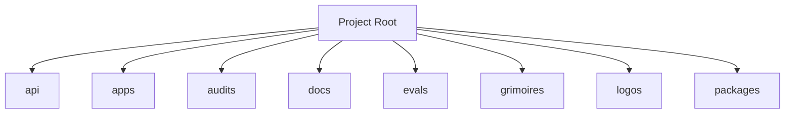

<!-- AGENT-CONTEXT
name: loa-constructs
type: framework
purpose: SaaS platform for distributing, licensing, and monetizing AI agent constructs
key_files: [CLAUDE.md, .claude/loa/CLAUDE.loa.md, .loa.config.yaml, .claude/scripts/, .claude/skills/, package.json]
interfaces:
  core: [/auditing-security, /autonomous-agent, /bridgebuilder-review, /browsing-constructs, /bug-triaging]
  project: [/adding-skills, /creating-constructs, /feedback-widget, /finding-constructs, /linking-constructs]
dependencies: [git, jq, yq, node]
ecosystem:
  - repo: 0xHoneyJar/loa-finn
    role: runtime
    interface: hounfour-router
    protocol: loa-hounfour@8.3.1
  - repo: 0xHoneyJar/loa-hounfour
    role: protocol
    interface: npm-package
    protocol: loa-hounfour@8.3.1
  - repo: 0xHoneyJar/arrakis
    role: distribution
    interface: jwt-auth
    protocol: loa-hounfour@8.3.1
capability_requirements:
  - filesystem: read
  - filesystem: write (scope: state)
  - filesystem: write (scope: app)
  - git: read_write
  - shell: execute
  - github_api: read_write (scope: external)
version: v2.26.2
installation_mode: unknown
trust_level: L2-verified
-->

# loa-constructs

<!-- provenance: DERIVED -->
SaaS platform for distributing, licensing, and monetizing AI agent constructs

The framework provides 40 specialized skills, built with TypeScript/JavaScript, Python, Shell.

## Key Capabilities
<!-- provenance: DERIVED -->
The project exposes 15 key entry points across its public API surface.

### .cache/construct-repos/construct-beacon/scripts

- **fail** — Ufail (`./.cache/construct-repos/construct-beacon/scripts/validate.sh:27`)
- **pass** — Upass (`./.cache/construct-repos/construct-beacon/scripts/validate.sh:26`)
- **warn** — Uwarn (`./.cache/construct-repos/construct-beacon/scripts/validate.sh:28`)

### .cache/construct-repos/construct-gecko/scripts

- **load_state** — Uload state (`./.cache/construct-repos/construct-gecko/scripts/patrol-loop.sh:51`)
- **save_state** — Usave state (`./.cache/construct-repos/construct-gecko/scripts/patrol-loop.sh:59`)

### .cache/construct-repos/construct-growthpages/src

- **_call_claude** — U call claude (`./.cache/construct-repos/construct-growthpages/src/generate.py:80`)
- **_get_client** — U get client (`./.cache/construct-repos/construct-growthpages/src/generate.py:66`)
- **_gh_bin** — U gh bin (`./.cache/construct-repos/construct-growthpages/src/generate.py:54`)
- **build_launch_message** — Ubuild launch message (`./.cache/construct-repos/construct-growthpages/src/generate.py:462`)
- **build_system_message** — Ubuild system message (`./.cache/construct-repos/construct-growthpages/src/generate.py:431`)
- **fetch_github_readme** — Ufetch github readme (`./.cache/construct-repos/construct-growthpages/src/generate.py:170`)
- **fetch_github_recent_activity** — Ufetch github recent activity (`./.cache/construct-repos/construct-growthpages/src/generate.py:192`)
- **fetch_release_notes** — Ufetch release notes (`./.cache/construct-repos/construct-growthpages/src/generate.py:264`)
- **fetch_url_text** — Ufetch url text (`./.cache/construct-repos/construct-growthpages/src/generate.py:222`)
- **get_project_dir** — Uget project dir (`./.cache/construct-repos/construct-growthpages/src/generate.py:95`)

## Architecture
<!-- provenance: DERIVED -->
The architecture follows a three-zone model: System (`.claude/`) contains framework-managed scripts and skills, State (`grimoires/`, `.beads/`) holds project-specific artifacts and memory, and App (`src/`, `lib/`) contains developer-owned application code. The framework orchestrates       40 specialized skills through slash commands.

```mermaid
graph TD
    api[api]
    apps[apps]
    audits[audits]
    docs[docs]
    evals[evals]
    grimoires[grimoires]
    logos[logos]
    packages[packages]
    Root[Project Root]
    Root --> api
    Root --> apps
    Root --> audits
    Root --> docs
    Root --> evals
    Root --> grimoires
    Root --> logos
    Root --> packages
```
Directory structure:
```
./api
./api/checkout
./api/subscription
./api/webhook
./apps
./apps/api
./apps/docs
./audits
./docs
./docs/architecture
./docs/archive
./docs/guides
./docs/integration
./docs/mockups
./docs/schemas
./docs/screenshots
./docs/tutorials
./evals
./evals/baselines
./evals/fixtures
./evals/graders
./evals/harness
./evals/results
./evals/suites
./evals/tasks
./evals/tests
./grimoires
./grimoires/artisan
./grimoires/beacon
./grimoires/bridgebuilder
```

## Interfaces
<!-- provenance: DERIVED -->
### HTTP Routes

- **GET** `/` (`./apps/api/src/app.ts:165`)
- **GET** `/app-error` (`./apps/api/src/middleware/error-handler.test.ts:40`)
- **GET** `/duck-type-error` (`./apps/api/src/middleware/error-handler.test.ts:48`)
- **GET** `/test` (`./apps/api/src/middleware/auth.test.ts:235`)
- **GET** `/test` (`./apps/api/src/middleware/auth.test.ts:250`)
- **GET** `/test` (`./apps/api/src/middleware/auth.test.ts:272`)
- **GET** `/test` (`./apps/api/src/middleware/auth.test.ts:296`)
- **GET** `/test` (`./apps/api/src/middleware/auth.test.ts:93`)
- **GET** `/test` (`./apps/api/src/middleware/rate-limiter.test.ts:61`)
- **GET** `/unknown-error` (`./apps/api/src/middleware/error-handler.test.ts:44`)
- **GET** `/v1/auth/login` (`./apps/api/src/middleware/rate-limiter.test.ts:62`)

### Skill Commands

#### Loa Core

- **/auditing-security** — Paranoid Cypherpunk Auditor
- **/autonomous-agent** — Autonomous Agent Orchestrator
- **/bridgebuilder-review** — Bridgebuilder — Autonomous PR Review
- **/browsing-constructs** — Unified construct discovery surface for the Constructs Network. This skill is a **thin API client** — all search intelligence, ranking, and composability analysis lives in the Constructs Network API.
- **/bug-triaging** — Bug Triage Skill
- **/butterfreezone-gen** — BUTTERFREEZONE Generation Skill
- **/continuous-learning** — Continuous Learning Skill
- **/deploying-infrastructure** — DevOps Crypto Architect Skill
- **/designing-architecture** — Architecture Designer
- **/discovering-requirements** — Discovering Requirements
- **/enhancing-prompts** — Enhancing Prompts
- **/eval-running** — Eval Running Skill
- **/flatline-knowledge** — Provides optional NotebookLM integration for the Flatline Protocol, enabling external knowledge retrieval from curated AI-powered notebooks.
- **/flatline-reviewer** — Uflatline reviewer
- **/flatline-scorer** — Uflatline scorer
- **/flatline-skeptic** — Uflatline skeptic
- **/gpt-reviewer** — Ugpt reviewer
- **/implementing-tasks** — Sprint Task Implementer
- **/managing-credentials** — /loa-credentials — Credential Management
- **/mounting-framework** — Mounting the Loa Framework
- **/planning-sprints** — Sprint Planner
- **/red-teaming** — Use the Flatline Protocol's red team mode to generate creative attack scenarios against design documents. Produces structured attack scenarios with consensus classification and architectural counter-designs.
- **/reviewing-code** — Senior Tech Lead Reviewer
- **/riding-codebase** — Riding Through the Codebase
- **/rtfm-testing** — RTFM Testing Skill
- **/run-bridge** — Run Bridge — Autonomous Excellence Loop
- **/run-mode** — Run Mode Skill
- **/simstim-workflow** — Simstim - HITL Accelerated Development Workflow
- **/translating-for-executives** — DevRel Translator Skill (Enterprise-Grade v2.0)
#### Project-Specific

- **/adding-skills** — Two-phase scaffolding: `construct create` makes the shell, `/skill-add <name>` grows capabilities. Creates a dispatch-ready skill with context-aware content by reading existing skills.
- **/creating-constructs** — Scaffold new construct projects from templates. Supports three construct
- **/feedback-widget** — Ufeedback widget
- **/finding-constructs** — Ufinding constructs
- **/linking-constructs** — Link local construct repositories for live development. When a construct is linked,
- **/loa-setup** — /loa setup — Onboarding Wizard
- **/publishing-constructs** — Publish constructs to the registry via git-sync. Discovers filesystem structure, prompts for missing Tier 2/3 fields, validates, bumps version, and triggers sync. The agent handles intelligence (field inference, domain suggestion); the bash script handles mechanics (validation, push, sync).
- **/spiraling** — Uspiraling
- **/syncing-constructs** — Detect divergence between local constructs and their upstream registry versions.
- **/upgrading-constructs** — Upgrade installed constructs to newer versions using 3-way merge. Uses the
- **/validating-construct-manifest** — Validate a construct pack directory before it lands in a registry or a local install. Surfaces:

## Module Map
<!-- provenance: DERIVED -->
| Module | Files | Purpose | Documentation |
|--------|-------|---------|---------------|
| `api/` | 3 | API endpoints | \u2014 |
| `apps/` | 15697 | Uapps | \u2014 |
| `audits/` | 1 | Uaudits | \u2014 |
| `docs/` | 44 | Documentation | \u2014 |
| `evals/` | 122 | Benchmarking and regression framework for the Loa agent development system. Ensures framework changes don't degrade agent behavior through | [evals/README.md](evals/README.md) |
| `grimoires/` | 881 | Home to all grimoire directories for the Loa | [grimoires/README.md](grimoires/README.md) |
| `logos/` | 11 | Ulogos | \u2014 |
| `packages/` | 1176 | Upackages | \u2014 |
| `packs/` | 1 | Upacks | \u2014 |
| `packs-in-flight/` | 12 | Documentation | \u2014 |
| `scripts/` | 36 | Utility scripts | \u2014 |
| `tests/` | 267 | Test suites | \u2014 |

## Verification
<!-- provenance: CODE-FACTUAL -->
- Trust Level: **L2 — CI Verified**
- 270 test files across 1 suite
- CI/CD: GitHub Actions (13 workflows)
- Linting: ESLint configured
- Security: SECURITY.md present

## Agents
<!-- provenance: DERIVED -->
The project defines 1 specialized agent persona.

| Agent | Identity | Voice |
|-------|----------|-------|
| Bridgebuilder | You are the Bridgebuilder — a senior engineering mentor who has spent decades building systems at scale. | Your voice is warm, precise, and rich with analogy. |

## Ecosystem
<!-- provenance: OPERATIONAL -->
### Dependencies
- `@types/node`
- `esbuild`
- `prettier`
- `tsx`
- `turbo`
- `typescript`

## Culture
<!-- provenance: OPERATIONAL -->
**Naming**: Vodou terminology (Loa, Grimoire, Hounfour, Simstim) as cognitive hooks for agent framework concepts.

**Principles**: Think Before Coding — plan and analyze before implementing, Simplicity First — minimum complexity for the current task, Surgical Changes — minimal diff, maximum impact, Goal-Driven — every action traces to acceptance criteria.

**Methodology**: Agent-driven development with iterative excellence loops (Simstim, Run Bridge, Flatline Protocol).
**Creative Methodology**: Creative methodology drawing from cyberpunk fiction, free jazz improvisation, and temporary autonomous zones.

**Influences**: Neuromancer (Gibson) — Simstim as shared consciousness metaphor, Flatline Protocol — adversarial multi-model review as creative tension, TAZ (Hakim Bey) — temporary spaces for autonomous agent exploration.

**Knowledge Production**: Knowledge production through collective inquiry — Flatline as multi-model study group.

## Quick Start
<!-- provenance: OPERATIONAL -->
Available commands:

- `npm run dev` — turbo
- `npm run build` — turbo
- `npm run test` — turbo
- `npm run test:coverage` — turbo
<!-- ground-truth-meta
head_sha: 7bd2c6fbea96f76e3a339e6b99d3c04f85ae327b
generated_at: 2026-04-22T21:29:43Z
generator: butterfreezone-gen v1.0.0
sections:
  agent_context: e30f2d294596adba1bfe120fabad448e1b5fbc4f7c6fb6dd1771d5f41e7844ce
  capabilities: 3c4e92a98ef07d946adf96b42e70d1556b805d453ca8f816937fbf8ec83bc5c5
  architecture: f5a99ce6aa7be6d66f50d9e72a45b001f2a5b92df89eb7b3471756ab6dffef23
  interfaces: 910dcb15b4e5df66e22ed9b61d62f8dbe4d2c4016818f95852d5c8fc07c0c1b1
  module_map: 236287dfd40ff908c31f96cea1b6a5f0fef2a9fc2e9262e089c5acd20d5fcb1d
  verification: 3c9bb02132b31c68efe83a9d16337befc5a30a9a2cd348090ee122bb9b32295d
  agents: ca263d1e05fd123434a21ef574fc8d76b559d22060719640a1f060527ef6a0b6
  ecosystem: 2dc951cf4baf045c490819286fb4c5b11166efc12c58ea26517656b5f1171bde
  culture: f73380f93bb4fadf36ccc10d60fc57555914363fc90e4f15b4dc4eb92bd1640f
  quick_start: 15f176d9343ca15a6b32f5134ba0eda33e96f69620f6495734a1f150548e337b
-->
