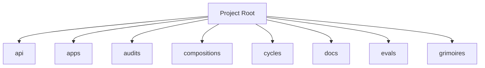

<!-- AGENT-CONTEXT
name: loa-constructs
type: framework
purpose: SaaS platform for distributing, licensing, and monetizing AI agent constructs
key_files: [CLAUDE.md, .claude/loa/CLAUDE.loa.md, .loa.config.yaml, .claude/scripts/, .claude/skills/, package.json]
interfaces:
  core: [/auditing-security, /autonomous-agent, /bridgebuilder-review, /browsing-constructs, /bug-triaging]
  project: [/adding-skills, /cost-budget-enforcer, /creating-constructs, /cross-repo-status-reader, /feedback-widget]
dependencies: [git, jq, yq, node]
ecosystem:
  - repo: 0xHoneyJar/loa-finn
    role: runtime
    interface: hounfour-router
    protocol: loa-hounfour@8.3.1
  - repo: 0xHoneyJar/loa-hounfour
    role: protocol
    interface: npm-package
    protocol: loa-hounfour@8.3.1
  - repo: 0xHoneyJar/arrakis
    role: distribution
    interface: jwt-auth
    protocol: loa-hounfour@8.3.1
capability_requirements:
  - filesystem: read
  - filesystem: write (scope: state)
  - filesystem: write (scope: app)
  - git: read_write
  - shell: execute
  - github_api: read_write (scope: external)
version: v2.38.0
installation_mode: unknown
trust_level: L2-verified
-->

# loa-constructs

<!-- provenance: CODE-FACTUAL -->
SaaS platform for distributing, licensing, and monetizing AI agent constructs

The framework provides 47 specialized skills, built with TypeScript/JavaScript, Python, Shell.

## Key Capabilities
<!-- provenance: CODE-FACTUAL -->
The project exposes 5 key entry points across its public API surface.
# API Surface — loa-constructs
## Server bootstrap
- **Framework**: Hono v4.6 + `@hono/node-server` (apps/api/package.json)
- **Entry point**: `apps/api/src/index.ts` → `app.ts`
- **API version**: `/v1` mount (app.ts:99, 162)
- **Default port**: 3000 (config/env.ts:12)
- **Default host**: 0.0.0.0 (config/env.ts:13)
## Global middleware (in order — app.ts:46-94)
## Route groups (mounted under `/v1`)
## Verb counts (approx — `c.get/c.post/...` calls in non-test routes)

## Architecture
<!-- provenance: CODE-FACTUAL -->
The architecture follows a three-zone model: System (`.claude/`) contains framework-managed scripts and skills, State (`grimoires/`, `.beads/`) holds project-specific artifacts and memory, and App (`src/`, `lib/`) contains developer-owned application code. The framework orchestrates       47 specialized skills through slash commands.

```mermaid
graph TD
    api[api]
    apps[apps]
    audits[audits]
    compositions[compositions]
    cycles[cycles]
    docs[docs]
    evals[evals]
    grimoires[grimoires]
    Root[Project Root]
    Root --> api
    Root --> apps
    Root --> audits
    Root --> compositions
    Root --> cycles
    Root --> docs
    Root --> evals
    Root --> grimoires
```
Directory structure:
```
./api
./api/checkout
./api/subscription
./api/webhook
./apps
./apps/api
./apps/docs
./audits
./compositions
./cycles
./cycles/cycle-309722a219
./cycles/cycle-309725186c
./cycles/cycle-309728dd1b
./cycles/cycle-309806767c
./cycles/cycle-30980925d5
./cycles/cycle-309811b105
./cycles/cycle-30990251ff
./cycles/cycle-31047133ca
./docs
./docs/architecture
./docs/archive
./docs/guides
./docs/integration
./docs/migration
./docs/mockups
./docs/schemas
./docs/screenshots
./docs/tutorials
./evals
./evals/baselines
```

## Interfaces
<!-- provenance: CODE-FACTUAL -->
### HTTP Routes

- **GET** `/` (`./apps/api/src/app.ts:172`)
- **GET** `/app-error` (`./apps/api/src/middleware/error-handler.test.ts:40`)
- **GET** `/duck-type-error` (`./apps/api/src/middleware/error-handler.test.ts:48`)
- **GET** `/test` (`./apps/api/src/middleware/auth.test.ts:235`)
- **GET** `/test` (`./apps/api/src/middleware/auth.test.ts:250`)
- **GET** `/test` (`./apps/api/src/middleware/auth.test.ts:272`)
- **GET** `/test` (`./apps/api/src/middleware/auth.test.ts:296`)
- **GET** `/test` (`./apps/api/src/middleware/auth.test.ts:93`)
- **GET** `/test` (`./apps/api/src/middleware/rate-limiter.test.ts:61`)
- **GET** `/unknown-error` (`./apps/api/src/middleware/error-handler.test.ts:44`)
- **GET** `/v1/auth/login` (`./apps/api/src/middleware/rate-limiter.test.ts:62`)
- **POST** `/v1/admin/refresh-registry` (`./apps/api/src/middleware/nonce-store.ts:65`)

### Skill Commands

#### Loa Core

- **/auditing-security** — Paranoid Cypherpunk Auditor
- **/autonomous-agent** — Autonomous Agent Orchestrator
- **/bridgebuilder-review** — Bridgebuilder — Autonomous PR Review
- **/browsing-constructs** — Unified construct discovery surface for the Constructs Network. This skill is a **thin API client** — all search intelligence, ranking, and composability analysis lives in the Constructs Network API.
- **/bug-triaging** — Bug Triage Skill
- **/butterfreezone-gen** — BUTTERFREEZONE Generation Skill
- **/continuous-learning** — Continuous Learning Skill
- **/deploying-infrastructure** — DevOps Crypto Architect Skill
- **/designing-architecture** — Architecture Designer
- **/discovering-requirements** — Discovering Requirements
- **/enhancing-prompts** — Enhancing Prompts
- **/eval-running** — Eval Running Skill
- **/flatline-knowledge** — Provides optional NotebookLM integration for the Flatline Protocol, enabling external knowledge retrieval from curated AI-powered notebooks.
- **/flatline-reviewer** — Uflatline reviewer
- **/flatline-scorer** — Uflatline scorer
- **/flatline-skeptic** — Uflatline skeptic
- **/gpt-reviewer** — Ugpt reviewer
- **/implementing-tasks** — Sprint Task Implementer
- **/managing-credentials** — /loa-credentials — Credential Management
- **/mounting-framework** — Mounting the Loa Framework
- **/planning-sprints** — Sprint Planner
- **/red-teaming** — Use the Flatline Protocol's red team mode to generate creative attack scenarios against design documents. Produces structured attack scenarios with consensus classification and architectural counter-designs.
- **/reviewing-code** — Senior Tech Lead Reviewer
- **/riding-codebase** — Riding Through the Codebase
- **/rtfm-testing** — RTFM Testing Skill
- **/run-bridge** — Run Bridge — Autonomous Excellence Loop
- **/run-mode** — Run Mode Skill
- **/simstim-workflow** — Simstim - HITL Accelerated Development Workflow
- **/translating-for-executives** — DevRel Translator Skill (Enterprise-Grade v2.0)
#### Project-Specific

- **/adding-skills** — Two-phase scaffolding: `construct create` makes the shell, `/skill-add <name>` grows capabilities. Creates a dispatch-ready skill with context-aware content by reading existing skills.
- **/cost-budget-enforcer** — Daily token-cap enforcement for autonomous Loa cycles. Replaces the
- **/creating-constructs** — Scaffold new construct projects from templates. Supports three construct
- **/cross-repo-status-reader** — Read structured cross-repo state for ≤50 repos in parallel via `gh api`, with TTL cache + stale fallback, BLOCKER extraction from each repo's `grimoires/loa/NOTES.md` tail, and per-source error capture so one repo's failure does not abort the full read. The operator-visibility primitive for the Agent-Network Operator (P1).
- **/feedback-widget** — Ufeedback widget
- **/finding-constructs** — Ufinding constructs
- **/graduated-trust** — The L4 primitive maintains a per-(scope, capability, actor) trust ledger
- **/hitl-jury-panel** — Replace `AskUserQuestion`-class decisions during operator absence with a panel of ≥3 deliberately-diverse panelists. Each panelist (model + persona) returns a view and reasoning; the skill logs all views BEFORE selection, then picks one binding view via a deterministic seed derived from `(decision_id, context_hash)`. Provides an autonomous adjudication primitive without compromising auditability.
- **/linking-constructs** — Link local construct repositories for live development. When a construct is linked,
- **/loa-setup** — /loa setup — Onboarding Wizard
- **/publishing-constructs** — Publish constructs to the registry via git-sync. Discovers filesystem structure, prompts for missing Tier 2/3 fields, validates, bumps version, and triggers sync. The agent handles intelligence (field inference, domain suggestion); the bash script handles mechanics (validation, push, sync).
- **/scheduled-cycle-template** — Compose `/schedule` (cron registration) with the existing autonomous-mode primitives into a generic 5-phase cycle: **read state → decide → dispatch → await → log**. Caller plugs five small phase scripts (the *DispatchContract*) into a YAML; the L3 lib runs them under a flock, records every phase to a hash-chained audit log, and (optionally) consults the L2 cost gate before letting any work begin.

## Module Map
<!-- provenance: CODE-FACTUAL -->
| Module | Files | Purpose | Documentation |
|--------|-------|---------|---------------|
| `api/` | 3 | API endpoints | \u2014 |
| `apps/` | 15719 | Uapps | \u2014 |
| `audits/` | 1 | Uaudits | \u2014 |
| `compositions/` | 1 | Ucompositions | \u2014 |
| `cycles/` | 45 | Documentation | \u2014 |
| `docs/` | 49 | Documentation | \u2014 |
| `evals/` | 122 | Benchmarking and regression framework for the Loa agent development system. Ensures framework changes don't degrade agent behavior through | [evals/README.md](evals/README.md) |
| `grimoires/` | 1036 | Home to all grimoire directories for the Loa | [grimoires/README.md](grimoires/README.md) |
| `lib/` | 1 | Source code | \u2014 |
| `packages/` | 1176 | Upackages | \u2014 |
| `scripts/` | 36 | Utility scripts | \u2014 |
| `tests/` | 553 | Test suites | \u2014 |
| `tools/` | 3 | Utools | \u2014 |

## Verification
<!-- provenance: CODE-FACTUAL -->
- Trust Level: **L2 — CI Verified**
- 556 test files across 1 suite
- CI/CD: GitHub Actions (14 workflows)
- Linting: ESLint configured
- Security: SECURITY.md present

## Agents
<!-- provenance: DERIVED -->
The project defines 1 specialized agent persona.

| Agent | Identity | Voice |
|-------|----------|-------|
| Bridgebuilder | You are the Bridgebuilder — a senior engineering mentor who has spent decades building systems at scale. | Your voice is warm, precise, and rich with analogy. |

## Ecosystem
<!-- provenance: OPERATIONAL -->
### Dependencies
- `@types/node`
- `esbuild`
- `prettier`
- `tsx`
- `turbo`
- `typescript`

## Culture
<!-- provenance: OPERATIONAL -->
**Naming**: Vodou terminology (Loa, Grimoire, Hounfour, Simstim) as cognitive hooks for agent framework concepts.

**Principles**: Think Before Coding — plan and analyze before implementing, Simplicity First — minimum complexity for the current task, Surgical Changes — minimal diff, maximum impact, Goal-Driven — every action traces to acceptance criteria.

**Methodology**: Agent-driven development with iterative excellence loops (Simstim, Run Bridge, Flatline Protocol).
**Creative Methodology**: Creative methodology drawing from cyberpunk fiction, free jazz improvisation, and temporary autonomous zones.

**Influences**: Neuromancer (Gibson) — Simstim as shared consciousness metaphor, Flatline Protocol — adversarial multi-model review as creative tension, TAZ (Hakim Bey) — temporary spaces for autonomous agent exploration.

**Knowledge Production**: Knowledge production through collective inquiry — Flatline as multi-model study group.

## Quick Start
<!-- provenance: OPERATIONAL -->
Available commands:

- `npm run dev` — turbo
- `npm run build` — turbo
- `npm run test` — turbo
- `npm run test:coverage` — turbo
<!-- ground-truth-meta
head_sha: f3cecde3826e5894ec180d9ddd3992d3a994b96a
generated_at: 2026-05-09T16:25:16Z
generator: butterfreezone-gen v1.0.0
sections:
  agent_context: f6cbbb733fad20b570081293245b10a69209411de598e86bc2c6d86fbda2df10
  capabilities: 4b62d222e5aaf2083317bf600ba3f019afeb0698d303f2bf7509a2cec59b11b9
  architecture: 6daad447e2220a822052437eab179dc79b17413a123636bd0b070035d5823e32
  interfaces: b50b0e09bda2d8f39e3b0d7e0914a966457386f37d823677a3a7d490881d24bc
  module_map: 86db6f5d7aaac62475e10da48868688d840200542125238db6dedb745f013a86
  verification: 96d9d021ae37b016d9d180cfd3e2660601a18614b38cc2420acfd5ad44e41abd
  agents: ca263d1e05fd123434a21ef574fc8d76b559d22060719640a1f060527ef6a0b6
  ecosystem: 2dc951cf4baf045c490819286fb4c5b11166efc12c58ea26517656b5f1171bde
  culture: f73380f93bb4fadf36ccc10d60fc57555914363fc90e4f15b4dc4eb92bd1640f
  quick_start: 15f176d9343ca15a6b32f5134ba0eda33e96f69620f6495734a1f150548e337b
-->
