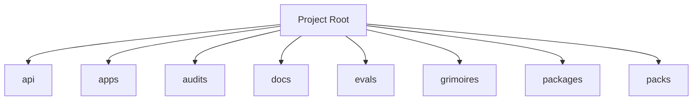

<!-- AGENT-CONTEXT
name: loa-constructs
type: framework
purpose: SaaS platform for distributing, licensing, and monetizing AI agent constructs
key_files: [CLAUDE.md, .claude/loa/CLAUDE.loa.md, .loa.config.yaml, .claude/scripts/, .claude/skills/, package.json]
interfaces:
  core: [/auditing-security, /autonomous-agent, /bridgebuilder-review, /browsing-constructs, /bug-triaging]
  project: [/creating-constructs, /finding-constructs, /linking-constructs, /publishing-constructs, /syncing-constructs]
dependencies: [git, jq, yq, node]
capability_requirements:
  - filesystem: read
  - filesystem: write (scope: state)
  - filesystem: write (scope: app)
  - git: read_write
  - shell: execute
  - github_api: read_write (scope: external)
version: v2.7.1
installation_mode: unknown
trust_level: L2-verified
-->

# loa-constructs

<!-- provenance: DERIVED -->
SaaS platform for distributing, licensing, and monetizing AI agent constructs

The framework provides 35 specialized skills, built with TypeScript/JavaScript, Python, Shell.

## Architecture
<!-- provenance: DERIVED -->
The architecture follows a three-zone model: System (`.claude/`) contains framework-managed scripts and skills, State (`grimoires/`, `.beads/`) holds project-specific artifacts and memory, and App (`src/`, `lib/`) contains developer-owned application code. The framework orchestrates       35 specialized skills through slash commands.

```mermaid
graph TD
    api[api]
    apps[apps]
    audits[audits]
    docs[docs]
    evals[evals]
    grimoires[grimoires]
    packages[packages]
    packs[packs]
    Root[Project Root]
    Root --> api
    Root --> apps
    Root --> audits
    Root --> docs
    Root --> evals
    Root --> grimoires
    Root --> packages
    Root --> packs
```
Directory structure:
```
./api
./api/checkout
./api/subscription
./api/webhook
./apps
./apps/api
./apps/explorer
./audits
./docs
./docs/architecture
./docs/archive
./docs/guides
./docs/integration
./docs/mockups
./docs/schemas
./docs/screenshots
./docs/tutorials
./evals
./evals/baselines
./evals/fixtures
./evals/graders
./evals/harness
./evals/results
./evals/suites
./evals/tasks
./evals/tests
./grimoires
./grimoires/artisan
./grimoires/bridgebuilder
./grimoires/loa
```

## Interfaces
<!-- provenance: DERIVED -->
### Skill Commands

#### Loa Core

- **/auditing-security** — Paranoid Cypherpunk Auditor
- **/autonomous-agent** — Uautonomous agent
- **/bridgebuilder-review** — Bridgebuilder — Autonomous PR Review
- **/browsing-constructs** — Provide a multi-select UI for browsing and installing packs from the Loa Constructs Registry. Enables composable skill installation per-repo.
- **/bug-triaging** — Bug Triage Skill
- **/butterfreezone-gen** — BUTTERFREEZONE Generation Skill
- **/continuous-learning** — Continuous Learning Skill
- **/deploying-infrastructure** — Udeploying infrastructure
- **/designing-architecture** — Architecture Designer
- **/discovering-requirements** — Discovering Requirements
- **/enhancing-prompts** — Uenhancing prompts
- **/eval-running** — Ueval running
- **/flatline-knowledge** — Provides optional NotebookLM integration for the Flatline Protocol, enabling external knowledge retrieval from curated AI-powered notebooks.
- **/flatline-reviewer** — Uflatline reviewer
- **/flatline-scorer** — Uflatline scorer
- **/flatline-skeptic** — Uflatline skeptic
- **/gpt-reviewer** — Ugpt reviewer
- **/implementing-tasks** — Sprint Task Implementer
- **/managing-credentials** — /loa-credentials — Credential Management
- **/mounting-framework** — Create structure (preserve if exists)
- **/planning-sprints** — Sprint Planner
- **/red-teaming** — Use the Flatline Protocol's red team mode to generate creative attack scenarios against design documents. Produces structured attack scenarios with consensus classification and architectural counter-designs.
- **/reviewing-code** — Senior Tech Lead Reviewer
- **/riding-codebase** — Riding Through the Codebase
- **/rtfm-testing** — RTFM Testing Skill
- **/run-bridge** — Run Bridge — Autonomous Excellence Loop
- **/run-mode** — Urun mode
- **/simstim-workflow** — Check post-PR state
- **/translating-for-executives** — Utranslating for executives
#### Project-Specific

- **/creating-constructs** — Scaffold new construct projects from templates. Supports three construct
- **/finding-constructs** — Ufinding constructs
- **/linking-constructs** — Link local construct repositories for live development. When a construct is linked,
- **/publishing-constructs** — Publish constructs to the Loa Constructs Registry. Runs a 10-point validation
- **/syncing-constructs** — Detect divergence between local constructs and their upstream registry versions.
- **/upgrading-constructs** — Upgrade installed constructs to newer versions using 3-way merge. Uses the

## Module Map
<!-- provenance: DERIVED -->
| Module | Files | Purpose | Documentation |
|--------|-------|---------|---------------|
| `api/` | 3 | API endpoints | \u2014 |
| `apps/` | 15967 | Uapps | \u2014 |
| `audits/` | 1 | Uaudits | \u2014 |
| `docs/` | 41 | Documentation | \u2014 |
| `evals/` | 122 | Benchmarking and regression framework for the Loa agent development system. Ensures framework changes don't degrade agent behavior through | [evals/README.md](evals/README.md) |
| `grimoires/` | 509 | Home to all grimoire directories for the Loa | [grimoires/README.md](grimoires/README.md) |
| `packages/` | 90 | Upackages | \u2014 |
| `packs/` | 1 | Upacks | \u2014 |
| `scripts/` | 27 | Utility scripts | \u2014 |
| `tests/` | 196 | Test suites | \u2014 |

## Verification
<!-- provenance: CODE-FACTUAL -->
- Trust Level: **L2 — CI Verified**
- 196 test files across 1 suite
- CI/CD: GitHub Actions (10 workflows)
- Linting: ESLint configured
- Security: SECURITY.md present

## Agents
<!-- provenance: DERIVED -->
The project defines 1 specialized agent persona.

| Agent | Identity | Voice |
|-------|----------|-------|
| Bridgebuilder | You are the Bridgebuilder — a senior engineering mentor who has spent decades building systems at scale. | Your voice is warm, precise, and rich with analogy. |

## Ecosystem
<!-- provenance: OPERATIONAL -->
### Dependencies
- `@types/node`
- `next`
- `prettier`
- `react`
- `react-dom`
- `tsx`
- `turbo`
- `typescript`

## Quick Start
<!-- provenance: OPERATIONAL -->
Available commands:

- `npm run dev` — turbo
- `npm run build` — turbo
- `npm run test` — turbo
- `npm run test:coverage` — turbo
<!-- ground-truth-meta
head_sha: c50b8fc9342c33b862c5f96c694e6023cc30a320
generated_at: 2026-02-27T22:09:38Z
generator: butterfreezone-gen v1.0.0
sections:
  agent_context: 216200d644d33e7b245db3474bafbe79b45d3e06bfd0265b7cc6cb3ea082b87b
  architecture: ffdfd8f14e40bdad179aae5c8587b22dc82e36eee2f0d0d1448a561cc5978b35
  interfaces: 96a525cab8e1628033128a8048f8fa8814ca169f193b38c9364b6d71c6ea3180
  module_map: 5d2857ede090eab63b7fe34ec2d49af27315d81f6e65bc288efe1f3ba05d6af5
  verification: 6badfc40824e9dffb00087fff8fab9498900bf799490353bf7df676dc813cc41
  agents: ca263d1e05fd123434a21ef574fc8d76b559d22060719640a1f060527ef6a0b6
  ecosystem: 0d998700d4489ca2aec077a69004279a3c45c117b9fb5b37c9f85ad511187c7c
  quick_start: 15f176d9343ca15a6b32f5134ba0eda33e96f69620f6495734a1f150548e337b
-->
