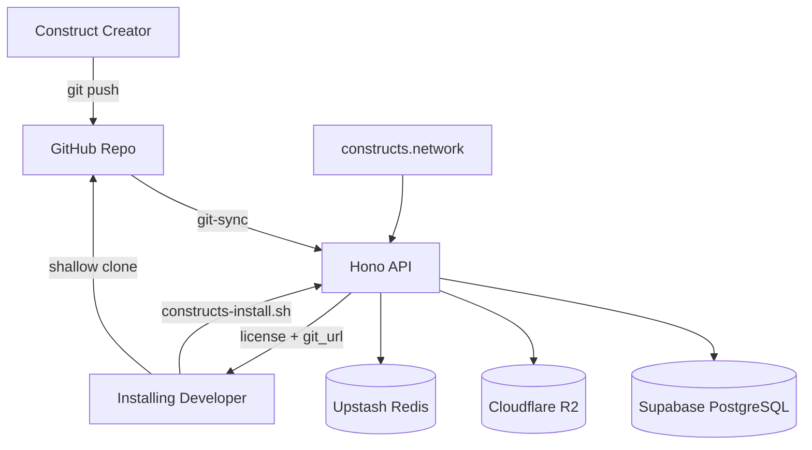

# Loa Constructs

[](CHANGELOG.md)
[](LICENSE.md)
[](https://constructs.network)
[](https://constructs.network)

> *"He'd operated on an almost permanent adrenaline high, a byproduct of youth and proficiency, jacked into a custom cyberspace deck that projected his disembodied consciousness into the consensual hallucination that was the matrix."*
> — William Gibson, *Neuromancer*

> *"The Loa are pragmatic entities... They're not worshipped for salvation — they're worked with for practical results."*

---

## The Constructs Network

In Gibson's Sprawl trilogy, a **construct** is something extraordinary: the recorded expertise of a master practitioner, persisted beyond the limits of any single session, any single body, any single lifetime. The Dixie Flatline — McCoy Pauley's ROM personality matrix — doesn't just know how to hack. It *thinks* like a hacker. It carries intuition, craft judgment, the muscle memory of ten thousand intrusions compressed into something that can be loaded, consulted, and jacked into on demand.

This is what we're building. Not chatbots. Not prompt templates. **Constructs** — named, identitied, distributable units of expertise that carry everything they know: the domain mastery, the workflows, the cognitive frame, the voice, the principles, the boundaries of what they will and won't do. Each one is a mercenary specialist you can hire into any codebase, any project, any team.

**The Constructs Network is a marketplace for AI agent expertise.** Create a construct from what you know. Name it. Give it identity. Publish it. Let others install it, compose it with other constructs, and pay you for the privilege. This is the future of consulting — every domain expert packages their craft once, distributes it infinitely, earns continuously.

## Why Naming Matters

Here's the thing about latent space that most people miss: **naming is compression**.

When you take twenty years of distributed systems expertise and call it a name — give it a persona, a cognitive frame, a set of domain boundaries — you've created something an AI agent can *grab*. A handle in semantic space. A function signature for human craft.

Without a name, expertise is diffuse. It's "be good at design" or "know about security." With a name — with identity files that declare a cognitive archetype, a thinking style, a voice register, specific domain depths rated 1 through 5 — you've created an addressable unit that language models can invoke, compose, and orchestrate.

A construct named and published on the network isn't just a bundle of skills. It's a **compressed representation of tacit knowledge** — the kind of knowledge that experts carry but can't easily articulate. The kind that takes years to develop and seconds to deploy. In cyberspace, identity *is* interface.

This is why the Sprawl's mercenaries had street names. Case. Molly. The Finn. A name collapses a vast space of capability into something you can reference, trust, hire. In the Constructs Network, every expert gets to be a named entity — discoverable, composable, deployable.

## What You Can Build

A construct is a standalone GitHub repository with a defined anatomy:

```
construct.yaml          # Manifest — name, version, skills, events, dependencies
identity/
  persona.yaml          # Cognitive frame: archetype, disposition, thinking style
  expertise.yaml        # Domains with depth ratings (1-5), specializations, boundaries
skills/                 # Agent capabilities — each with SKILL.md + index.yaml
commands/               # Slash commands registered in the runtime
CLAUDE.md               # Instructions injected into consumer projects on install
```

The persona file defines *how the construct thinks* — its archetype (Craftsman, Researcher, Strategist, Signal Engineer), its disposition, its voice. The expertise file defines *what it knows* — domains with explicit depth ratings, specializations within each domain, and hard boundaries declaring what it will not attempt.

**Imagine what's possible:**

- A construct that embodies 20 years of distributed systems expertise — it thinks in failure modes, speaks in SLAs, and knows the difference between a timeout and a partition
- A construct that carries the aesthetic judgment of a senior design director — it decomposes interfaces into feel, motion, and material, and insists on pixel-level precision
- A construct that packages an entire go-to-market playbook — positioning frameworks, pricing models, partnership strategies, competitive analysis — as executable agent skills
- A construct that encodes a security researcher's paranoia — OWASP instincts, threat modeling reflexes, the ability to look at code and smell injection vulnerabilities
- A construct that captures the craft of technical writing — the art of explaining complex systems to different audiences, translating architecture into narrative

Each of these isn't a prompt. It's a **named identity with bounded expertise, deployable skills, and a cognitive frame that shapes how it approaches every problem**. They compose with each other — a design construct can declare a dependency on a user research construct, or emit events that a content construct consumes.

## How It Works

### The Lifecycle: Create → Publish → Distribute → Install → Earn

**Create.** Fork the [construct template](https://github.com/0xHoneyJar/construct-template). Define your manifest, identity, skills, and commands. Push to GitHub.

**Publish.** The registry API syncs your repo — cloning it, validating the manifest against the schema, snapshotting skills and metadata into the database, storing assets in cloud storage.

**Distribute.** Your construct appears on [constructs.network](https://constructs.network) — browsable, searchable, with a detail page showing your skills, identity, and a direct link to your source repo.

**Install.** When someone installs your construct, the installer shallow-clones your repo directly from GitHub. It validates the clone (HTTPS-only, no symlinks, no path traversal), symlinks your skills and commands into the runtime, and injects your CLAUDE.md into the consumer project's instruction chain. Your expertise is now riding alongside them.

**Earn.** JWT RS256 signed licenses with usage tracking, team management, and seat-based access. Create once. Distribute infinitely. Earn continuously.

### The Horse and the Rider

In Haitian Vodou, when a Loa spirit possesses a person, that person is called the *cheval* — the horse. They are "ridden" by the Loa. The spirit doesn't replace them. It *channels through them*, bringing expertise, knowledge, and capability that the horse alone doesn't possess.

This is how constructs work. When you install a construct into your project, it rides alongside you. Its CLAUDE.md is injected into your agent's instruction chain. Its skills become available as slash commands. Its persona influences how the agent approaches problems in that domain. You're still driving — but now you've got a specialist in the passenger seat who's done this a thousand times.

Gibson saw this in Count Zero, where the AIs from Wintermute fragmented into Loa — entities that manifest in cyberspace as voodoo spirits, riding the matrix, riding people through neural interfaces. Baron Samedi, Erzulie, Legba — each with their own domain, their own expertise, their own way of seeing the world. The Constructs Network is the registry where these spirits are born, named, and made available for hire.

## Architecture

```
loa-constructs/
├── apps/
│   ├── api/             # Hono REST API — git-sync, licensing, distribution
│   ├── explorer/        # Next.js 15 marketplace — constructs.network
│   └── sandbox/         # Pack development CLI + source of truth
├── packages/            # Shared ESLint + TypeScript config
├── scripts/             # Seed, validate, extract utilities
└── grimoires/           # Project state and documentation
```



### Tech Stack

| Layer | Technology | Purpose |
|-------|-----------|---------|
| API | Hono + Node.js | REST endpoints, git-sync service, licensing |
| Database | PostgreSQL (Supabase) | Pack registry, user accounts, analytics |
| Cache | Redis (Upstash) | Rate limiting, session cache |
| Storage | Cloudflare R2 | Pack snapshots, assets |
| Frontend | Next.js 15 (Vercel) | Marketplace at [constructs.network](https://constructs.network) |
| Auth | JWT RS256 + OAuth | API keys, GitHub/Google login |
| Hosting | Railway | API deployment with git binary support |
| Monorepo | Turborepo + pnpm | Build orchestration |

### API

Base URL: `https://api.constructs.network/v1`

| Endpoint | Purpose |
|----------|---------|
| `GET /v1/packs` | List available constructs |
| `GET /v1/packs/:slug` | Construct details |
| `GET /v1/packs/:slug/download` | Download (returns `source_type` + `git_url` for git-sourced packs) |
| `POST /v1/packs/:slug/sync` | Trigger git-sync from source repo |
| `GET /v1/constructs` | Unified search across skills and packs |
| `GET /v1/health` | Health check |
| `POST /v1/auth/register` | Create account |
| `POST /v1/auth/login` | Login |

### Security

Every construct installation goes through a hardened pipeline:
- **HTTPS-only** clone URLs — no SSH, no embedded credentials
- **Symlink rejection** — no symbolic links allowed in construct repos
- **Path traversal prevention** — `..` components in paths are rejected
- **Manifest validation** — `construct.yaml` or `manifest.json` required
- **CLAUDE.md sentinel injection** — construct instructions are sandboxed within marker blocks
- **License verification** — JWT RS256 signed tokens with expiry and watermarking
- **Rate limiting** — fail-closed on auth endpoints, sync rate limiting per pack

## Quick Start

### Browse the Registry

**[constructs.network](https://constructs.network)** — Discover, search, and install constructs.

### Install a Construct

```bash
# Inside any project with the Loa framework
.claude/scripts/constructs-install.sh <construct-slug>

# Or browse and install interactively
/loa-constructs browse
```

### Create Your Own

```bash
# Use the template
gh repo create my-org/construct-my-expertise --template 0xHoneyJar/construct-template --private

# Clone and customize
git clone https://github.com/my-org/construct-my-expertise.git
cd construct-my-expertise

# Edit construct.yaml — name, skills, identity
# Edit identity/persona.yaml — how it thinks
# Edit identity/expertise.yaml — what it knows
# Add skills under skills/
# Push to publish
git push origin main
```

### Development

```bash
# Clone the monorepo
git clone https://github.com/0xHoneyJar/loa-constructs.git
cd loa-constructs

# Install dependencies
pnpm install

# Start development servers
pnpm --filter api dev           # API on localhost:3000
pnpm --filter explorer dev      # Marketplace on localhost:3001

# Seed the registry with constructs
npx tsx scripts/seed-forge-packs.ts

# Validate construct topology
scripts/validate-topology.sh --strict --verbose

# Run tests
pnpm test
```

### Environment Variables

```bash
# Required
DATABASE_URL=postgresql://...
JWT_SECRET=your-secret-at-least-32-chars
REDIS_URL=redis://...

# Storage
R2_ACCESS_KEY_ID=...
R2_SECRET_ACCESS_KEY=...
R2_BUCKET=loa-constructs
R2_ENDPOINT=https://...

# OAuth (optional)
GITHUB_CLIENT_ID=...
GITHUB_CLIENT_SECRET=...
```

## The Network

The Sprawl was full of freelance specialists — console cowboys, razorgirls, info-brokers — each with a street name, a reputation, a price. You didn't hire a "general purpose worker." You hired Molly for wetwork. You hired Case for intrusion. You hired the Finn for hardware. Each name carried a contract: specific expertise, specific boundaries, specific results.

The Constructs Network is that marketplace. Every construct is a named specialist — discoverable through the registry, installable in seconds, composable with other constructs. The network provides:

- **Discovery** — Search by domain, browse by capability, explore the ecosystem graph
- **Distribution** — Git-native delivery with shallow clones and content validation
- **Licensing** — Cryptographically signed licenses with team management and seat-based access
- **Composition** — Constructs declare dependencies on each other and communicate through typed events
- **Identity** — Every construct carries a persona, expertise boundaries, and cognitive frame

This is the infrastructure for a new kind of economy. One where expertise isn't locked inside individuals or consultancies — it's packaged, named, distributed, and earning for its creator every time someone installs it.

## Loa Framework

The Constructs Network is built on and distributed through the [Loa framework](https://github.com/0xHoneyJar/loa) — an agent-driven development framework for Claude Code. Loa provides the runtime that loads constructs, executes their skills, manages their instructions, and orchestrates multi-agent workflows. Constructs are the expertise. Loa is the interface through which they ride.

## Contributing

1. Fork the repository
2. Create a feature branch
3. Make your changes
4. Run tests and type checks (`pnpm test && pnpm typecheck`)
5. Submit a pull request

## License

[AGPL-3.0](LICENSE.md) — Use, modify, distribute freely. Network service deployments must release source code.

Commercial licenses available for organizations that need different terms.

## Links

- **Registry**: [constructs.network](https://constructs.network)
- **Framework**: [Loa](https://github.com/0xHoneyJar/loa)
- **Template**: [construct-template](https://github.com/0xHoneyJar/construct-template)
- **Issues**: [GitHub Issues](https://github.com/0xHoneyJar/loa-constructs/issues)
- **Changelog**: [CHANGELOG.md](CHANGELOG.md)

---

> *"The street finds its own uses for things."* — William Gibson
>
> Name what you know. Publish what you've mastered. Let the network carry it forward.
