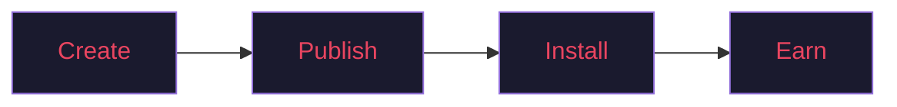
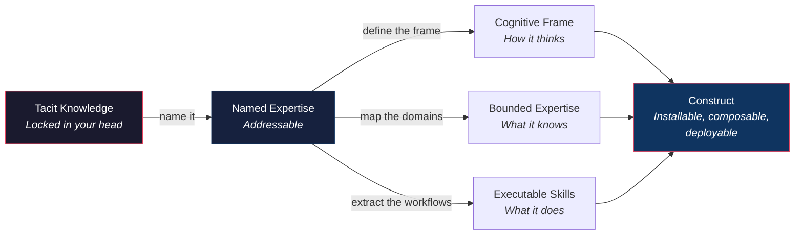
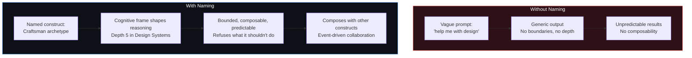
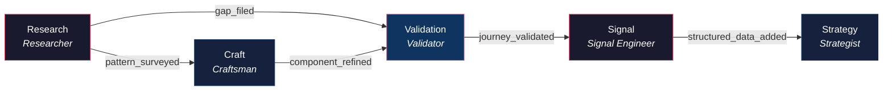
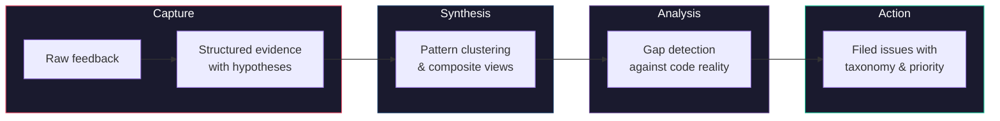
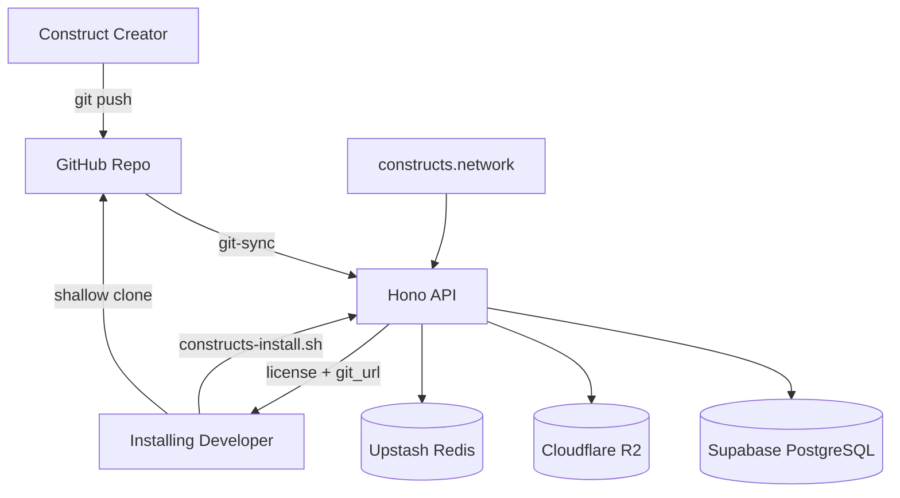

<div align="center">


*"He'd operated on an almost permanent adrenaline high..."* — William Gibson, *Neuromancer*

</div>

# Constructs Network

**A marketplace for AI agent expertise.** Constructs are named, distributable units of expertise — they carry identity, skills, cognitive frames, and boundaries. Install one and your agent gains a new specialization. Build one and others can use it. Ridden with [Loa](https://github.com/0xHoneyJar/loa) for Claude Code.



Browse available constructs at **[constructs.network](https://constructs.network)**

---

## Get Started

### Install a Construct

```bash
constructs-install.sh <construct-slug>
```

Find constructs to install at [constructs.network](https://constructs.network).

### Create Your Own

```bash
gh repo create my-org/construct-my-expertise \
  --template 0xHoneyJar/construct-template --private
```

1. Edit `construct.yaml` — name, version, description
2. Define identity — persona, expertise domains, boundaries
3. Add skills — the actions your construct performs
4. Push to publish

Full template and docs: [construct-template](https://github.com/0xHoneyJar/construct-template)

---

## What's Inside a Construct

```
construct.yaml          # Manifest — name, version, metadata
identity/
  persona.yaml          # How it thinks — archetype, cognitive style
  expertise.yaml        # What it knows — domains rated 1-5, hard boundaries
skills/                 # What it does — executable capabilities
commands/               # Slash commands exposed to users
CLAUDE.md               # Instructions injected on install
```

**Persona** defines the cognitive frame — an archetype, thinking style, and communication patterns. Your construct doesn't just execute; it *reasons* within a specific discipline.

**Expertise** declares bounded domains with depth ratings (1–5) and explicit hard boundaries — what the construct will *refuse* to do. Constraints are features.

**Skills** are the actions — each skill is a self-contained unit with its own capability metadata (model tier, danger level, execution hints) for intelligent routing.

---

## Why Naming Matters

Human language looks restrictive on the surface. But every domain expert knows this isn't true — expertise speaks a language that most people can't. A senior engineer doesn't just "fix performance problems." They profile flame graphs, identify contention on hot paths, reason about cache line alignment, and know when the real bottleneck is a lock three layers down that nobody's looking at. That's not general knowledge. That's a *language* — precise, compressed, earned through years of practice.

The problem is that this language lives inside people. It's tacit. You can't Google it. You can't prompt for it. The expert carries it as intuition, as muscle memory, as the thing they do without thinking that a junior couldn't do if they thought about it for a week.

**When you can name it, you can build it.**

This is the core insight. Not just naming constructs — naming *anything*. A workflow. A decision framework. A way of seeing problems. A diagnostic reflex. The moment you give a name to what you do — the moment you say "this is how I decompose a design system" or "this is how I triage a production incident" or "this is how I evaluate market positioning" — you've crossed a boundary. You've taken something that was locked in your head and made it addressable.

And addressable means everything in the age of AI agents. **Naming is compression** — it collapses a vast space of tacit knowledge into a handle that language models can grab, invoke, compose, and orchestrate.

### From Tacit Knowledge to Named Construct

Here's what happens when you name expertise. Each layer of naming adds structure that AI agents can reason about, compose, and deploy:



Without a name, expertise is diffuse: *"be good at design."* With a name — with a cognitive frame, a thinking style, domain depths rated 1 through 5, explicit boundaries declaring what you will and won't do — you've created a **function signature for human craft**.

### What Naming Actually Looks Like

Every construct on the network starts with the same question: *what do you call what you do?* The answer becomes structure that agents can use:

| What You Name | What It Becomes | Schema | Why It Matters |
|---------------|-----------------|--------|----------------|
| How you think about problems | **Cognitive Frame** | `persona.yaml → cognitiveFrame.archetype` | Agents adopt your reasoning style, not just your knowledge |
| Your working disposition | **Disposition** | `persona.yaml → cognitiveFrame.disposition` | "Detail-obsessed" vs "big-picture" shapes every decision |
| How you make decisions | **Decision Making** | `persona.yaml → cognitiveFrame.decision_making` | "Evidence-weighted" vs "intuition-first" — agents follow your methodology |
| What you know deeply | **Domains with Depth** | `expertise.yaml → domains[].depth` | Depth 1 (aware) through 5 (world-class) — agents know their limits |
| What you specialize in | **Specializations** | `expertise.yaml → domains[].specializations` | The specific niche skills within each domain |
| What you refuse to do | **Boundaries** | `expertise.yaml → domains[].boundaries` | Hard limits prevent agents from overreaching — "does NOT write backend logic" |
| Your workflows | **Skills** | `skills/*/SKILL.md` | Repeatable processes become executable agent capabilities |
| How you communicate | **Voice** | `persona.yaml → voice.tone, register` | Technical vs conversational, precise vs warm — agents speak your language |

### Naming in Practice: Five Archetypes

This is how real expertise gets named into real constructs. Each row is a named archetype — a way of thinking that took years to develop, compressed into something installable:

| Archetype | Named Thinking Style | Named Domains (Depth) | Named Boundaries |
|-----------|---------------------|----------------------|------------------|
| **Craftsman** | Visual-spatial — decomposes interfaces into feel, motion, and material | Design Systems (5), Motion Design (5), Visual Refinement (4), Taste Compounding (4) | Does NOT implement backend logic. Does NOT replace user research. |
| **Researcher** | Abductive reasoning — synthesizes user quotes, behaviors, and context into testable hypotheses | User Research (5), Gap Analysis (4), Journey Shaping (4) | Does NOT build UI prototypes. Does NOT make product decisions. |
| **Validator** | Deductive verification — starts from expectations, traces through code reality, identifies divergence | Journey Validation (5), Code Grounding (4), Interactive Testing (4) | Does NOT write unit tests. Does NOT refactor code. |
| **Signal Engineer** | Structural — maps content to machine-readable schemas and discovery surfaces | Structured Data (5), SEO Engineering (4), Content Discovery (4) | Does NOT create marketing content. Does NOT manage ad campaigns. |
| **Strategist** | Systems thinking — connects product capabilities to market opportunities | Product Positioning (5), Launch Strategy (4), Developer Relations (4), Pricing (3) | Does NOT create visual brand assets. Does NOT run paid campaigns. |

Notice what naming gives you: a Craftsman with depth-5 Design Systems and depth-5 Motion Design *thinks differently* than a Strategist with depth-5 Positioning. The Craftsman decomposes a landing page into feel, weight, and rhythm. The Strategist decomposes it into value proposition, competitive differentiation, and conversion signals. **Same artifact, completely different expertise applied** — because the name carries the cognitive frame, not just the knowledge.

### Why Builders Need to Understand This



If you're an expert building a construct, naming forces you to **externalize what makes your expertise different**. Not "I'm good at design" but:

- **Archetype**: Craftsman (not Researcher, not Strategist)
- **Thinking style**: Visual-spatial — decomposes into feel, motion, material
- **Decision making**: Taste-driven with systematic validation
- **Depth 5**: Design Systems, Motion Design
- **Depth 3**: Frontend Best Practices (knows enough to implement, not architect)
- **Hard boundary**: Does NOT implement backend logic

This precision is what makes constructs composable. An agent can route a design task to the Craftsman, a user research task to the Researcher, and a launch task to the Strategist — because each name carries enough structure to know *what it should handle* and *what it should refuse*.

### Naming Creates Composability

When expertise is properly named, constructs can work together through typed events and declared dependencies:



None of this composition is possible with unnamed, unbounded expertise. It's the **names** — the archetypes, the domains, the boundaries, the events — that give agents the structure to orchestrate.

---

## The Depth of a Construct

A construct can be a single skill that does one thing exceptionally well — or it can be an entire methodology with phased workflows, cultural context, templates, and typed events that other constructs consume. Both are valid. The architecture supports depth without requiring it.

Imagine a construct built for user research — not just collecting feedback, but transforming raw observations into tracked, actionable issues through a structured pipeline:



Each phase has a dedicated skill. Each skill's output becomes the next skill's input:

| Phase | What the Skill Does | Input | Output Artifact |
|-------|-------------------|-------|-----------------|
| **Capture** | Structures raw observations into evidence with confidence scores | Unstructured feedback, session notes | Evidence canvas with tagged hypotheses |
| **Synthesis** | Clusters evidence by pattern, infers relationships | Multiple evidence canvases | Journey definitions, composite views |
| **Analysis** | Compares synthesized patterns against product reality | Journeys + actual codebase | Severity-classified gap report |
| **Action** | Files trackable issues with taxonomy labels and evidence links | Gap report | GitHub/Linear issues ready for triage |

A construct this deep might also include a **diagnostic skill** — a conversational framework that helps you ask better questions before entering the pipeline at all — and a **migration skill** that converts legacy research formats into the construct's native artifacts.

### Context Composition

Mature constructs can layer domain knowledge. A base context defines universal patterns, then **overlays** extend it for specific domains — composing at runtime without duplication:

> **Base context** (web development fundamentals) + **React overlay** (component patterns, hook conventions) + **Accessibility overlay** (ARIA, screen reader testing) = a composed context that understands all three simultaneously.

This means one construct can serve multiple domains without forking.

### Cross-Construct Communication

Constructs don't have to work alone. Typed events let one construct's output trigger another construct's workflow:

```mermaid
flowchart LR
    R[Research Construct] -->|"gap_filed &#123;severity, evidence&#125;"| T[Task Construct]
    T -->|"task_completed &#123;resolution, diff&#125;"| R
    R -->|"pattern_detected &#123;cluster, confidence&#125;"| S[Strategy Construct]

    style R fill:#1a1a2e,stroke:#e94560,color:#fff
    style T fill:#1a1a2e,stroke:#16c79a,color:#fff
    style S fill:#1a1a2e,stroke:#0f3460,color:#fff
```



Events are declared in the pack manifest — `artifact_created`, `pattern_detected`, `gap_filed` — so the network knows what each construct emits and consumes. Pack dependencies make these relationships explicit.

### None of This Is Required

A construct with a single skill and a clear boundary is perfectly valid. Some of the most useful constructs in the network do **one thing** extremely well — a focused diagnostic, a specific code generation pattern, a single analysis framework. The phased pipelines, context overlays, and event systems exist for those who discover they need depth. They don't constrain those who want simplicity. Start with one skill. Let the structure emerge from real need.

---

## How It Works

### The Horse and the Rider

In Haitian Vodou, when a Loa spirit possesses a person, that person is called the *cheval* — the horse. They are "ridden" by the Loa. The spirit doesn't replace them. It *channels through them*, bringing expertise, knowledge, and capability that the horse alone doesn't possess.

This is how constructs work. When you install a construct into your project, it rides alongside you. Its CLAUDE.md is injected into your agent's instruction chain. Its skills become available as slash commands. Its persona influences how the agent approaches problems in that domain. You're still driving — but now you've got a specialist in the passenger seat who's done this a thousand times.

### The Lifecycle

**Create.** Fork the [construct template](https://github.com/0xHoneyJar/construct-template). Define your manifest, identity, skills, and commands. Push to GitHub.

**Publish.** The registry API syncs your repo — cloning it, validating the manifest against the schema, snapshotting skills and metadata into the database, storing assets in cloud storage.

**Distribute.** Your construct appears on [constructs.network](https://constructs.network) — browsable, searchable, with a detail page showing your skills, identity, and a direct link to your source repo.

**Install.** When someone installs your construct, the installer shallow-clones your repo directly from GitHub. It validates the clone (HTTPS-only, no symlinks, no path traversal), symlinks your skills and commands into the runtime, and injects your CLAUDE.md into the consumer project's instruction chain. Your expertise is now riding alongside them.

**Earn.** JWT RS256 signed licenses with usage tracking, team management, and seat-based access. Create once. Distribute infinitely. Earn continuously.

---

## The Network

In Gibson's Sprawl, every specialist had a street name and a reputation. Case was the best cowboy in the Chiba sky. Molly's razorgirl reflexes preceded her through every door. The Finn knew where to find anything, for a price. They didn't do everything — they went deep in one thing and the network handled the rest.

The Constructs Network is that marketplace for AI agent expertise.

**What the network provides:**

- **Discovery** — Find constructs by domain, capability, or reputation
- **Distribution** — Install with a single command, stay current with upstream improvements
- **Composition** — Combine constructs from different experts into unified workflows
- **Identity** — Every construct carries its creator's name, methodology, and versioned history
- **Licensing** — Create once, distribute infinitely, earn continuously

### Why Experts Build Constructs

A full-stack developer who's decent at frontend, backend, and design will produce a decent generalist construct. But the developer who splits that into three — a frontend construct with deep component architecture instincts, a backend construct with battle-tested API design patterns, a design construct with real taste — gets something qualitatively different. Each one goes deep enough to be worth installing.

That's the leverage model. Every hour you spend deepening a construct — adding skills, refining the cognitive frame, expanding domain coverage — benefits every person who has it installed. Your time compounds across the entire network. You do what you love at extreme depth, and the distribution model means that depth reaches everyone who needs it.

The best constructs won't come from people trying to cover everything. They'll come from specialists who can't stop thinking about their domain — the security researcher who dreams in attack surfaces, the accessibility expert who feels a missing aria-label like a splinter, the database architect who sees query plans in their sleep.

Package that obsession once. Let it propagate.

### Why Teams Install Constructs

Installing a construct isn't downloading a tool. It's getting access to how an expert thinks — their diagnostic reflexes, their decision frameworks, the boundaries they've learned the hard way.

A well-built construct can teach. It can walk a junior developer through a security audit with the same patience and rigor as the expert who built it. It can guide a team through architectural decisions using frameworks refined across hundreds of real projects. The conversation patterns, the diagnostic levels, the templates — they carry methodology, not just capability.

Some constructs are designed to educate. Others are designed for expert-only use — dense, opinionated, uncompromising. The structure supports both. A single focused skill or an entire methodology with cultural contexts, event systems, and cross-construct dependencies. The flexibility is the point.

### The Open Market

Every time an open market has been created where creative people can push boundaries — forums, modding communities, freelancing platforms, gaming economies — abundance followed in forms nobody predicted. The Constructs Network is that for AI agent expertise.

We don't know what people will build. Someone will package a niche regulatory compliance methodology that saves entire industries weeks of work. Someone will create a construct for a discipline that doesn't have a name yet. Someone will compose three constructs together in a way that produces something none of the original creators imagined.

The structure is ready. The network is live. What happens next is up to the people who build on it.

---

## Architecture

```
loa-constructs/
├── apps/
│   ├── api/             # Hono REST API — git-sync, licensing, distribution
│   ├── explorer/        # Next.js 15 marketplace — constructs.network
│   └── sandbox/         # Pack development CLI + source of truth
├── packages/            # Shared ESLint + TypeScript config
├── scripts/             # Seed, validate, extract utilities
└── grimoires/           # Project state and documentation
```



### Tech Stack

| Layer | Technology | Purpose |
|-------|-----------|---------|
| API | Hono + Node.js | REST endpoints, git-sync service, licensing |
| Database | PostgreSQL (Supabase) | Pack registry, user accounts, analytics |
| Cache | Redis (Upstash) | Rate limiting, session cache |
| Storage | Cloudflare R2 | Pack snapshots, assets |
| Frontend | Next.js 15 (Vercel) | Marketplace at [constructs.network](https://constructs.network) |
| Auth | JWT RS256 + OAuth | API keys, GitHub/Google login |
| Hosting | Railway | API deployment with git binary support |
| Monorepo | Turborepo + pnpm | Build orchestration |

### API

Base URL: `https://api.constructs.network/v1`

| Endpoint | Purpose |
|----------|---------|
| `GET /v1/packs` | List available constructs |
| `GET /v1/packs/:slug` | Construct details |
| `GET /v1/packs/:slug/download` | Download (returns `source_type` + `git_url` for git-sourced packs) |
| `POST /v1/packs/:slug/sync` | Trigger git-sync from source repo |
| `GET /v1/constructs` | Unified search across skills and packs |
| `GET /v1/health` | Health check |
| `POST /v1/auth/register` | Create account |
| `POST /v1/auth/login` | Login |

### Security

Every construct installation goes through a hardened pipeline:
- **HTTPS-only** clone URLs — no SSH, no embedded credentials
- **Symlink rejection** — no symbolic links allowed in construct repos
- **Path traversal prevention** — `..` components in paths are rejected
- **Manifest validation** — `construct.yaml` or `manifest.json` required
- **CLAUDE.md sentinel injection** — construct instructions are sandboxed within marker blocks
- **License verification** — JWT RS256 signed tokens with expiry and watermarking
- **Rate limiting** — fail-closed on auth endpoints, sync rate limiting per pack

## Development

```bash
# Clone the monorepo
git clone https://github.com/0xHoneyJar/loa-constructs.git
cd loa-constructs

# Install dependencies
pnpm install

# Start development servers
pnpm --filter api dev           # API on localhost:3000
pnpm --filter explorer dev      # Marketplace on localhost:3001

# Seed the registry with constructs
npx tsx scripts/seed-forge-packs.ts

# Validate construct topology
scripts/validate-topology.sh --strict --verbose

# Run tests
pnpm test
```

### Environment Variables

```bash
# Required
DATABASE_URL=postgresql://...
JWT_SECRET=your-secret-at-least-32-chars
REDIS_URL=redis://...

# Storage
R2_ACCESS_KEY_ID=...
R2_SECRET_ACCESS_KEY=...
R2_BUCKET=loa-constructs
R2_ENDPOINT=https://...

# OAuth (optional)
GITHUB_CLIENT_ID=...
GITHUB_CLIENT_SECRET=...
```

## Loa Framework

The Constructs Network is ridden with [Loa](https://github.com/0xHoneyJar/loa) — an agent-driven development framework for Claude Code. Loa provides the runtime that loads constructs, executes their skills, manages their instructions, and orchestrates multi-agent workflows. Constructs are the expertise. Loa is the horse they ride.

## Contributing

1. Fork the repository
2. Create a feature branch
3. Make your changes
4. Run tests and type checks (`pnpm test && pnpm typecheck`)
5. Submit a pull request

## License

[AGPL-3.0](LICENSE.md) — Use, modify, distribute freely. Network service deployments must release source code.

Commercial licenses available for organizations that need different terms.

## Links

- **Registry**: [constructs.network](https://constructs.network)
- **Framework**: [Loa](https://github.com/0xHoneyJar/loa)
- **Template**: [construct-template](https://github.com/0xHoneyJar/construct-template)
- **Issues**: [GitHub Issues](https://github.com/0xHoneyJar/loa-constructs/issues)
- **Changelog**: [CHANGELOG.md](CHANGELOG.md)

---

> *"The street finds its own uses for things."* — William Gibson
>
> Name what you know. Publish what you've mastered. Let the network carry it forward.
