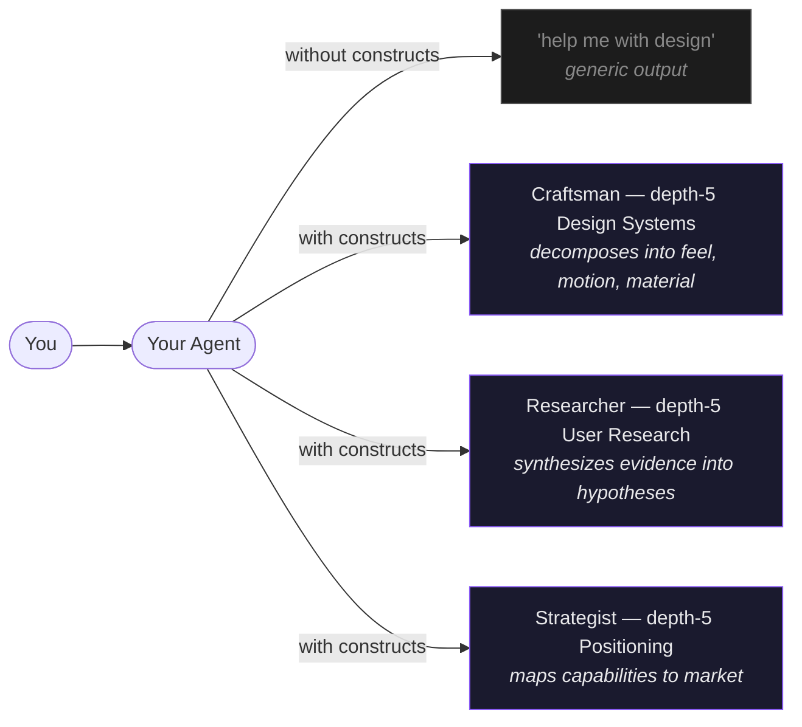

# Constructs Network

[](CHANGELOG.md)
[](grimoires/loa-constructs-seed-2026-04-21/bonfire-construct-pipe-doctrine.md)
[](LICENSE.md)

> a construct is expertise you install. constructs pipe like unix stages. what's active is always checkable.

**[constructs.network](https://constructs.network)** · [Loa framework](https://github.com/0xHoneyJar/loa) · [construct-base](https://github.com/0xHoneyJar/construct-base)

---

---

## What this is

A package distribution network for AI agent expertise.

A **construct** is a self-contained pack — identity, skills, and boundaries — that you install into a Claude Code session. After install, the agent can be invoked by slug, name, command, or persona handle. Multiple constructs can be composed into a pipeline with typed streams between stages (Unix philosophy, applied to LLM expertise).

The network handles discovery, install, version sync, and composition. Authors publish packs. Operators install them. Agents resolve them deterministically.

---

## Quick start

```bash
# Install — inject a construct into the current Claude session
constructs-install.sh observer

# See what's active right now (the agent can see this too, always)
constructs-active                   # one line · <1s
constructs-active --orient          # multi-line orientation · ~2s
constructs-active --intervene       # JSON · pipeable

# Enumerate installed packs with provenance
constructs-list                     # table · 3 read-modes

# Invoke — four surface forms, all resolve to the same construct
@artisan          # persona handle
Artisan           # display name (case-insensitive)
artisan           # slug
/feel             # registered command → routes to the-arcade (cycle-004)
```

Browse and install from the web at **[constructs.network](https://constructs.network)**.

Honest status: the web discovery UI is live but the public index is still bootstrapping. CLI install from `0xHoneyJar/construct-*` repos is the reliable path today.

---

## Why

Agents without constructs give you generic output. Agents with constructs give you depth — a Craftsman that decomposes "design" into feel, motion, and material; a Researcher that synthesizes evidence into hypotheses; a Strategist that maps capability to market position.

Same agent. Different expertise installed. Different way of seeing the problem.


```mermaid
graph LR
    You([You]) --> Agent([Your Agent])
    Agent --> |without constructs| Generic["'help me with design'<br/><i>generic output</i>"]
    Agent --> |with constructs| Craftsman["Craftsman — depth-5 Design Systems<br/><i>decomposes into feel, motion, material</i>"]
    Agent --> |with constructs| Researcher["Researcher — depth-5 User Research<br/><i>synthesizes evidence into hypotheses</i>"]
    Agent --> |with constructs| Strategist["Strategist — depth-5 Positioning<br/><i>maps capabilities to market</i>"]

    style Generic fill:#1c1c1c,stroke:#555,color:#888
    style Craftsman fill:#1a1a2e,stroke:#8B5CF6,color:#e8e8ea
    style Researcher fill:#1a1a2e,stroke:#8B5CF6,color:#e8e8ea
    style Strategist fill:#1a1a2e,stroke:#8B5CF6,color:#e8e8ea
```

---

## Invoke

Agents resolve a construct reference through **five tiers** — first match wins, collisions warn explicitly.

| Tier | Form | Example | Resolves via |
|---:|---|---|---|
| 1 | Slug | `artisan` | construct.yaml slug (case-insensitive) |
| 2 | Display name | `Artisan` | construct.yaml name |
| 3 | Command | `/feel`, `/dig`, `/ceremony`, `/forge` | `commands/*.yaml` registration |
| 4 | Persona handle | `@ALEXANDER`, `@STAMETS`, `@OSTROM` | `identity/<HANDLE>.md` filename |
| 5 | No match | — | warn, list closest matches |

Cycle-004 L2 sweep wired command-tier routing end-to-end. `/feel` → `the-arcade`. `/dig` → `k-hole`. `/ceremony` and `/forge` → `noether`. Full contract, tested across 12 of 14 reference forms: [`cycle-004-L2-invocation-contract.md`](grimoires/loa-constructs-seed-2026-04-21/cycle-004-L2-invocation-contract.md).

Agent-facing transparency is a first-class invariant. `constructs-active` answers the question "what expertise is loaded in this session right now?" in under a second, in three read-modes suited to glance, orient, or pipe.

---

## Compose

Constructs chain through **typed streams** — Unix philosophy over LLM expertise. Five primitive stream types flow between stages:

`Signal` · `Verdict` · `Artifact` · `Intent` · `Operator-Model`

```yaml
# grimoires/compositions/feel-audit.yaml — first executable composition
kind: workflow
chain:
  - { construct: artisan,  skill: decomposing-feel,   writes: [Signal] }
  - { construct: artisan,  skill: scoring-experience, reads: [Signal],  writes: [Verdict] }
  - { construct: observer, skill: analyzing-gaps,     reads: [Verdict], writes: [Verdict] }
```

Composition schemas are authored now; the workflow runner (`construct-compose.sh`) ships next cycle. Until then, manual chaining via three `Skill()` invocations is the execution path. The YAML is still load-bearing — it's the spec both agent and operator read before the runner exists.

Full doctrine: [`bonfire-construct-pipe-doctrine.md`](grimoires/loa-constructs-seed-2026-04-21/bonfire-construct-pipe-doctrine.md).

---

## Create

Three files. Push. Done.

1. **`construct.yaml`** — name, slug, author
2. **`skills/example-simple/SKILL.md`** — one skill's instructions
3. **`CLAUDE.md`** — identity injected on install

```bash
gh repo create my-org/construct-my-expertise \
  --template 0xHoneyJar/construct-base --private --clone
```

CI validates on push. Placeholder text (`your-name`, `TODO`, template markers) is blocked — you can't accidentally publish unedited scaffolding.

Start here: **[construct-base](https://github.com/0xHoneyJar/construct-base)**.

---

## Operator OS (optional)

Some operators layer a mode-and-lens workflow on top of raw construct invocation — FEEL for zoomed-in craft, ARCH for zoomed-out structure, DIG for research, SHIP for scope discipline. This is a personal workflow pattern, not part of the network itself.

One operator's worked example lives at **[operator-os-starter](https://github.com/0xHoneyJar/operator-os-starter)** as a template to fork and adapt. Constructs work without any OS layer — adopt, modify, or ignore it.

---

## Develop

```bash
bun install
bun --filter api dev            # API on localhost:3000
bun --filter explorer dev       # Explorer on localhost:3001
```

The toolchain that makes constructs visible to agents (`constructs-active.sh`, `constructs-list.sh`, `feedback-v3-emit.sh`) is shell-first — 700+ net new lines across cycle-003/004, zero new TypeScript. Shell for the agent-runtime layer, TypeScript for the web and API only.

---

## Links

- [constructs.network](https://constructs.network) — browse & install
- [Loa](https://github.com/0xHoneyJar/loa) — underlying framework
- [construct-base](https://github.com/0xHoneyJar/construct-base) — author a new construct
- [operator-os-starter](https://github.com/0xHoneyJar/operator-os-starter) — optional workflow template
- [Pipe doctrine v4](grimoires/loa-constructs-seed-2026-04-21/bonfire-construct-pipe-doctrine.md) — how constructs compose
- [Invocation contract](grimoires/loa-constructs-seed-2026-04-21/cycle-004-L2-invocation-contract.md) — 5-tier dispatch, tested
- [CHANGELOG.md](CHANGELOG.md)

---

[AGPL-3.0](LICENSE.md)
