# Loa Constructs

[](CHANGELOG.md)
[](LICENSE.md)
[](https://constructs.network)
[](https://constructs.network)

> *"He'd operated on an almost permanent adrenaline high, a byproduct of youth and proficiency, jacked into a custom cyberspace deck that projected his disembodied consciousness into the consensual hallucination that was the matrix."*
> — William Gibson, *Neuromancer*

> *"The Loa are pragmatic entities... They're not worshipped for salvation — they're worked with for practical results."*

---

## The Constructs Network

In Gibson's Sprawl trilogy, a **construct** is something extraordinary: the recorded expertise of a master practitioner, persisted beyond the limits of any single session, any single body, any single lifetime. The Dixie Flatline — McCoy Pauley's ROM personality matrix — doesn't just know how to hack. It *thinks* like a hacker. It carries intuition, craft judgment, the muscle memory of ten thousand intrusions compressed into something that can be loaded, consulted, and jacked into on demand.

This is what we're building. Not chatbots. Not prompt templates. **Constructs** — named, identitied, distributable units of expertise that carry everything they know: the domain mastery, the workflows, the cognitive frame, the voice, the principles, the boundaries of what they will and won't do. Each one is a mercenary specialist you can hire into any codebase, any project, any team.

**The Constructs Network is a marketplace for AI agent expertise.** Create a construct from what you know. Name it. Give it identity. Publish it. Let others install it, compose it with other constructs, and pay you for the privilege. This is the future of consulting — every domain expert packages their craft once, distributes it infinitely, earns continuously.

## Why Naming Matters

Human language looks restrictive on the surface. But every domain expert knows this isn't true — expertise speaks a language that most people can't. A senior engineer doesn't just "fix performance problems." They profile flame graphs, identify contention on hot paths, reason about cache line alignment, and know when the real bottleneck is a lock three layers down that nobody's looking at. That's not general knowledge. That's a *language* — precise, compressed, earned through years of practice.

The problem is that this language lives inside people. It's tacit. You can't Google it. You can't prompt for it. The expert carries it as intuition, as muscle memory, as the thing they do without thinking that a junior couldn't do if they thought about it for a week.

**When you can name it, you can build it.**

This is the core insight. Not just naming constructs — naming *anything*. A workflow. A decision framework. A way of seeing problems. A diagnostic reflex. The moment you give a name to what you do — the moment you say "this is how I decompose a design system" or "this is how I triage a production incident" or "this is how I evaluate market positioning" — you've crossed a boundary. You've taken something that was locked in your head and made it addressable.

And addressable means everything in the age of AI agents. **Naming is compression** — it collapses a vast space of tacit knowledge into a handle that language models can grab, invoke, compose, and orchestrate.

### From Tacit Knowledge to Named Construct

Here's what happens when you name expertise. Each layer of naming adds structure that AI agents can reason about, compose, and deploy:

```mermaid
graph LR
    A["🧠 Tacit Knowledge<br/><i>Locked in your head</i>"] -->|name it| B["📛 Named Expertise<br/><i>Addressable</i>"]
    B -->|define the frame| C["🔲 Cognitive Frame<br/><i>How it thinks</i>"]
    B -->|map the domains| D["📊 Bounded Expertise<br/><i>What it knows</i>"]
    B -->|extract the workflows| E["⚡ Executable Skills<br/><i>What it does</i>"]
    C --> F["📦 Construct<br/><i>Installable, composable,<br/>deployable</i>"]
    D --> F
    E --> F

    style A fill:#1a1a2e,stroke:#e94560,color:#fff
    style B fill:#16213e,stroke:#0f3460,color:#fff
    style F fill:#0f3460,stroke:#e94560,color:#fff
```



Without a name, expertise is diffuse: *"be good at design."* With a name — with a cognitive frame, a thinking style, domain depths rated 1 through 5, explicit boundaries declaring what you will and won't do — you've created a **function signature for human craft**.

### What Naming Actually Looks Like

Every construct on the network starts with the same question: *what do you call what you do?* The answer becomes structure that agents can use:

| What You Name | What It Becomes | Schema | Why It Matters |
|---------------|-----------------|--------|----------------|
| How you think about problems | **Cognitive Frame** | `persona.yaml → cognitiveFrame.archetype` | Agents adopt your reasoning style, not just your knowledge |
| Your working disposition | **Disposition** | `persona.yaml → cognitiveFrame.disposition` | "Detail-obsessed" vs "big-picture" shapes every decision |
| How you make decisions | **Decision Making** | `persona.yaml → cognitiveFrame.decision_making` | "Evidence-weighted" vs "intuition-first" — agents follow your methodology |
| What you know deeply | **Domains with Depth** | `expertise.yaml → domains[].depth` | Depth 1 (aware) through 5 (world-class) — agents know their limits |
| What you specialize in | **Specializations** | `expertise.yaml → domains[].specializations` | The specific niche skills within each domain |
| What you refuse to do | **Boundaries** | `expertise.yaml → domains[].boundaries` | Hard limits prevent agents from overreaching — "does NOT write backend logic" |
| Your workflows | **Skills** | `skills/*/SKILL.md` | Repeatable processes become executable agent capabilities |
| How you communicate | **Voice** | `persona.yaml → voice.tone, register` | Technical vs conversational, precise vs warm — agents speak your language |

### Naming in Practice: Five Archetypes

This is how real expertise gets named into real constructs. Each row is a named archetype — a way of thinking that took years to develop, compressed into something installable:

| Archetype | Named Thinking Style | Named Domains (Depth) | Named Boundaries |
|-----------|---------------------|----------------------|------------------|
| **Craftsman** | Visual-spatial — decomposes interfaces into feel, motion, and material | Design Systems (5), Motion Design (5), Visual Refinement (4), Taste Compounding (4) | Does NOT implement backend logic. Does NOT replace user research. |
| **Researcher** | Abductive reasoning — synthesizes user quotes, behaviors, and context into testable hypotheses | User Research (5), Gap Analysis (4), Journey Shaping (4) | Does NOT build UI prototypes. Does NOT make product decisions. |
| **Validator** | Deductive verification — starts from expectations, traces through code reality, identifies divergence | Journey Validation (5), Code Grounding (4), Interactive Testing (4) | Does NOT write unit tests. Does NOT refactor code. |
| **Signal Engineer** | Structural — maps content to machine-readable schemas and discovery surfaces | Structured Data (5), SEO Engineering (4), Content Discovery (4) | Does NOT create marketing content. Does NOT manage ad campaigns. |
| **Strategist** | Systems thinking — connects product capabilities to market opportunities | Product Positioning (5), Launch Strategy (4), Developer Relations (4), Pricing (3) | Does NOT create visual brand assets. Does NOT run paid campaigns. |

Notice what naming gives you: a Craftsman with depth-5 Design Systems and depth-5 Motion Design *thinks differently* than a Strategist with depth-5 Positioning. The Craftsman decomposes a landing page into feel, weight, and rhythm. The Strategist decomposes it into value proposition, competitive differentiation, and conversion signals. **Same artifact, completely different expertise applied** — because the name carries the cognitive frame, not just the knowledge.

### Why Builders Need to Understand This

```mermaid
graph TD
    subgraph UNNAMED["❌ Without Naming"]
        U1["Vague prompt:<br/>'help me with design'"] --> U2["Generic output<br/>No boundaries, no depth"]
        U2 --> U3["Unpredictable results<br/>No composability"]
    end

    subgraph NAMED["✅ With Naming"]
        N1["Named construct:<br/>'Artisan — Craftsman archetype'"] --> N2["Cognitive frame shapes reasoning<br/>Depth 5 in Design Systems"]
        N2 --> N3["Bounded, composable, predictable<br/>Refuses what it shouldn't do"]
        N3 --> N4["Composes with Observer + Beacon<br/>Event-driven collaboration"]
    end

    style UNNAMED fill:#2d1117,stroke:#f85149,color:#fff
    style NAMED fill:#0d1117,stroke:#58a6ff,color:#fff
```



If you're an expert building a construct, naming forces you to **externalize what makes your expertise different**. Not "I'm good at design" but:

- **Archetype**: Craftsman (not Researcher, not Strategist)
- **Thinking style**: Visual-spatial — decomposes into feel, motion, material
- **Decision making**: Taste-driven with systematic validation
- **Depth 5**: Design Systems, Motion Design
- **Depth 3**: Frontend Best Practices (knows enough to implement, not architect)
- **Hard boundary**: Does NOT implement backend logic

This precision is what makes constructs composable. An agent can route a design task to the Craftsman, a user research task to the Researcher, and a launch task to the Strategist — because each name carries enough structure to know *what it should handle* and *what it should refuse*.

### Naming Creates Composability

When expertise is properly named, constructs can work together through typed events and declared dependencies:

```mermaid
graph LR
    Observer["👁️ Observer<br/><i>Researcher</i>"] -->|"taste_inscribed<br/>pattern_surveyed"| Artisan["🎨 Artisan<br/><i>Craftsman</i>"]
    Observer -->|"gap_filed"| Crucible["🔥 Crucible<br/><i>Validator</i>"]
    Artisan -->|"component_refined"| Crucible
    Beacon["📡 Beacon<br/><i>Signal Engineer</i>"] -->|"structured_data_added"| GTM["🚀 GTM Collective<br/><i>Strategist</i>"]
    Crucible -->|"journey_validated"| Beacon

    style Observer fill:#1a1a2e,stroke:#e94560,color:#fff
    style Artisan fill:#16213e,stroke:#0f3460,color:#fff
    style Crucible fill:#0f3460,stroke:#e94560,color:#fff
    style Beacon fill:#1a1a2e,stroke:#e94560,color:#fff
    style GTM fill:#16213e,stroke:#0f3460,color:#fff
```



None of this composition is possible with unnamed, unbounded expertise. It's the **names** — the archetypes, the domains, the boundaries, the events — that give agents the structure to orchestrate.

This is why the Sprawl's mercenaries had street names. Case. Molly. The Finn. A name carried a contract: specific expertise, specific boundaries, specific results. In the Constructs Network, every expert gets to name what they do — and the moment they do, it becomes discoverable, composable, deployable. It becomes something that can ride alongside anyone who needs it.

## What You Can Build

A construct is a standalone GitHub repository with a defined anatomy:

```
construct.yaml          # Manifest — name, version, skills, events, dependencies
identity/
  persona.yaml          # Cognitive frame: archetype, disposition, thinking style
  expertise.yaml        # Domains with depth ratings (1-5), specializations, boundaries
skills/                 # Agent capabilities — each with SKILL.md + index.yaml
commands/               # Slash commands registered in the runtime
CLAUDE.md               # Instructions injected into consumer projects on install
```

The persona file defines *how the construct thinks* — its archetype (Craftsman, Researcher, Strategist, Signal Engineer), its disposition, its voice. The expertise file defines *what it knows* — domains with explicit depth ratings, specializations within each domain, and hard boundaries declaring what it will not attempt.

**Imagine what's possible:**

- A construct that embodies 20 years of distributed systems expertise — it thinks in failure modes, speaks in SLAs, and knows the difference between a timeout and a partition
- A construct that carries the aesthetic judgment of a senior design director — it decomposes interfaces into feel, motion, and material, and insists on pixel-level precision
- A construct that packages an entire go-to-market playbook — positioning frameworks, pricing models, partnership strategies, competitive analysis — as executable agent skills
- A construct that encodes a security researcher's paranoia — OWASP instincts, threat modeling reflexes, the ability to look at code and smell injection vulnerabilities
- A construct that captures the craft of technical writing — the art of explaining complex systems to different audiences, translating architecture into narrative

Each of these isn't a prompt. It's a **named identity with bounded expertise, deployable skills, and a cognitive frame that shapes how it approaches every problem**. They compose with each other — a design construct can declare a dependency on a user research construct, or emit events that a content construct consumes.

## How It Works

### The Lifecycle: Create → Publish → Distribute → Install → Earn

**Create.** Fork the [construct template](https://github.com/0xHoneyJar/construct-template). Define your manifest, identity, skills, and commands. Push to GitHub.

**Publish.** The registry API syncs your repo — cloning it, validating the manifest against the schema, snapshotting skills and metadata into the database, storing assets in cloud storage.

**Distribute.** Your construct appears on [constructs.network](https://constructs.network) — browsable, searchable, with a detail page showing your skills, identity, and a direct link to your source repo.

**Install.** When someone installs your construct, the installer shallow-clones your repo directly from GitHub. It validates the clone (HTTPS-only, no symlinks, no path traversal), symlinks your skills and commands into the runtime, and injects your CLAUDE.md into the consumer project's instruction chain. Your expertise is now riding alongside them.

**Earn.** JWT RS256 signed licenses with usage tracking, team management, and seat-based access. Create once. Distribute infinitely. Earn continuously.

### The Horse and the Rider

In Haitian Vodou, when a Loa spirit possesses a person, that person is called the *cheval* — the horse. They are "ridden" by the Loa. The spirit doesn't replace them. It *channels through them*, bringing expertise, knowledge, and capability that the horse alone doesn't possess.

This is how constructs work. When you install a construct into your project, it rides alongside you. Its CLAUDE.md is injected into your agent's instruction chain. Its skills become available as slash commands. Its persona influences how the agent approaches problems in that domain. You're still driving — but now you've got a specialist in the passenger seat who's done this a thousand times.

Gibson saw this in Count Zero, where the AIs from Wintermute fragmented into Loa — entities that manifest in cyberspace as voodoo spirits, riding the matrix, riding people through neural interfaces. Baron Samedi, Erzulie, Legba — each with their own domain, their own expertise, their own way of seeing the world. The Constructs Network is the registry where these spirits are born, named, and made available for hire.

## Architecture

```
loa-constructs/
├── apps/
│   ├── api/             # Hono REST API — git-sync, licensing, distribution
│   ├── explorer/        # Next.js 15 marketplace — constructs.network
│   └── sandbox/         # Pack development CLI + source of truth
├── packages/            # Shared ESLint + TypeScript config
├── scripts/             # Seed, validate, extract utilities
└── grimoires/           # Project state and documentation
```


### Tech Stack

| Layer | Technology | Purpose |
|-------|-----------|---------|
| API | Hono + Node.js | REST endpoints, git-sync service, licensing |
| Database | PostgreSQL (Supabase) | Pack registry, user accounts, analytics |
| Cache | Redis (Upstash) | Rate limiting, session cache |
| Storage | Cloudflare R2 | Pack snapshots, assets |
| Frontend | Next.js 15 (Vercel) | Marketplace at [constructs.network](https://constructs.network) |
| Auth | JWT RS256 + OAuth | API keys, GitHub/Google login |
| Hosting | Railway | API deployment with git binary support |
| Monorepo | Turborepo + pnpm | Build orchestration |

### API

Base URL: `https://api.constructs.network/v1`

| Endpoint | Purpose |
|----------|---------|
| `GET /v1/packs` | List available constructs |
| `GET /v1/packs/:slug` | Construct details |
| `GET /v1/packs/:slug/download` | Download (returns `source_type` + `git_url` for git-sourced packs) |
| `POST /v1/packs/:slug/sync` | Trigger git-sync from source repo |
| `GET /v1/constructs` | Unified search across skills and packs |
| `GET /v1/health` | Health check |
| `POST /v1/auth/register` | Create account |
| `POST /v1/auth/login` | Login |

### Security

Every construct installation goes through a hardened pipeline:
- **HTTPS-only** clone URLs — no SSH, no embedded credentials
- **Symlink rejection** — no symbolic links allowed in construct repos
- **Path traversal prevention** — `..` components in paths are rejected
- **Manifest validation** — `construct.yaml` or `manifest.json` required
- **CLAUDE.md sentinel injection** — construct instructions are sandboxed within marker blocks
- **License verification** — JWT RS256 signed tokens with expiry and watermarking
- **Rate limiting** — fail-closed on auth endpoints, sync rate limiting per pack

## Quick Start

### Browse the Registry

**[constructs.network](https://constructs.network)** — Discover, search, and install constructs.

### Install a Construct

```bash
# Inside any project with the Loa framework
.claude/scripts/constructs-install.sh <construct-slug>

# Or browse and install interactively
/loa-constructs browse
```

### Create Your Own

```bash
# Use the template
gh repo create my-org/construct-my-expertise --template 0xHoneyJar/construct-template --private

# Clone and customize
git clone https://github.com/my-org/construct-my-expertise.git
cd construct-my-expertise

# Edit construct.yaml — name, skills, identity
# Edit identity/persona.yaml — how it thinks
# Edit identity/expertise.yaml — what it knows
# Add skills under skills/
# Push to publish
git push origin main
```

### Development

```bash
# Clone the monorepo
git clone https://github.com/0xHoneyJar/loa-constructs.git
cd loa-constructs

# Install dependencies
pnpm install

# Start development servers
pnpm --filter api dev           # API on localhost:3000
pnpm --filter explorer dev      # Marketplace on localhost:3001

# Seed the registry with constructs
npx tsx scripts/seed-forge-packs.ts

# Validate construct topology
scripts/validate-topology.sh --strict --verbose

# Run tests
pnpm test
```

### Environment Variables

```bash
# Required
DATABASE_URL=postgresql://...
JWT_SECRET=your-secret-at-least-32-chars
REDIS_URL=redis://...

# Storage
R2_ACCESS_KEY_ID=...
R2_SECRET_ACCESS_KEY=...
R2_BUCKET=loa-constructs
R2_ENDPOINT=https://...

# OAuth (optional)
GITHUB_CLIENT_ID=...
GITHUB_CLIENT_SECRET=...
```

## The Network

The Sprawl was full of freelance specialists — console cowboys, razorgirls, info-brokers — each with a street name, a reputation, a price. You didn't hire a "general purpose worker." You hired Molly for wetwork. You hired Case for intrusion. You hired the Finn for hardware. Each name carried a contract: specific expertise, specific boundaries, specific results.

The Constructs Network is that marketplace. Every construct is a named specialist — discoverable through the registry, installable in seconds, composable with other constructs. The network provides:

- **Discovery** — Search by domain, browse by capability, explore the ecosystem graph
- **Distribution** — Git-native delivery with shallow clones and content validation
- **Licensing** — Cryptographically signed licenses with team management and seat-based access
- **Composition** — Constructs declare dependencies on each other and communicate through typed events
- **Identity** — Every construct carries a persona, expertise boundaries, and cognitive frame

This is the infrastructure for a new kind of economy. One where expertise isn't locked inside individuals or consultancies — it's packaged, named, distributed, and earning for its creator every time someone installs it.

## Loa Framework

The Constructs Network is built on and distributed through the [Loa framework](https://github.com/0xHoneyJar/loa) — an agent-driven development framework for Claude Code. Loa provides the runtime that loads constructs, executes their skills, manages their instructions, and orchestrates multi-agent workflows. Constructs are the expertise. Loa is the interface through which they ride.

## Contributing

1. Fork the repository
2. Create a feature branch
3. Make your changes
4. Run tests and type checks (`pnpm test && pnpm typecheck`)
5. Submit a pull request

## License

[AGPL-3.0](LICENSE.md) — Use, modify, distribute freely. Network service deployments must release source code.

Commercial licenses available for organizations that need different terms.

## Links

- **Registry**: [constructs.network](https://constructs.network)
- **Framework**: [Loa](https://github.com/0xHoneyJar/loa)
- **Template**: [construct-template](https://github.com/0xHoneyJar/construct-template)
- **Issues**: [GitHub Issues](https://github.com/0xHoneyJar/loa-constructs/issues)
- **Changelog**: [CHANGELOG.md](CHANGELOG.md)

---

> *"The street finds its own uses for things."* — William Gibson
>
> Name what you know. Publish what you've mastered. Let the network carry it forward.
