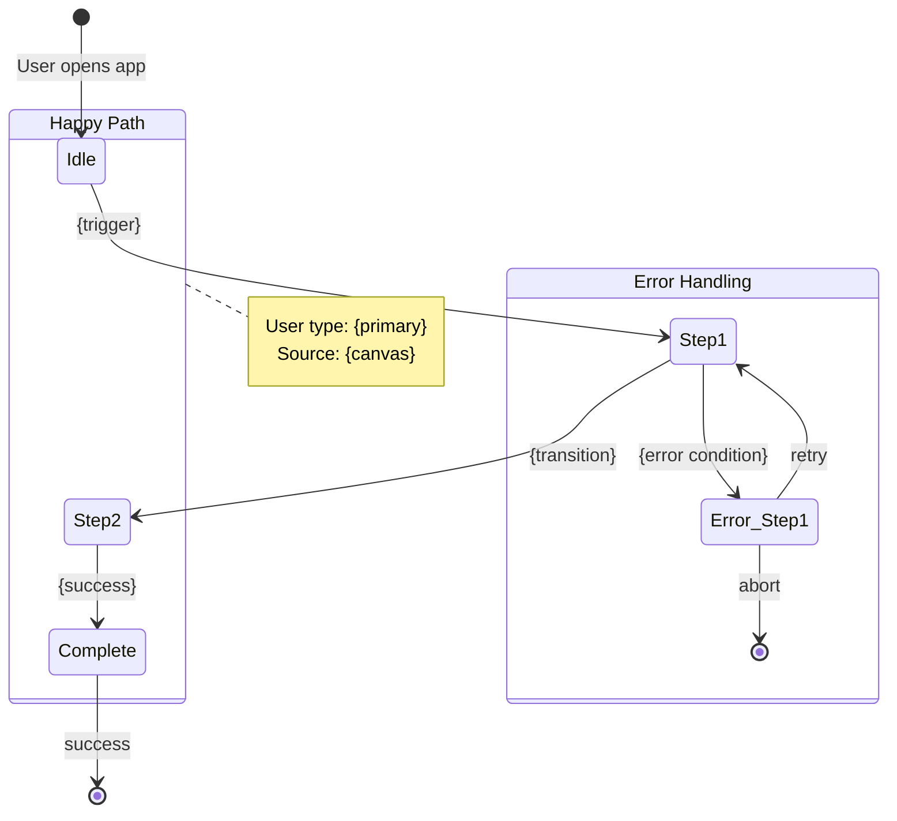
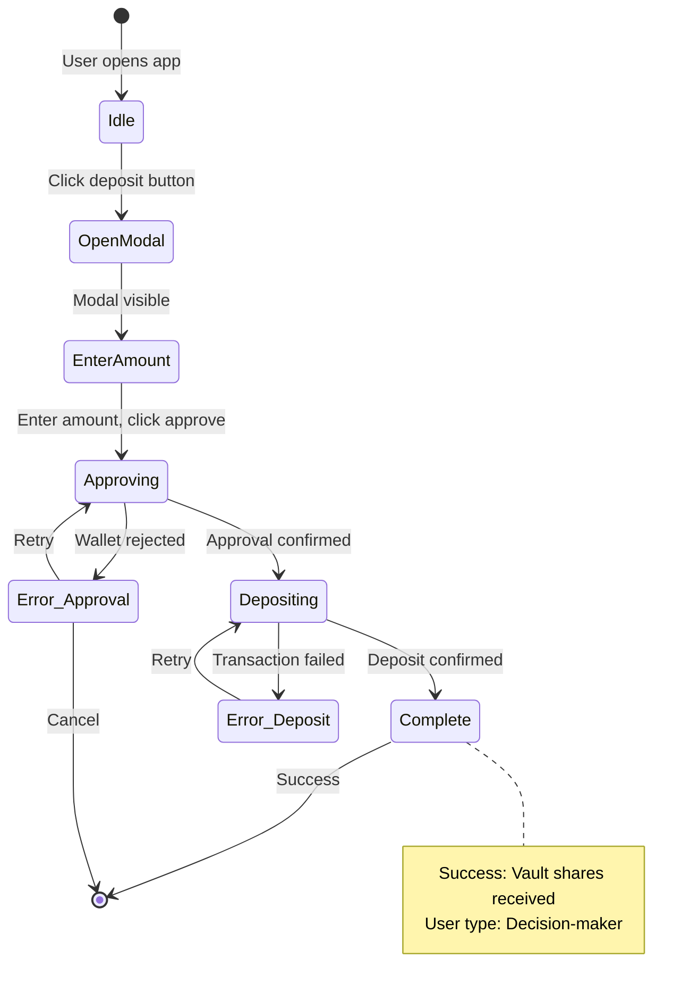
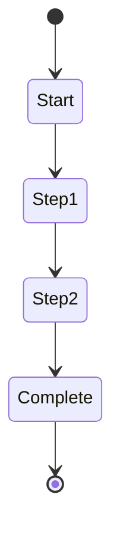
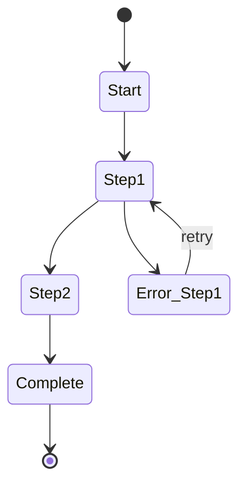
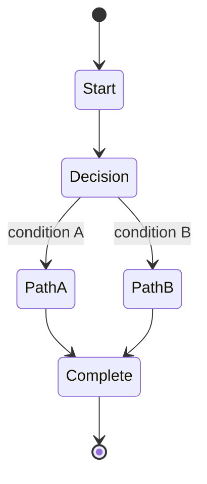
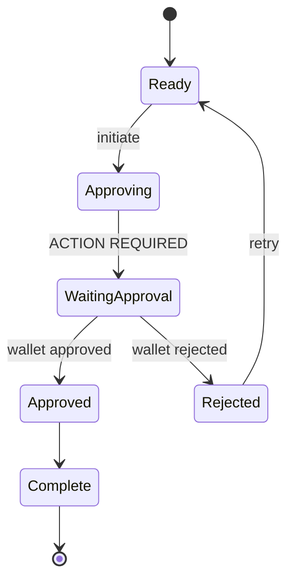

# Diagramming States

Generate Mermaid stateDiagram-v2 diagrams from journey definitions with state-to-selector mapping for Playwright testing.

---

## Trigger

```
/diagram {journey-id}
/diagram {journey-id} --render         # Also invoke beautiful-mermaid for SVG/PNG
/diagram {journey-id} --with-reality   # Generate dual diagram (User Expects vs Code Does)
/diagram {journey-id} --with-reality --render  # Dual diagram + render to SVG/PNG
```

**Examples:**
```bash
/diagram deposit-flow
/diagram rewards-display --render
/diagram reward-understanding --with-reality
/diagram reward-understanding --with-reality --render
```

---

## Workflow

### Step 1: Load Journey

Read journey file:
```bash
grimoires/observer/journeys/{journey-id}.md
```

Parse:
- YAML frontmatter (id, title, status, source_canvases)
- Steps section (trigger, action, expected, errors)
- Success condition
- Known gaps

### Step 2: Extract State Machine Components

**From Journey Steps:**

| Journey Element | State Machine Element |
|-----------------|----------------------|
| Step trigger | Transition trigger |
| Step action | State entry action |
| Step expected | State assertion |
| Potential errors | Error state branches |
| Success condition | Final state |

**State Naming Convention:**
- PascalCase for state names
- Descriptive action-based names
- Error states prefixed with `Error_`

### Step 3: Generate Mermaid Diagram

**Diagram Structure:**


**Conversion Rules:**

1. **Entry State**: `[*] --> Idle`
2. **Steps to States**: Each journey step becomes a state
3. **Triggers to Transitions**: Step triggers become transition labels
4. **Errors to Branches**: Known gaps create error state branches
5. **Success to Final**: Success condition reaches `[*]`

### Step 4: Generate State Mapping Table

Create selector mapping for each state:

```markdown
## State Mapping

| State | Element | Selector | Assertion |
|-------|---------|----------|-----------|
| Idle | Deposit Button | `[data-testid="deposit-button"]` | `toBeVisible()` |
| EnterAmount | Amount Input | `[data-testid="amount-input"]` | `toBeVisible()` |
| Approving | Approve Button | `[data-testid="approve-button"]` | `toBeEnabled()` |
| Depositing | Confirm Button | `[data-testid="confirm-button"]` | `toBeEnabled()` |
| Complete | Success Message | `[data-testid="success-message"]` | `toContainText("Success")` |
| Error_Approval | Error Message | `[data-testid="error-message"]` | `toBeVisible()` |
```

**Selector Inference:**
- Use existing `data-testid` if known
- Suggest semantic testid based on state name
- Flag for manual verification

### Step 5: Write Diagram File

Create/update `grimoires/crucible/diagrams/{journey-id}-diagram.md`:

```markdown
---
type: state-diagram
journey: {journey-id}
version: 1
source_journey: grimoires/observer/journeys/{journey-id}.md
linked_test: null
created: {timestamp}
last_validated: null
---

# {Journey Title} - State Diagram

## State Machine



---

## State Mapping

| State | Element | Selector | Assertion | Verified |
|-------|---------|----------|-----------|----------|
| Idle | Deposit Button | `[data-testid="deposit-button"]` | `toBeVisible()` | [ ] |
| OpenModal | Modal | `[data-testid="deposit-modal"]` | `toBeVisible()` | [ ] |
| EnterAmount | Amount Input | `[data-testid="amount-input"]` | `toBeVisible()` | [ ] |
| Approving | Approve Button | `[data-testid="approve-button"]` | `toBeEnabled()` | [ ] |
| Depositing | Confirm Button | `[data-testid="confirm-deposit"]` | `toBeEnabled()` | [ ] |
| Complete | Success Message | `[data-testid="deposit-success"]` | `toContainText()` | [ ] |
| Error_Approval | Error Alert | `[data-testid="error-alert"]` | `toBeVisible()` | [ ] |

---

## Wallet Interactions

These states require manual wallet interaction:

| State | Interaction | Notes |
|-------|-------------|-------|
| Approving | Token approval | First-time only |
| Depositing | Transaction sign | Every deposit |

---

## Source Journey

- **Journey**: grimoires/observer/journeys/{journey-id}.md
- **Canvases**: {source_canvases}
- **User Types**: {user_types}

---

## Validation Checklist

- [ ] All states reachable
- [ ] Error states have recovery paths
- [ ] Selectors verified in codebase
- [ ] Wallet interactions marked
```

### Step 6: Update Laboratory State

Update `grimoires/crucible/state.yaml`:
```yaml
active:
  phase: mapping
  journey: {journey-id}

journeys:
  {journey-id}:
    status: validated  # Upgrade from draft
    diagram_version: 1
```

### Step 7: Invoke beautiful-mermaid (Optional)

If `--render` flag provided:
```
/beautiful-mermaid grimoires/crucible/diagrams/{journey-id}-diagram.md
```

This generates SVG/PNG in the same directory.

### Step 8: Report Output

```
✓ Diagram created: grimoires/crucible/diagrams/{journey-id}-diagram.md

State Machine Summary:
  - States: 7 (5 happy path, 2 error)
  - Transitions: 10
  - Wallet Interactions: 2

State Mapping:
  - 7 selectors suggested
  - 0 verified (run tests to verify)

Next Steps:
  - Verify selectors in codebase
  - Generate test: /validate {journey-id}
  - Render diagram: /diagram {journey-id} --render
```

---

## State Diagram Patterns

### Happy Path



### With Error Handling



### With Choice State



### With Wallet Interaction



---

## Selector Conventions

**Preferred Patterns:**
```typescript
// Component-based
[data-testid="{component}-{element}"]

// Examples
[data-testid="deposit-modal"]
[data-testid="deposit-amount-input"]
[data-testid="deposit-confirm-button"]
[data-testid="deposit-success-message"]
```

**Assertion Patterns:**
```typescript
expect(locator).toBeVisible()       // Element exists and visible
expect(locator).toBeEnabled()       // Button clickable
expect(locator).toContainText(x)    // Text content
expect(locator).toHaveValue(x)      // Input value
expect(locator).toHaveClass(x)      // CSS class present
```

---

## Error Handling

| Error | Resolution |
|-------|------------|
| Journey not found | Suggest /shape --run |
| No steps in journey | Suggest adding steps manually |
| Diagram already exists | Increment version, preserve old |

---

## Integration Points

- **shaping-journeys**: Journeys as input
- **validating-journeys**: Diagrams as input for test generation
- **beautiful-mermaid**: SVG/PNG rendering
- **Laboratory state**: Updates journey status

---

## Dual Diagram Mode (`--with-reality`)

When the `--with-reality` flag is provided, generate a side-by-side diagram showing User Expectations vs Code Reality.

### Step D1: Load Reality File

Find the linked reality file from:
1. Journey's `reality_file` frontmatter field
2. `grimoires/crucible/state.yaml` → `reality` section → journey link
3. Prompt user if not found

Parse reality file for:
- States table (State, Line, Trigger, UI Feedback)
- State machine mermaid diagram
- Error handling section

### Step D2: Load Gap Report (if exists)

Check for gap report at:
```bash
grimoires/crucible/gaps/{journey-id}-gaps.md
```

Parse for:
- Open gaps with Gap ID, Type, Severity
- Resolution status

### Step D3: Generate Dual Mermaid Diagram

Create side-by-side state machines:

```mermaid
stateDiagram-v2
    direction LR

    state "👤 User Expects" as user {
        [*] --> User_Notice: Notice tokens
        User_Notice --> User_Seek: Look for explanation
        User_Seek --> User_Verify: Check documentation
        User_Verify --> User_Understand: Find answer
        User_Understand --> [*]
    }

    state "💻 Code Does" as code {
        [*] --> Code_Idle: Initial state
        Code_Idle --> Code_Step1: executeDepositFlow()
        Code_Step1 --> Code_Step2: approval confirmed
        Code_Step2 --> Code_Step3: deposit confirmed
        Code_Step3 --> Code_Step4: shares approved
        Code_Step4 --> Code_Complete: stake confirmed
        Code_Complete --> [*]
    }

    note right of User_Seek
        ⚠️ GAP-3: User expects step context
        Code shows only step title
        Severity: Medium
    end note

    note right of Code_Idle
        ⚠️ GAP-4: User expects APY info
        Code has prop but no data
        Severity: High
    end note
```



**Dual Diagram Rules:**

1. **User Expects Side** (👤):
   - States derived from journey steps
   - State names prefixed with `User_`
   - Labels reflect user mental model
   - Based on user quotes and expectations

2. **Code Does Side** (💻):
   - States derived from reality file
   - State names prefixed with `Code_`
   - Labels reflect actual implementation
   - Based on code analysis

3. **Gap Annotations**:
   - Add `note` for each open gap
   - Include Gap ID, brief description, severity
   - Position note near relevant state

4. **Visual Indicators**:
   - ⚠️ for High/Critical gaps
   - 📋 for Medium gaps
   - 💡 for Low gaps / suggestions

### Step D4: Generate Gap Mapping Table

Create a mapping between user expectations and code reality:

```markdown
## Gap Mapping

| User Expects | Code Does | Gap ID | Status |
|--------------|-----------|--------|--------|
| See source attribution | Shows amount only | GAP-1 | RESOLVED |
| Understand each step | Shows step title only | GAP-3 | OPEN |
| See APY before deposit | Prop exists, no data | GAP-4 | OPEN |
```

### Step D5: Write Dual Diagram File

Create `grimoires/crucible/diagrams/{journey-id}-dual.md`:

```markdown
---
type: dual-diagram
journey: {journey-id}
version: 1
source_journey: grimoires/observer/journeys/{journey-id}.md
source_reality: grimoires/crucible/reality/{component}-reality.md
gap_report: grimoires/crucible/gaps/{journey-id}-gaps.md
created: {timestamp}
open_gaps: {count}
resolved_gaps: {count}
---

# {Journey Title} - User Truth × Code Reality

## Overview

This diagram compares user expectations (from journey synthesis) with code reality (from code extraction) to visualize gaps.

**Journey**: {journey-id}
**Reality Source**: {component}
**Open Gaps**: {count}
**Resolved Gaps**: {count}

---

## Dual State Machine

```mermaid
{dual diagram here}
```

---

## Gap Mapping

| User Expects | Code Does | Gap ID | Severity | Status |
|--------------|-----------|--------|----------|--------|
{gap mapping rows}

---

## User Expects (Detail)

{Extracted from journey steps with quotes}

---

## Code Does (Detail)

{Extracted from reality file with line references}

---

## Open Gaps Summary

{List of open gaps with recommended actions}

---

## Source Artifacts

- **Journey**: {journey path}
- **Reality**: {reality path}
- **Gap Report**: {gap report path}
- **Source Canvases**: {canvas list}
```

### Step D6: Update Laboratory State

Update `grimoires/crucible/state.yaml`:
```yaml
journeys:
  {journey-id}:
    dual_diagram: grimoires/crucible/diagrams/{journey-id}-dual.md
    dual_diagram_version: 1
```

### Step D7: Report Output (Dual Mode)

```
✓ Dual diagram created: grimoires/crucible/diagrams/{journey-id}-dual.md

User Truth × Code Reality Summary:
  - User Expects: {n} states
  - Code Does: {m} states
  - Open Gaps: {k}
  - Resolved Gaps: {r}

Gap Annotations:
  - ⚠️ GAP-4: APY not calculated (High)
  - 📋 GAP-3: Transaction lacks context (Medium)

Next Steps:
  - Review dual diagram visualization
  - Address open gaps: /file-gap {journey-id} {gap-id}
  - Render: /diagram {journey-id} --with-reality --render
```

---

## Related

- `/shape` - Create journeys from canvases
- `/validate` - Generate tests from diagrams
- `/beautiful-mermaid` - Render Mermaid diagrams
- `/ground` - Extract code reality for comparison
- `/analyze-gap` - Generate gap analysis for annotations
