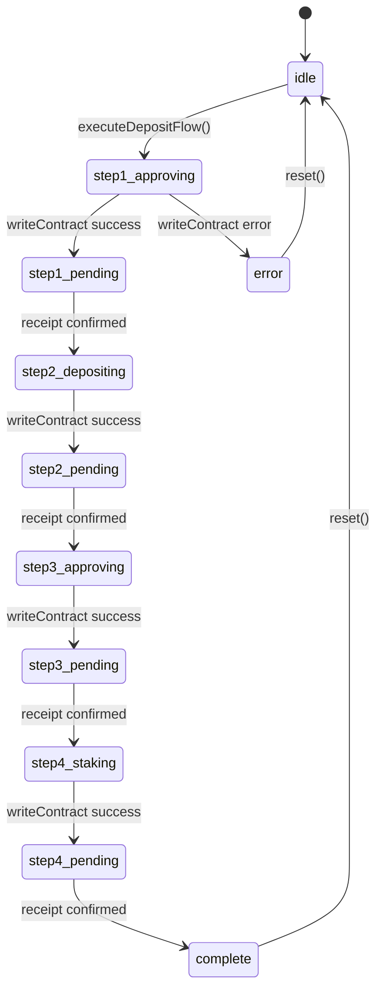

# Grounding Code

Extract actual code behavior from components, hooks, or flows. Create structured reality files that document states, transitions, UI feedback, and error handling with file:line evidence.

---

## Trigger

```
/ground {component}
/ground {path/to/hook.ts}
/ground {component} --journey {journey-id}
/ground {component} --deep
```

**Examples:**
```bash
/ground use-recipe-deposit-flow
/ground apps/web/lib/hooks/use-recipe-deposit-flow.ts
/ground use-recipe-withdraw-flow --journey reward-understanding
```

---

## Arguments

| Argument | Required | Description |
|----------|----------|-------------|
| `component` | Yes | Component name, hook name, or file path |
| `--journey {id}` | No | Link to specific journey for gap pre-population |
| `--deep` | No | Follow all imports and dependencies |

---

## Workflow

### Phase 1: Identify Target

1. Parse component identifier from input
2. Search codebase for matching file(s):
   - Hook pattern: `**/use-{component}*.ts`
   - Component pattern: `**/{component}*.tsx`
   - Direct path: Use provided path if it's a file path
3. If multiple matches, list and prompt for selection
4. Read the source file(s)

### Phase 2: Extract State Definitions

Search for state patterns in the code:

**React State Patterns:**
```typescript
// useState - look for state variable declarations
const [currentStep, setCurrentStep] = useState<...>(...)  // initial value
const [error, setError] = useState<...>(null)
const [isComplete, setIsComplete] = useState(false)

// useReducer - look for reducer definitions
const [state, dispatch] = useReducer(reducer, initialState)

// Step/Status variables
type DepositStep = 1 | 2 | 3 | 4
type Status = 'idle' | 'pending' | 'complete' | 'error'
```

**State Machine Patterns:**
```typescript
// XState or similar
const machine = createMachine({
  initial: 'idle',
  states: { idle: {}, loading: {}, ... }
})
```

Record for each state:
- State name
- Initial value
- Type definition (if available)
- Line number

### Phase 3: Map State Transitions

Identify how states change:

**Transition Triggers:**
```typescript
// Direct state setters
setCurrentStep(2)
setError('message')
setIsComplete(true)

// Effect-based transitions
useEffect(() => {
  if (condition) setCurrentStep(next)
}, [deps])

// Async transitions
try {
  await writeContract(...)
  setCurrentStep(next)
} catch (err) {
  setError(err)
}
```

Record for each transition:
- Source state
- Trigger (what causes the transition)
- Target state
- Line number
- Any guards/conditions

### Phase 4: Identify UI Feedback

Extract user-facing messages and indicators:

**Status Messages:**
```typescript
// Text content in components
<Text>Approve in wallet...</Text>
<Text>Confirming on chain...</Text>

// Status message mappings
const statusMessages = {
  step1_approving: "Approve in wallet...",
  step1_pending: "Confirming on chain...",
}

// Conditional rendering
{isPending && <Spinner />}
{error && <ErrorMessage>{error}</ErrorMessage>}
```

Record for each feedback:
- State it appears in
- Message or indicator type
- Component/line where rendered

### Phase 5: Catalog Error Handling

Document error states and recovery:

**Error Patterns:**
```typescript
// try/catch blocks
try {
  await operation()
} catch (err) {
  setError(formatError(err))
  setRetryableStep(n)
}

// Error state checks
if (step1Receipt?.status === "reverted") {
  setError("Transaction reverted")
  setRetryableStep(1)
}

// Error boundaries (in components)
<ErrorBoundary fallback={...}>
```

Record for each error:
- Error type/condition
- Error handling action
- Recovery mechanism (retry, reset, etc.)
- Line number

### Phase 6: Build State Machine Diagram

Convert extracted information to mermaid stateDiagram-v2:



### Phase 7: Write Reality File

Create output file at `grimoires/crucible/reality/{component}-reality.md`:

```yaml
---
type: code-reality
component: "{component-name}"
extracted: "{ISO-8601 timestamp}"
source_files:
  - "{path/to/file.ts}"
grounded_by: "manual"
linked_journeys: []
---
```

Include all sections:
1. Overview (purpose, entry point)
2. States table (state, line, trigger, UI feedback)
3. State Machine diagram (mermaid)
4. UI Feedback table (state, message, source)
5. Error Handling table (error type, handling, line, recovery)
6. Missing/Gaps section (empty, for later analysis)
7. Source Evidence table (claim, code snippet, file:line)

### Phase 8: Update Laboratory State

1. Update `grimoires/crucible/state.yaml`:
   ```yaml
   reality_files:
     directory: grimoires/crucible/reality/
     count: {n+1}
     last_extraction: "{timestamp}"

   # Add to reality registry
   reality:
     {component}:
       file: grimoires/crucible/reality/{component}-reality.md
       extracted: "{timestamp}"
       source_files: [...]
       linked_journeys: [...]
   ```

2. If `--journey {id}` provided:
   - Link reality file to journey
   - Update journey metadata with reality reference

---

## Output

```
Code Reality Extracted

Component: {component}
Source: {file path}
States: {count}
Transitions: {count}
Errors Handled: {count}

Reality file: grimoires/crucible/reality/{component}-reality.md

State Machine:
  [*] → idle → step1 → step2 → ... → complete

Next Steps:
  - Compare with journey: /analyze-gap {journey-id}
  - View in diagram: /diagram {journey-id} --with-reality
```

---

## Extraction Patterns Reference

### Hook State Patterns

```typescript
// Pattern: useState with type
const [currentStep, setCurrentStep] = useState<StepType>(0)
// Extract: state=currentStep, initial=0, type=StepType

// Pattern: useRef for latest value
const amountRef = useRef(amount)
// Note: Not a state, but tracks value across renders

// Pattern: Derived state
const isComplete = currentStep === 4 && receipt?.status === "success"
// Extract: derived state, depends on currentStep and receipt
```

### Transaction Flow Patterns

```typescript
// Pattern: writeContract with receipt wait
const { writeContractAsync } = useWriteContract()
const { data: receipt } = useWaitForTransactionReceipt({ hash })

// States: writing → waiting → confirmed/reverted
```

### Error Handling Patterns

```typescript
// Pattern: Error with retry
setError(formatError(err))
setRetryableStep(stepNumber)
// Recovery: retryStep() function

// Pattern: Error with reset
setError(message)
// Recovery: reset() or clearError()
```

---

## Error Handling

| Error | Resolution |
|-------|------------|
| Component not found | List similar files, suggest alternatives |
| Multiple matches | Display list, prompt for selection |
| No state found | Report minimal extraction, suggest manual review |
| Parse error | Log error, continue with partial extraction |
| Reality file exists | Prompt to overwrite or create versioned copy |

---

## Integration Points

- **riding-codebase**: Uses same code grounding patterns
- **analyzing-gaps**: Reality files feed into gap analysis
- **diagramming-states**: Reality used for dual-sided diagrams
- **walking-through**: Reality provides expected behavior reference

---

## Related

- `/analyze-gap` - Compare reality with user expectations
- `/diagram --with-reality` - Generate dual-sided diagrams
- `/ride` - Full codebase analysis
- `/observe` - Capture user expectations
