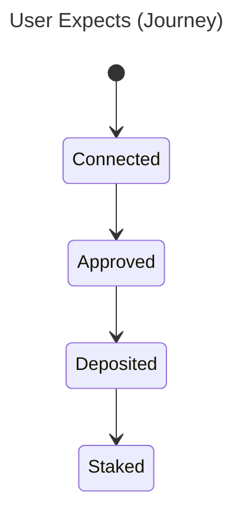
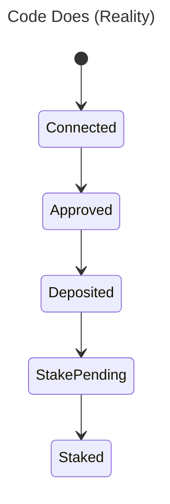

# ⚗️ Sigil of the Crucible (Crucible Pack)

> *"In the crucible, expectations meet reality. Only truth survives."*

Validation and testing skills for **journey verification**. Ground code reality, generate state diagrams, create Playwright tests, and iterate on feedback.

## Skills (5)

| Command | Skill | Phase | Output |
|---------|-------|-------|--------|
| `/ground` | `grounding-code` | Extract | Reality File |
| `/diagram` | `diagramming-states` | Visualize | Mermaid Diagrams |
| `/validate` | `validating-journeys` | Test | Playwright Scripts |
| `/walkthrough` | `walking-through` | Verify | Walkthrough Capture |
| `/iterate` | `iterating-feedback` | Feedback | Updated Artifacts |

---

## Workflow

### Phase 1: Extract (`/ground`)

```
Codebase → State Machine Extraction → Reality File
```

- Extract **state machines** from hooks and components
- Catalog **UI feedback** (loading, error, success states)
- Document **transitions** with `file:line` citations
- Map **error handling paths**

### Phase 2: Visualize (`/diagram`)

```
Reality + Journey → Dual State Diagrams
```

**Dual Diagram Mode**:
- **User Expects**: What the journey says should happen
- **Code Does**: What the reality file shows

Side-by-side comparison reveals gaps.

### Phase 3: Test (`/validate`)

```
State Diagrams → Playwright Test Scripts
```

- Generate **test scenarios** from journey steps
- Infer **selectors** from component names
- Create **error state test cases**
- Map **test coverage** to journey steps

### Phase 4: Verify (`/walkthrough`)

```
Live Application → Interactive Verification
```

**Wallet Presets**:
| Preset | State |
|--------|-------|
| `empty` | No tokens, no history |
| `active` | Has tokens, mid-journey |
| `rewards-ready` | Claimable rewards waiting |

- **Step-by-step prompts** guide verification
- **Screenshot capture** with annotations
- **Gap discovery prompts** surface issues

### Phase 5: Feedback (`/iterate`)

```
Test Results → Updated Upstream Artifacts
```

- Infer **failure root causes**
- Generate **canvas update proposals**
- Suggest **journey step corrections**
- Preserve **high-confidence** findings (won't overwrite)

---

## Installation

```bash
# From your project root
cp -r /path/to/forge/crucible .claude/constructs/packs/crucible
.claude/constructs/packs/crucible/scripts/install.sh .
```

---

## Grimoire Structure

After installation:

```
grimoires/crucible/
├── diagrams/       # Mermaid state diagrams
│   ├── {journey}-expects.md
│   └── {journey}-does.md
├── reality/        # Code reality files
│   └── {feature}.md
├── gaps/           # Gap analysis reports
│   └── {gap-id}.md
├── tests/          # Generated Playwright tests
│   └── {journey}.spec.ts
├── walkthroughs/   # Walkthrough captures
│   └── {date}-{journey}.md
└── results/        # Test results
    └── {run-id}.json
```

---

## Key Features

### Dual Diagram Mode





Gap: User expects direct transition, code has pending state.

### Selector Inference

From component:
```tsx
<Button data-testid="deposit-btn">Deposit</Button>
```

Generated selector:
```typescript
await page.getByTestId('deposit-btn').click();
```

### Confidence Preservation

When `/iterate` updates artifacts:
- ✅ Updates `low` confidence findings
- ⚠️ Flags `medium` confidence for review
- ❌ Never overwrites `high` confidence

---

## Templates

| Template | Purpose |
|----------|---------|
| `reality-template.md` | Code reality extraction structure |
| `gap-template.md` | Gap analysis report format |

---

## Integration with Lens

Crucible consumes Lens outputs:

| Lens Output | Crucible Input |
|-------------|----------------|
| Journey Definition | `/diagram` source |
| Gap Report | `/file-gap` (Lens) |
| UTC | Context for `/ground` |

---

## Requirements

- Claude Code CLI
- Loa Framework with `constructs-loader.sh`
- **Playwright** (for `/validate` command)

```bash
# Install Playwright
npm init playwright@latest
```
