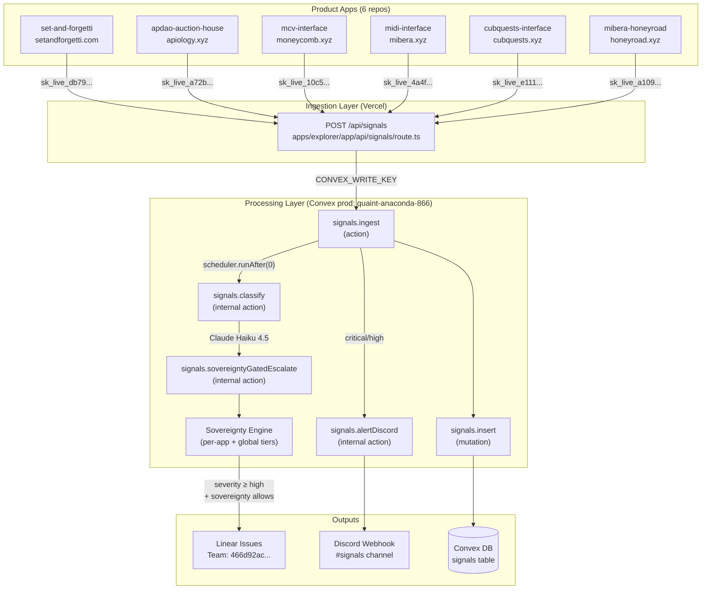
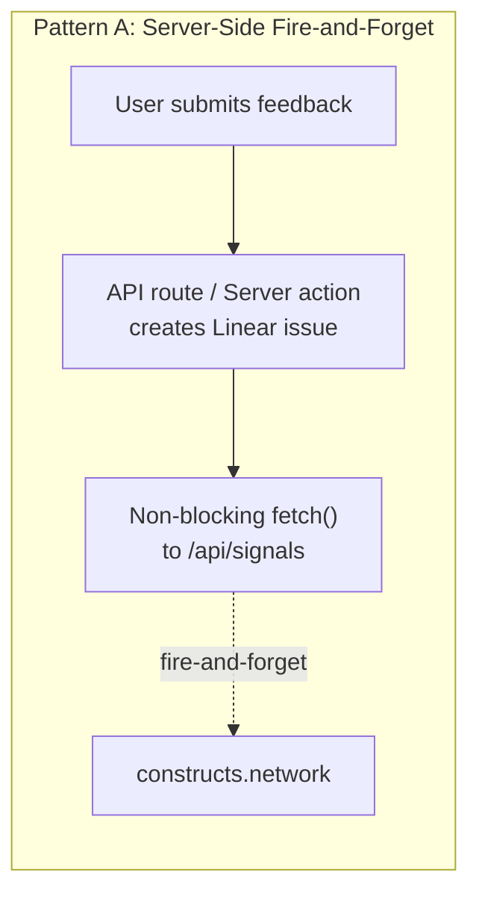
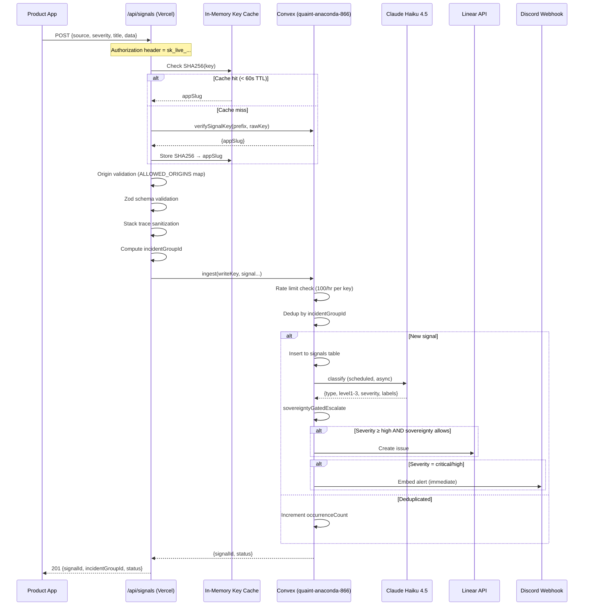
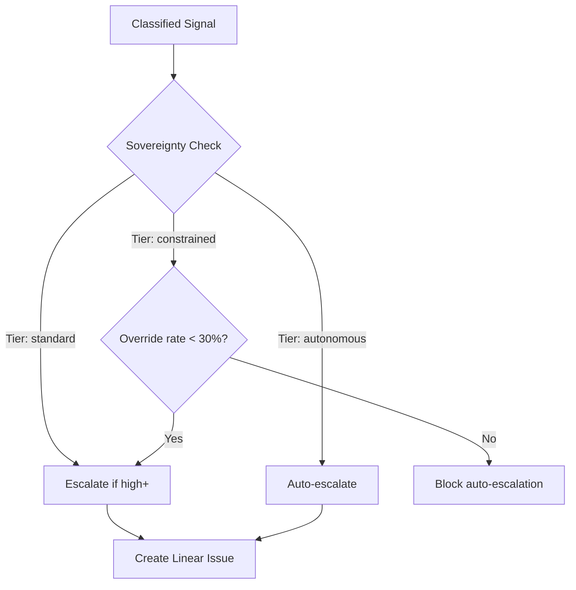

# Ruggy Signal Pipeline — Architecture Reference

> Last updated: 2026-03-13 (cycle-046 deployment closeout)

## Overview

Ruggy is the ecosystem intelligence layer for 0xHoneyJar. It consolidates user feedback and error signals from **6 independent product repos** into a single pipeline hosted on **constructs.network** (the explorer app). Signals are ingested, classified by AI, and routed to Linear/Discord based on severity and sovereignty rules.

## Signal Flow



## Fan-Out Patterns (How Each Repo Sends Signals)

Each repo uses a slightly different integration pattern depending on its stack:



| Repo | Pattern | Integration Point | Env Var | Hosting |
|------|---------|------------------|---------|---------|
| **set-and-forgetti** | Server route | `apps/web/app/api/feedback/route.ts` | `SIGNALS_API_KEY` | Vercel |
| **apdao-auction-house** | Server action | `actions/create-feedback.ts` | `SIGNALS_API_KEY` | Vercel |
| **mcv-interface** | Convex action | `convex/feedback.ts` (scheduled) | `SIGNALS_API_KEY` (Convex env) | Convex |
| **midi-interface** | Server action | `app/actions/feedback.ts` | `SIGNALS_API_KEY` | Vercel |
| **cubquests-interface** | Client widget | `components/feedback-button.tsx` | `NEXT_PUBLIC_SIGNALS_API_KEY` | Vercel |
| **mibera-honeyroad** | Client widget | `components/feedback-button.tsx` | `NEXT_PUBLIC_SIGNALS_API_KEY` | Vercel |

**Key distinction**: Server-side integrations (SAF, APDAO, MCV, MIDI) keep the API key secret. Client-side widgets (CUB, MIBERA) use `NEXT_PUBLIC_` prefix — the key is exposed but origin-validated server-side.

## Ingestion Route Detail

`apps/explorer/app/api/signals/route.ts` (181 lines)



## Classification (Haiku)

The `classify` internal action sends each signal to Claude Haiku 4.5 with app-specific context. Output:

```json
{
  "type": "bug | utc",
  "level1Symptom": "What the user experienced",
  "level2Want": "What the user actually wants",
  "level3Hypothesis": "Root cause hypothesis",
  "severity": "critical | high | medium | low",
  "category": "crash | regression | broken_feature | data_issue | feature_request | ux_friction | performance | confusion | praise",
  "confidence": 0.85,
  "labels": ["wallet", "transaction-flow"]
}
```

Each app has a context snippet (`APP_CONTEXT` map in signals.ts) so Haiku understands the product domain when classifying.

## Sovereignty Engine

Per-app governance layer that controls automatic escalation:



| Tier | Meaning | Escalation Behavior |
|------|---------|-------------------|
| `constrained` | New/untrusted | Auto-escalate critical + high; triage medium/low |
| `standard` | Established | Auto-escalate critical + high |
| `autonomous` | High trust | Auto-escalate all actionable |

Tiers evolve based on override rate (how often humans disagree with AI classification).

## Security Model

| Layer | Mechanism |
|-------|-----------|
| **Auth** | Per-app API keys (`sk_live_*`), hash-validated in Convex (raw key never stored) |
| **Origin** | ALLOWED_ORIGINS map per appSlug (bypassed for server-side callers with no Origin header) |
| **Transport** | CONVEX_WRITE_KEY shared secret between Vercel route and Convex ingest action |
| **Rate Limit** | 100 signals/hr per API key prefix (Convex mutation counter) |
| **Dedup** | incidentGroupId = `appSlug:source:classifier:5minBucket` |
| **Sanitization** | Stack traces stripped of secrets (API keys, JWTs, AWS creds) |
| **Key Cache** | In-memory SHA256 cache (60s TTL, 5K max entries) — reduces Convex round-trips |

## Environment Variables

### Vercel (constructs.network / loa-constructs-explorer)

| Variable | Purpose |
|----------|---------|
| `CONVEX_WRITE_KEY` | Shared secret for Convex ingest auth |
| `NEXT_PUBLIC_CONVEX_URL` | Convex prod endpoint |
| `SIGNALS_API_KEY` | This app's own key (if self-ingesting) |

### Convex (quaint-anaconda-866)

| Variable | Purpose |
|----------|---------|
| `CONVEX_WRITE_KEY` | Must match Vercel's value exactly |
| `ANTHROPIC_API_KEY` | Claude Haiku 4.5 for classification |
| `LINEAR_API_KEY` | Issue creation for escalated signals |
| `LINEAR_TEAM_PRODUCT` | Linear team ID for product issues |
| `LINEAR_TEAM_INFRASTRUCTURE` | Linear team ID for infra issues |
| `DISCORD_SIGNALS_WEBHOOK_URL` | Discord channel for alerts |

### Product Repos

| Repo | Variable | Value Prefix |
|------|----------|-------------|
| set-and-forgetti | `SIGNALS_API_KEY` | `sk_live_db79...` |
| apdao-auction-house | `SIGNALS_API_KEY` | `sk_live_a72b...` |
| mcv-interface | `SIGNALS_API_KEY` (Convex env) | `sk_live_10c5...` |
| midi-interface | `SIGNALS_API_KEY` | `sk_live_4a4f...` |
| cubquests-interface | `NEXT_PUBLIC_SIGNALS_API_KEY` | `sk_live_e111...` |
| mibera-honeyroad | `NEXT_PUBLIC_SIGNALS_API_KEY` | `sk_live_a109...` |

## Key Files

| File | Purpose |
|------|---------|
| `apps/explorer/app/api/signals/route.ts` | HTTP ingestion endpoint (181 lines) |
| `apps/explorer/lib/signals/validation.ts` | Zod schemas, sanitization, dedup ID |
| `apps/explorer/lib/convex/server.ts` | Convex HTTP client factory |
| `apps/explorer/convex/signals.ts` | All Convex functions (ingest, classify, escalate, sovereignty, alerting) |
| `apps/explorer/convex/schema.ts` | Database schema (signals, signalKeys, signalRateLimits, sovereignty tables) |

## What Changed (Before → After)

**Before Ruggy**: Each repo had isolated feedback handling. Some went to Linear directly, some logged to Convex, some had no feedback at all. No cross-repo visibility.

```
[SAF] → Linear (direct)
[APDAO] → Linear (direct)
[MCV] → Convex (local)
[MIDI] → Convex (local)
[CUB] → Nothing
[MIBERA] → Nothing
```

**After Ruggy**: All feedback converges to a single pipeline with AI classification, sovereignty governance, and unified observability.

```
[SAF]    ─┐
[APDAO]  ─┤
[MCV]    ─┤→ constructs.network/api/signals → Convex → Haiku → Linear + Discord
[MIDI]   ─┤
[CUB]    ─┤
[MIBERA] ─┘
```

Repos that already had Linear integration (SAF, APDAO) now **also** fan out to Ruggy after their existing Linear call — additive, not replacing.
