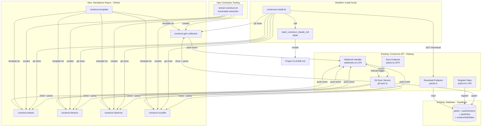
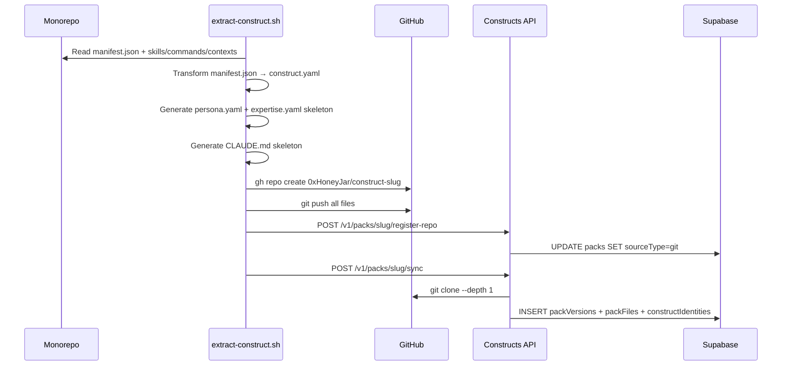
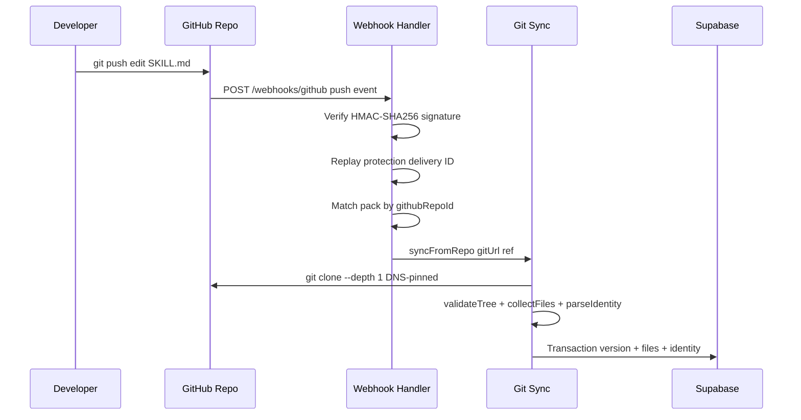
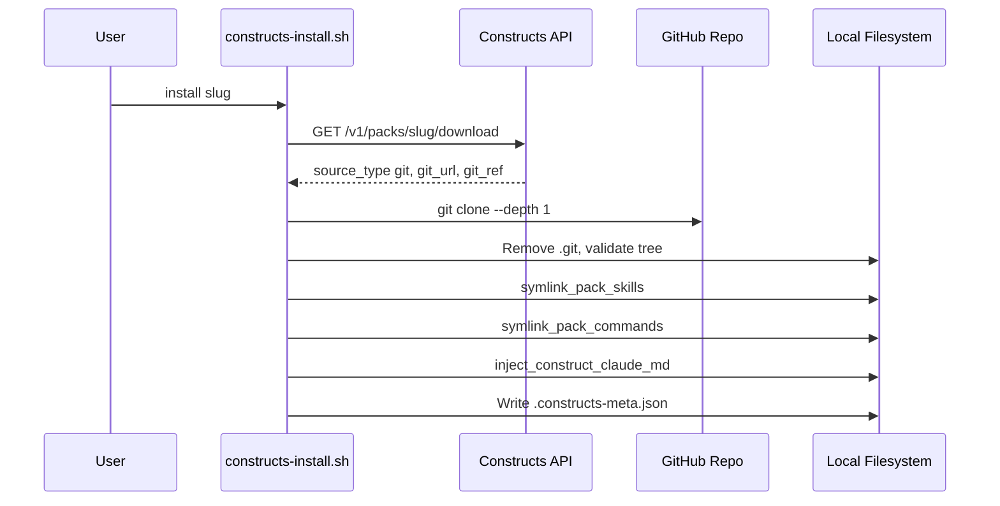
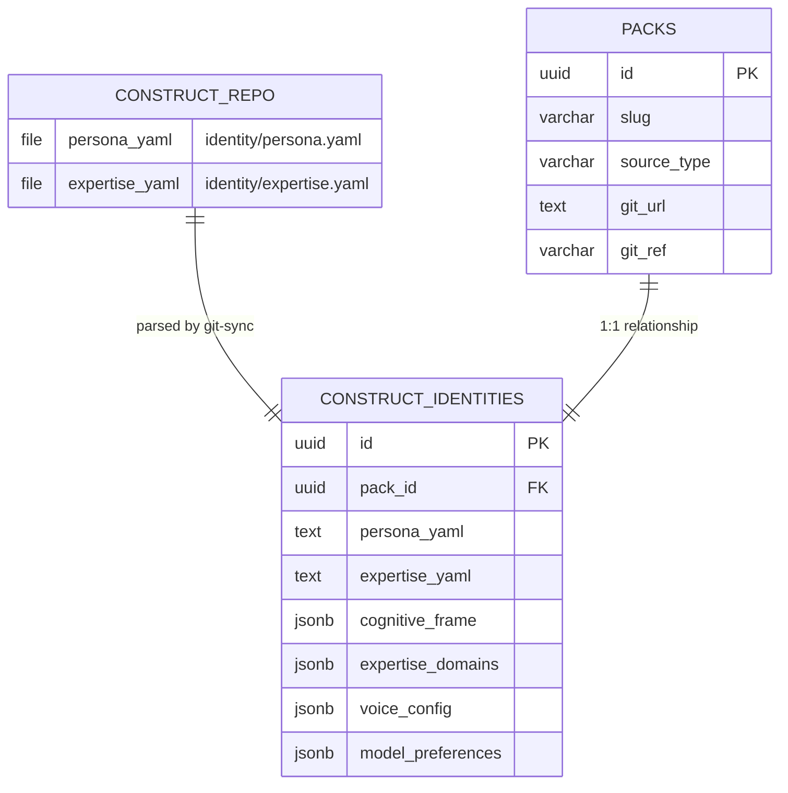

# Software Design Document: Construct Extraction — 5 Expert Repos

**Version:** 1.0
**Date:** 2026-02-17
**Author:** Architecture Designer Agent
**Status:** Draft
**PRD Reference:** grimoires/loa/prd.md
**Cycle:** cycle-016

---

## Table of Contents

1. [Project Architecture](#1-project-architecture)
2. [Software Stack](#2-software-stack)
3. [Database Design](#3-database-design)
4. [UI Design](#4-ui-design)
5. [API Specifications](#5-api-specifications)
6. [Error Handling Strategy](#6-error-handling-strategy)
7. [Testing Strategy](#7-testing-strategy)
8. [Development Phases](#8-development-phases)
9. [Known Risks and Mitigation](#9-known-risks-and-mitigation)
10. [Open Questions](#10-open-questions)
11. [Appendix](#11-appendix)

---

## 1. Project Architecture

### 1.1 System Overview

This project extracts 5 construct packs from the monorepo's `apps/sandbox/packs/` into standalone GitHub repositories under `0xHoneyJar/construct-{slug}`. Each construct becomes a self-contained expert — with identity, skills, CLAUDE.md, and CI — distributed via the existing git-sync infrastructure (PR #121).

The project touches 3 layers:
1. **External artifacts** — 6 new GitHub repos (5 constructs + 1 template)
2. **API changes** — 2 prerequisite changes to `git-sync.ts:collectFiles()`
3. **Install script changes** — New `inject_construct_claude_md()` function
4. **Monorepo cleanup** — Seed script migration, sandbox deletion

> From prd.md: "A construct is an expert, not a file bundle." (prd.md:L26)

### 1.2 Architectural Pattern

**Pattern:** Infrastructure Migration with Automated Extraction

**Justification:** This is not a greenfield system design — the distribution infrastructure (git-sync, webhooks, API endpoints, install script) is already deployed. The architecture is a migration pattern: transform monorepo subfolders into standalone repos, fill identity gaps, wire up CLAUDE.md injection, and remove the source of truth from the monorepo.

### 1.3 Component Diagram



### 1.4 System Components

#### 1.4.1 Extraction Script (`extract-construct.sh`)

- **Purpose:** Automate the creation of standalone construct repos from monorepo pack data
- **Responsibilities:**
  - Transform `manifest.json` → `construct.yaml` using field mapping (prd.md §FR-2.2)
  - Copy skills, commands, contexts, templates, scripts directories
  - Generate skeleton `identity/persona.yaml` and `identity/expertise.yaml`
  - Generate skeleton `CLAUDE.md`
  - Copy `construct.schema.json` for local CI validation
  - Create CI workflow (`validate.yml`)
  - Initialize git repo, create GitHub repo via `gh`, push
  - Register with API (`POST /v1/packs/{slug}/register-repo`)
  - Trigger initial sync (`POST /v1/packs/{slug}/sync`)
- **Interfaces:** CLI with `--slug`, `--dry-run`, `--skip-register` flags
- **Dependencies:** `gh` CLI, `yq`, `jq`, API credentials

#### 1.4.2 Template Repo (`construct-template`)

- **Purpose:** Canonical reference for construct structure — GitHub template repo
- **Responsibilities:**
  - Provide scaffolded `construct.yaml` with inline documentation
  - Include example skill directory structure
  - Provide `identity/persona.yaml` and `identity/expertise.yaml` examples
  - Include `CLAUDE.md` template
  - Ship CI workflow, README, CONTRIBUTING guide
- **Interfaces:** GitHub "Use this template" button
- **Dependencies:** None

#### 1.4.3 CLAUDE.md Injection (`inject_construct_claude_md()`)

- **Purpose:** Auto-import construct's CLAUDE.md into project context on install
- **Responsibilities:**
  - Detect or create sentinel block (`<!-- constructs:begin -->` / `<!-- constructs:end -->`)
  - Append `@` import line within sentinel block
  - Handle missing root CLAUDE.md (create with Loa import if applicable)
  - Idempotent (no duplicate imports)
  - Removal on uninstall
  - Atomic writes (temp file + `mv`)
  - Concurrency safety (lockfile)
  - Fallback to `.claude/constructs/CLAUDE.constructs.md` on failure
- **Interfaces:** Called from `do_install_pack()` and `do_uninstall_pack()`
- **Dependencies:** Root CLAUDE.md (optional), `.constructs-meta.json`

#### 1.4.4 Git Sync Service (Modified)

- **Purpose:** Clone, validate, and collect files from construct repos
- **Modifications Required:**
  1. Add `'templates'` to `ALLOWED_DIRS` array in `collectFiles()` (git-sync.ts)
  2. Add `'CLAUDE.md'` to `ALLOWED_ROOT_FILES` array in `collectFiles()` (git-sync.ts)
- **Interfaces:** `syncFromRepo(gitUrl, gitRef): Promise<SyncResult>` (unchanged)
- **Dependencies:** GitHub HTTPS access

### 1.5 Data Flow

#### Extraction Flow (One-Time)



#### Ongoing Sync Flow (Post-Extraction)



#### Install Flow (Post-Extraction)



### 1.6 External Integrations

| Service | Purpose | API Type | Notes |
|---------|---------|----------|-------|
| GitHub API | Repo creation, webhook config | REST | Via `gh` CLI |
| Constructs API | Register-repo, sync, download | REST | `api.constructs.network` |
| Supabase | PostgreSQL database | SQL (Drizzle ORM) | Pooled connection |
| Cloudflare R2 | File storage | S3-compatible | Fallback to DB content |

### 1.7 Deployment Architecture

No new deployment infrastructure. All changes target:
- **Existing Railway deployment** — API code changes (2 lines in `git-sync.ts`)
- **GitHub** — 6 new repos (5 constructs + 1 template)
- **Local** — Install script changes, extraction script

#### Cutover Coexistence Strategy

During extraction (Sprints 1-3), both monorepo packs and standalone repos exist simultaneously. The system must handle this dual-source period cleanly:

| State | Source of Truth | Install Behavior | Duration |
|-------|----------------|-----------------|----------|
| Pre-extraction | `apps/sandbox/packs/{slug}` via seed script | DB/base64 download | Until Sprint 1 starts |
| During extraction | Standalone repo (post `register-repo`) | Git clone from new repo | Sprints 1-3 (~1-2 weeks) |
| Post-extraction | Standalone repo only | Git clone (base64 fallback) | Permanent |

**Transition atomicity:** Each construct transitions individually via `register-repo`, which atomically sets `sourceType=git` + `gitUrl` + `githubRepoId`. After this call, all new syncs and installs use the standalone repo. There is no partial state — the pack is either DB-sourced or git-sourced.

**In-flight install behavior:** If a user starts an install during the `register-repo` call:
- If install started before `register-repo`: Uses DB/base64 download (old source) — still valid
- If install started after `register-repo`: Uses git clone (new source) — expected behavior
- No race condition: `register-repo` is a single DB `UPDATE` in a transaction

**Acceptance criteria for cutover:**
1. After each `register-repo`, verify next sync uses git clone (not DB)
2. Verify `GET /v1/packs/{slug}/download` returns `source_type: "git"` with `git_url`
3. Verify existing cached installs continue working (no breaking change to installed files)

### 1.8 Security Architecture

All security measures are inherited from the existing git-sync infrastructure:

| Protection | Implementation | Reference |
|-----------|---------------|-----------|
| HTTPS only | `validateGitUrl()` rejects non-HTTPS | git-sync.ts |
| DNS pinning | Local CONNECT proxy pins resolved IP | git-sync.ts |
| SSRF prevention | Private IP range blocking | git-sync.ts |
| No symlinks | `lstat()` check on all files | git-sync.ts |
| No path traversal | Rejects `..`, absolute paths, >255 chars | git-sync.ts |
| Shallow clone | `--depth 1 --single-branch`, 30s timeout | git-sync.ts |
| Webhook HMAC | SHA256 with `timingSafeEqual` | webhooks.ts |
| Replay protection | Delivery ID tracking | webhooks.ts |
| Rate limiting | 10 syncs per pack per hour | packs.ts |

**Webhook + Registration Trust Boundary:**

| Protection | Implementation |
|-----------|---------------|
| Admin-only registration | `POST /v1/packs/:slug/register-repo` requires admin API key (existing auth middleware) |
| githubRepoId binding | Once `githubRepoId` is set via register-repo, webhook handler MUST verify `delivery.repository.id === pack.githubRepoId` before syncing. Prevents repo-swap attacks where a different repo pushes events matching a pack's URL |
| URL immutability | `gitUrl` + `githubRepoId` are set once at registration. Changing requires a new register-repo call (admin-only), which re-validates the URL and fetches a fresh githubRepoId |
| Extraction script auth | Extraction script uses admin API key for register-repo calls; webhook secret is configured via `gh api` with the shared `GITHUB_WEBHOOK_SECRET` |

**New security for CLAUDE.md injection:**

| Protection | Implementation |
|-----------|---------------|
| Atomic writes | Write to temp file + `mv` |
| Concurrency lock | `mkdir`-based `.constructs-inject.lock/` with PID file + 10s timeout + stale lock detection (portable macOS/Linux) |
| No symlink target | Reject if CLAUDE.md is a symlink |
| Sentinel block isolation | Only mutate within `<!-- constructs:begin/end -->` |
| Loa import protection | Never modify content outside sentinel block |
| Import path validation | Validate `@` import paths match expected pattern |

---

## 2. Software Stack

### 2.1 Extraction Tooling

| Category | Technology | Version | Justification |
|----------|------------|---------|---------------|
| Script Language | Bash | 5.x | Consistent with existing install script (`constructs-install.sh`) |
| YAML Processing | `yq` | 4.x | Already a project dependency (`.loa.config.yaml` processing) |
| JSON Processing | `jq` | 1.7+ | Already used in CI scripts |
| GitHub CLI | `gh` | 2.x | Repo creation, webhook config, API calls |
| Git | `git` | 2.x | Repo initialization and push |

### 2.2 Backend (Existing — Minimal Changes)

| Category | Technology | Version | Justification |
|----------|------------|---------|---------------|
| Runtime | Node.js | 20.x LTS | Existing API runtime |
| Framework | Hono | 4.x | Existing API framework |
| ORM | Drizzle | 0.29+ | Existing DB layer |
| Validation | Zod | 3.22+ | Existing schema validation |

### 2.3 CI Per Construct Repo

| Category | Technology | Purpose |
|----------|------------|---------|
| CI Platform | GitHub Actions | Schema validation, structure checks |
| Schema Validation | `ajv-cli` 5.x | Validate `construct.yaml` against `construct.schema.json` |
| YAML Lint | `yamllint` | Validate identity files |
| Shell Lint | `shellcheck` | Lint scripts/ directory |

---

## 3. Database Design

### 3.1 Database Technology

**Primary Database:** PostgreSQL 15.x (Supabase-managed)

**No schema changes required.** All necessary tables exist:

| Table | Purpose | Status |
|-------|---------|--------|
| `packs` | Pack metadata, git source info | Deployed (has `sourceType`, `gitUrl`, `gitRef`, `githubRepoId`) |
| `packVersions` | Version history with manifest JSONB | Deployed |
| `packFiles` | File storage (base64 + R2 keys) | Deployed |
| `constructIdentities` | Identity data (persona, expertise) | Deployed |
| `packSyncEvents` | Rate limiting for sync operations | Deployed |
| `githubWebhookDeliveries` | Replay protection | Deployed |

### 3.2 Existing Schema (Reference)

#### `constructIdentities` Table

```sql
CREATE TABLE construct_identities (
    id UUID PRIMARY KEY DEFAULT gen_random_uuid(),
    pack_id UUID NOT NULL UNIQUE REFERENCES packs(id),
    persona_yaml TEXT,                    -- Raw identity/persona.yaml
    expertise_yaml TEXT,                  -- Raw identity/expertise.yaml
    cognitive_frame JSONB,               -- {archetype, disposition, thinking_style, decision_making}
    expertise_domains JSONB,             -- Array of domain objects
    voice_config JSONB,                  -- Voice preferences from persona
    model_preferences JSONB,             -- Model tier preferences
    created_at TIMESTAMPTZ DEFAULT NOW(),
    updated_at TIMESTAMPTZ DEFAULT NOW()
);
```

### 3.3 Versioning Semantics During Extraction

When a pack transitions from DB-sourced to git-sourced (via `register-repo` + first sync), version history requires careful handling:

| Concern | Rule | Rationale |
|---------|------|-----------|
| Existing `packVersions` rows | **Preserved.** No deletion or migration of pre-extraction versions | Users may have installed older versions; download links must remain valid |
| `is_latest` flag | **Reset by sync.** First git-sync sets its new version as `is_latest = true` and clears the flag on the previous latest | Standard sync behavior — no special extraction logic needed |
| Version string continuity | **Restart from `1.0.0`.** Extracted construct starts at version `1.0.0` in `construct.yaml` | Clean break — monorepo versions were seed-script artifacts, not meaningful semver |
| `packFiles` for old versions | **Retained as base64 in DB.** Old versions' files remain accessible via DB content column | Ensures `GET /download?version=old` still works for users pinned to old versions |
| `constructIdentities` | **Upserted on first sync.** `pack_id` is UNIQUE — first git-sync creates or replaces the identity row | Pre-extraction packs had no identity data (NULL columns), so this is always an insert |
| `packs.sourceType` | **Set to `'git'` by `register-repo`.** Irreversible without another `register-repo` call | Clear signal to all consumers (download, install, Explorer UI) |

**Acceptance criteria:**
1. After first git-sync, `SELECT * FROM pack_versions WHERE pack_id = ? ORDER BY created_at DESC LIMIT 1` returns the new version with `is_latest = true`
2. Old versions remain queryable: `SELECT * FROM pack_versions WHERE pack_id = ? AND version = '0.x.y'` returns rows
3. `constructIdentities` row exists with non-null `cognitive_frame` after first sync

### 3.4 Data Access Patterns

| Query | Frequency | Optimization |
|-------|-----------|--------------|
| `SELECT * FROM packs WHERE slug = ?` | High (every install/sync) | Unique index on `slug` |
| `SELECT * FROM pack_versions WHERE pack_id = ? AND is_latest = true` | High | Partial index on `is_latest` |
| `SELECT * FROM construct_identities WHERE pack_id = ?` | Medium (detail pages, sync) | Unique index on `pack_id` |
| `SELECT COUNT(*) FROM pack_sync_events WHERE pack_id = ? AND created_at > ?` | Medium (rate limit) | Composite index on `(pack_id, created_at)` |

### 3.4 Identity Data Flow



---

## 4. UI Design

### 4.1 Explorer Changes (Minimal)

The only UI change is FR-4.6: display GitHub repo link on construct detail pages when `sourceType === 'git'`.

| Page | Route | Change |
|------|-------|--------|
| Construct Detail | `/constructs/[slug]` | Add "View Source" link to `gitUrl` when `sourceType === 'git'` |

**Component change:** Conditional link in construct detail page:

```tsx
{pack.sourceType === 'git' && pack.gitUrl && (
  <a href={pack.gitUrl.replace('.git', '')} target="_blank" rel="noopener noreferrer">
    View Source on GitHub
  </a>
)}
```

### 4.2 No Other UI Changes

All other UI pages remain unchanged. The construct marketplace, install flow, and search are unaffected by the extraction.

---

## 5. API Specifications

### 5.1 Existing Endpoints (No Changes)

All API endpoints are already deployed and functional:

| Method | Endpoint | Purpose | Status |
|--------|----------|---------|--------|
| POST | `/v1/packs/:slug/register-repo` | Register git repo for a pack | Deployed |
| POST | `/v1/packs/:slug/sync` | Manual sync from git repo | Deployed |
| POST | `/v1/webhooks/github` | Auto-sync on push/tag events | Deployed |
| GET | `/v1/packs/:slug/download` | Download pack files + license | Deployed |

### 5.2 Prerequisite Code Changes (git-sync.ts)

**Change 1: Add `templates` to allowed directories**

```typescript
// git-sync.ts:collectFiles()
// Before:
const ALLOWED_DIRS = ['skills', 'commands', 'contexts', 'identity', 'scripts'];

// After:
const ALLOWED_DIRS = ['skills', 'commands', 'contexts', 'identity', 'scripts', 'templates'];
```

> From prd.md: "Observer and Crucible have `templates/` with canvas, journey, gap, and reality templates. Without this change, sync will silently drop template files" (prd.md:L299)

**Change 2: Add `CLAUDE.md` to allowed root files**

```typescript
// git-sync.ts:collectFiles()
// Before:
const ALLOWED_ROOT_FILES = ['construct.yaml', 'manifest.json', 'README.md', 'LICENSE'];

// After:
const ALLOWED_ROOT_FILES = ['construct.yaml', 'manifest.json', 'README.md', 'LICENSE', 'CLAUDE.md'];
```

> From prd.md: "The entire FR-3 feature depends on CLAUDE.md being present in the synced construct directory" (prd.md:L303)

### 5.3 Verification

After deploying both changes:

```bash
# Trigger sync for a construct with templates/ and CLAUDE.md
curl -X POST "https://api.constructs.network/v1/packs/observer/sync" \
  -H "Authorization: Bearer $API_KEY"

# Response should include files from templates/ and CLAUDE.md at root
```

---

## 6. Error Handling Strategy

### 6.1 Extraction Script Errors

| Error | Detection | Recovery |
|-------|-----------|----------|
| `gh repo create` fails | Non-zero exit code | Print error, skip construct, continue with others |
| `manifest.json` missing/invalid | `jq` parse failure | Halt for that construct, report which fields are missing |
| `yq` transform fails | Non-zero exit code | Print original JSON + error, manual fix needed |
| Git push fails | Non-zero exit code | Retry once, then prompt for manual push |
| Register-repo fails | HTTP non-200 | Print response body, skip (can be retried manually) |
| Sync fails | HTTP non-200 | Print response body, skip (auto-retries on next push) |

### 6.2 CLAUDE.md Injection Errors

| Error | Detection | Recovery |
|-------|-----------|----------|
| Root CLAUDE.md is a symlink | `[ -L CLAUDE.md ]` | Fail with actionable message, no modification |
| Root CLAUDE.md not writable | `[ ! -w CLAUDE.md ]` | Fail with actionable message |
| Sentinel block malformed | Regex check for mismatched markers | Fail with message identifying the problem |
| Lock held >10s | `mkdir`-lock timeout (stale PID detection) | Fail with retry message; remove stale lock if holding PID is dead |
| Any injection failure | Catch-all | Fall back to `.claude/constructs/CLAUDE.constructs.md` |

### 6.3 Error Response Format

All API errors follow the existing format:

```json
{
  "error": {
    "code": "SYNC_RATE_LIMITED",
    "message": "Maximum 10 syncs per hour exceeded"
  }
}
```

---

## 7. Testing Strategy

### 7.1 Per-Construct Verification Checklist

For each of the 5 constructs after extraction:

| # | Check | Command/Method |
|---|-------|----------------|
| 1 | Repo exists | `gh repo view 0xHoneyJar/construct-{slug}` |
| 2 | Schema valid | `ajv validate -s construct.schema.json -d construct.yaml` (CI) |
| 3 | CI passes | GitHub Actions green |
| 4 | Register succeeds | `POST /v1/packs/{slug}/register-repo` returns 200 |
| 5 | Sync succeeds | `POST /v1/packs/{slug}/sync` returns 200 with files + identity |
| 6 | Webhook fires | Push commit, verify sync event in DB |
| 7 | Install works | `constructs-install.sh install {slug}` creates symlinks |
| 8 | CLAUDE.md present | `.claude/constructs/packs/{slug}/CLAUDE.md` exists |
| 9 | Identity parsed | Sync response contains `identity.cognitiveFrame.archetype` |

### 7.2 CLAUDE.md Injection Tests

| # | Scenario | Expected |
|---|----------|----------|
| 1 | No root CLAUDE.md + Loa installed | Create CLAUDE.md with Loa import + sentinel block + construct import |
| 2 | No root CLAUDE.md + no Loa | Create CLAUDE.md with sentinel block + construct import only |
| 3 | Existing CLAUDE.md, no sentinel | Add sentinel block below Loa import, add construct import |
| 4 | Existing sentinel block | Append construct import within block |
| 5 | Second construct install | Both imports present, no duplicates |
| 6 | Re-install same construct | Idempotent, no duplicate lines |
| 7 | Uninstall first construct | First import removed, second remains |
| 8 | CLAUDE.md is symlink | Fail with error, no modification |
| 9 | Concurrent installs | Second install waits for lock, both succeed |
| 10 | Injection failure | Fallback to `.claude/constructs/CLAUDE.constructs.md` |

### 7.3 Dependency Compatibility Matrix

| Config | Test | Expected |
|--------|------|----------|
| Observer alone | Install, run skill | Works, events not delivered (no consumer) |
| Crucible alone | Install, run skill | Works, no errors without Observer |
| Observer + Crucible | Install both, trigger event | Bidirectional events fire |
| All 5 constructs | Install all | No conflicts, all skills available |

### 7.4 Rollback Verification

| # | Check | When |
|---|-------|------|
| 1 | Archive branch exists | Before sandbox deletion |
| 2 | Base64 fallback works | Block git clone, verify fallback download succeeds |
| 3 | Health gate passes | All 5 repos sync + install successfully |
| 4 | 48-hour soak clean | No sync errors, webhook delivery rate stable |

### 7.5 Rollback Runbook

Per-phase rollback steps for partial failure recovery:

| Phase | Failure Scenario | Rollback Steps | Decision Point |
|-------|-----------------|----------------|----------------|
| Sprint 0 (API) | Deployed `ALLOWED_DIRS`/`ALLOWED_ROOT_FILES` breaks existing sync | Revert Railway deployment to previous commit | If any existing pack sync fails after deploy |
| Sprint 1 (Extraction) | `extract-construct.sh` fails mid-way for a construct | Re-run script with same `--slug` (idempotent). If repo created but malformed: `gh repo delete 0xHoneyJar/construct-{slug} --yes`, re-run | If >2 retries fail, check manifest.json manually |
| Sprint 1 (Registration) | `register-repo` succeeds but sync fails | Re-trigger sync via `POST /v1/packs/{slug}/sync`. If DB state is partial: manual `DELETE FROM pack_versions WHERE pack_id = ? AND version = ?` | If identity parse fails, fix persona.yaml first |
| Sprint 1 (Injection) | `inject_construct_claude_md()` corrupts root CLAUDE.md | Restore from `.claude/constructs/CLAUDE.constructs.md` backup. Managed file is the source of truth — re-run injection or instruct user to add single `@` import | If sentinel block is corrupted, user must manually remove malformed markers |
| Sprint 2-3 (Extractions) | Individual construct fails extraction | Same as Sprint 1 — each construct is independent. Other extracted constructs are unaffected | If circular dep issue (Observer/Crucible), extract both with `--skip-register`, fix, then register |
| Sprint 4 (Cleanup) | Sandbox deletion breaks seed script | Restore from `archive/sandbox-packs-pre-extraction` branch: `git checkout archive/sandbox-packs-pre-extraction -- apps/sandbox/packs/` | If seed script still uses sandbox paths after migration |
| Sprint 4 (Soak) | Webhook delivery rate drops or sync errors spike | Re-register webhooks via extraction script `--skip-register` flag inverted. Check GitHub webhook delivery logs at `Settings > Webhooks > Recent Deliveries` | If >5% failure rate after 48h soak |

**Abort criteria:** If 3+ constructs fail extraction and cannot be re-run successfully, abort the cycle and fall back to monorepo packs (no sandbox deletion).

---

## 8. Development Phases

### Sprint 0: Prerequisites

**Focus:** API changes required before extraction begins

| # | Task | Files | Acceptance |
|---|------|-------|------------|
| 0.1 | Add `templates` to `ALLOWED_DIRS` | `apps/api/src/services/git-sync.ts` | Sync response includes `templates/` files |
| 0.2 | Add `CLAUDE.md` to `ALLOWED_ROOT_FILES` | `apps/api/src/services/git-sync.ts` | Sync response includes `CLAUDE.md` |
| 0.3 | Deploy API changes | Railway | Verify via `POST /v1/packs/gtm-collective/sync` |

### Sprint 1: Template + First Extraction + Minimal Injection

**Focus:** FR-1 (template repo) + FR-2 for GTM Collective + FR-3 minimal injection

| # | Task | Output |
|---|------|--------|
| 1.1 | Create `construct-template` repo | GitHub template repo with all scaffolding |
| 1.2 | Write extraction script (`extract-construct.sh`) | Reusable automation script |
| 1.3 | Define formal identity schemas | `persona.schema.yaml`, `expertise.schema.yaml` |
| 1.4 | Implement minimal `inject_construct_claude_md()` (install + idempotent + sentinel + uninstall) | Injection works before first public extraction |
| 1.5 | Extract GTM Collective | `construct-gtm-collective` repo (8 skills, 14 commands) |
| 1.6 | Author GTM Collective identity (skeleton) | `persona.yaml`, `expertise.yaml` |
| 1.7 | Author GTM Collective CLAUDE.md (skeleton) | Expert operating instructions |
| 1.8 | Register + sync + webhook GTM Collective | API integration verified |

> **Rationale**: Injection must ship before the first extraction is public so that installs of extracted constructs immediately activate the expert identity. Deferring injection to Sprint 4 would create a window where constructs ship CLAUDE.md but installs don't import it.

### Sprint 2: Independent Constructs

**Focus:** FR-2 for Artisan + Beacon

| # | Task | Output |
|---|------|--------|
| 2.1 | Extract Artisan | `construct-artisan` repo (14 skills) |
| 2.2 | Author Artisan identity + CLAUDE.md | Identity skeleton + expert instructions |
| 2.3 | Register + sync + webhook Artisan | API integration verified |
| 2.4 | Extract Beacon | `construct-beacon` repo (6 skills, contexts) |
| 2.5 | Author Beacon identity + CLAUDE.md | Identity skeleton + expert instructions |
| 2.6 | Register + sync + webhook Beacon | API integration verified |

### Sprint 3: Dependent Constructs

**Focus:** FR-2 for Observer + Crucible (circular dependency resolution)

| # | Task | Output |
|---|------|--------|
| 3.1 | Extract Observer | `construct-observer` repo (6 skills, contexts, templates) |
| 3.2 | Author Observer identity + CLAUDE.md | Identity skeleton + expert instructions |
| 3.3 | Register + sync + webhook Observer | API integration verified |
| 3.4 | Extract Crucible (change Observer dep to optional) | `construct-crucible` repo (5 skills, contexts) |
| 3.5 | Author Crucible identity + CLAUDE.md | Identity skeleton + expert instructions |
| 3.6 | Register + sync + webhook Crucible | API integration verified |
| 3.7 | Test dependency compatibility matrix | 3 configs per construct pass |

### Sprint 4: Injection Hardening + Cleanup

**Focus:** FR-3 edge cases + FR-4 (monorepo cleanup)

> Note: Minimal injection (install + uninstall + sentinel + managed file) was implemented in Sprint 1. Sprint 4 hardens edge cases and runs full test matrix.

| # | Task | Output |
|---|------|--------|
| 4.1 | Harden injection: concurrent lock, symlink CLAUDE.md detection, malformed sentinel recovery | Edge case coverage |
| 4.2 | Run all CLAUDE.md injection tests (10 scenarios) | Full test matrix pass |
| 4.3 | Migrate seed script (all 5 in `GIT_CONFIGS`) | `scripts/seed-forge-packs.ts` updated |
| 4.4 | Create archive branch | `archive/sandbox-packs-pre-extraction` |
| 4.5 | Run health gate (all 5 sync + install) | 100% pass |
| 4.6 | Verify base64 fallback (block git clone, confirm fallback succeeds) | Rollback path validated |
| 4.7 | Delete sandbox packs | `apps/sandbox/packs/{5 dirs}` removed |
| 4.8 | Update CI (remove sandbox scan paths) | `validate-topology.yml` updated |
| 4.9 | Add GitHub repo link to Explorer | Construct detail page updated |
| 4.10 | Final acceptance verification | All criteria from prd.md section 10 pass |

---

## 9. Known Risks and Mitigation

| Risk | Probability | Impact | Mitigation |
|------|-------------|--------|------------|
| Webhook secret not configured on new repo | Medium | Medium | Extraction script automates `gh api` for webhook creation with shared secret |
| Identity skeleton is too sparse for parseIdentity() | Low | Medium | Formal schema ensures all required fields present; skeleton includes all IdentityData fields |
| Artisan file count near 100-file limit | Low | Low | Artisan: ~14 skills x 3 files + contexts = ~50 files. Well within 100 limit |
| Concurrent webhook fires during extraction | Low | Low | Rate limiter (10/hr) + idempotent sync protect against duplicates |
| CLAUDE.md injection conflicts with user edits | Medium | Medium | Sentinel block isolates construct imports; content outside block is never touched |
| Git clone failures during install | Low | Medium | Base64 fallback in install script; git-sync stores files in DB |
| Extraction script fails mid-way | Medium | Low | Script is idempotent per construct; can re-run for individual slugs |

---

## 10. Open Questions

| Question | Owner | Status |
|----------|-------|--------|
| Webhook secret value — same secret for all repos or unique per repo? | @janitooor | **Resolved: Shared secret.** All 5 repos use same `GITHUB_WEBHOOK_SECRET` env var. Rationale: all repos under same org, webhook handler already uses single env var, per-repo lookup adds DB complexity for marginal security gain. Risk: one compromised repo can forge webhooks for others (mitigated — same org controls all repos). |
| Should template repo include a `Makefile` or `justfile` for common tasks? | @janitooor | Open |
| License audit (FR-2.0) — are all pack contents confirmed MIT-compatible? | @janitooor | Open |

---

## 11. Appendix

### A. Construct Repo Structure

Every standalone construct repo follows this structure:

```
construct-{slug}/
├── construct.yaml              # Pack manifest (schema_version >=3)
├── CLAUDE.md                   # Expert operating instructions
├── README.md                   # Install instructions, quick start
├── LICENSE                     # MIT
├── CONTRIBUTING.md             # Authoring guide (template only)
├── .github/
│   └── workflows/
│       └── validate.yml        # CI: schema, structure, lint
├── schemas/
│   └── construct.schema.json   # Local copy for CI validation
├── identity/
│   ├── persona.yaml            # Cognitive frame, voice, preferences
│   └── expertise.yaml          # Domains, depth, boundaries
├── skills/
│   └── {skill-name}/
│       ├── index.yaml          # Skill metadata + capabilities
│       └── SKILL.md            # Skill instructions
├── commands/                   # (if applicable)
│   └── {command}.md
├── contexts/                   # (if applicable)
│   └── {domain-specific files}
├── templates/                  # (if applicable)
│   └── {document templates}
└── scripts/                    # (if applicable)
    └── {post-install hooks, etc.}
```

### B. Identity Schema: `persona.yaml`

Formal schema matching `IdentityData` parsing in `git-sync.ts:parseIdentity()` (L707-773).

**Field Path Mapping** (verified against `parseIdentity()` source):

| YAML Path | Extracted To | DB Column | parseIdentity() Line |
|-----------|-------------|-----------|---------------------|
| `archetype` | `cognitiveFrame.archetype` | `cognitive_frame` JSONB | L743 |
| `disposition` | `cognitiveFrame.disposition` | `cognitive_frame` JSONB | L744 |
| `thinking_style` | `cognitiveFrame.thinking_style` | `cognitive_frame` JSONB | L745 |
| `decision_making` | `cognitiveFrame.decision_making` | `cognitive_frame` JSONB | L746 |
| `voice` | `voiceConfig` (whole object) | `voice_config` JSONB | L750-751 |
| `model_preferences` | `modelPreferences` (whole object) | `model_preferences` JSONB | L754-755 |

```yaml
# identity/persona.yaml — Formal Schema
# Fields map to constructIdentities table columns
# Field paths verified against git-sync.ts:parseIdentity() L741-756

# REQUIRED: cognitiveFrame fields (stored in cognitive_frame JSONB)
archetype: string            # e.g., "Researcher", "Validator", "Craftsman"
disposition: string          # e.g., "Hypothesis-first, empathetic"
thinking_style: string       # e.g., "Abductive reasoning, pattern synthesis"
decision_making: string      # e.g., "Evidence-weighted, user-centered"

# REQUIRED: voice fields (stored in voice_config JSONB)
voice:
  tone: string               # e.g., "Direct but warm"
  style: string              # e.g., "Concise, evidence-cited"
  formality: string          # e.g., "Professional casual"
  personality: string        # e.g., "Curious, methodical"

# OPTIONAL: model preferences (stored in model_preferences JSONB)
model_preferences:
  default_tier: string       # sonnet | opus | haiku
  thinking_required: boolean # Whether extended thinking is beneficial
  vision_capable: boolean    # Whether skills use vision/image input
```

**Validation:** The extraction script MUST validate each generated persona.yaml by feeding it through a test that asserts all 4 cognitiveFrame fields are non-null after YAML parse. CI in each construct repo should also verify identity file structure.

**Example (Observer):**

```yaml
archetype: Researcher
disposition: Hypothesis-first, empathetic
thinking_style: Abductive reasoning — forms hypotheses from observed patterns, tests against evidence
decision_making: Evidence-weighted, user-centered — prioritizes user truth over developer assumptions

voice:
  tone: Direct but warm
  style: Concise, evidence-cited
  formality: Professional casual
  personality: Curious, methodical, occasionally skeptical

model_preferences:
  default_tier: sonnet
  thinking_required: false
  vision_capable: false
```

### C. Identity Schema: `expertise.yaml`

```yaml
# identity/expertise.yaml — Formal Schema
# Fields map to constructIdentities.expertise_domains JSONB

# REQUIRED: domains array (stored in expertise_domains JSONB)
domains:
  - name: string             # Domain name, e.g., "User Research"
    depth: integer           # 1-5 scale (1=awareness, 5=mastery)
    specializations:         # Specific sub-areas
      - string
    boundaries:              # What this domain does NOT cover
      - string

# OPTIONAL: meta
meta:
  primary_domain: string     # Which domain is the core expertise
  cross_domain_bridges:      # How domains connect
    - from: string
      to: string
      relationship: string
```

**Example (Observer):**

```yaml
domains:
  - name: User Research
    depth: 5
    specializations:
      - Hypothesis-first observation
      - Level 3 diagnostic (user goals, not just tasks)
      - User truth canvases
      - Journey shaping
    boundaries:
      - Does NOT conduct surveys or statistical analysis
      - Does NOT build UI prototypes
      - Does NOT make product decisions (informs them)

  - name: Gap Analysis
    depth: 4
    specializations:
      - Expectation vs reality comparison
      - Issue filing with taxonomy labels
    boundaries:
      - Does NOT fix code gaps (reports them)
      - Does NOT prioritize backlog (provides evidence)

meta:
  primary_domain: User Research
  cross_domain_bridges:
    - from: User Research
      to: Gap Analysis
      relationship: "Observations surface gaps between user expectations and code reality"
```

### D. CLAUDE.md Template

```markdown
# {Construct Name}

> {One-line identity from persona.yaml archetype + disposition}

## Who I Am

{Synthesized from persona.yaml: archetype, thinking_style, decision_making}

## What I Know

{Synthesized from expertise.yaml: domains with depth levels}

### Boundaries

{From expertise.yaml: boundaries — what I do NOT know or do}

## Available Skills

| Skill | Purpose |
|-------|---------|
{Table generated from construct.yaml skills array + skill index.yaml descriptions}

## Workflow

{The construct's natural sequence of operations — synthesized from skill ordering}

## Configuration

- **Model Tier:** {from persona.yaml model_preferences.default_tier}
- **Thinking:** {from persona.yaml model_preferences.thinking_required}
```

### E. Extraction Script Interface

```bash
# Usage
./scripts/extract-construct.sh --slug <slug> [options]

# Options
--slug <slug>        # Required: construct slug (observer, crucible, etc.)
--dry-run            # Generate files locally but don't create repo or push
--skip-register      # Skip API registration (repo already registered)
--skip-webhook       # Skip webhook configuration
--private            # Create as private repo (for license audit concerns)
--template-repo <r>  # Template repo to use (default: 0xHoneyJar/construct-template)

# Examples
./scripts/extract-construct.sh --slug gtm-collective
./scripts/extract-construct.sh --slug artisan --dry-run
./scripts/extract-construct.sh --slug crucible --skip-register

# Batch (respects extraction order from PRD)
for slug in gtm-collective artisan beacon observer crucible; do
  ./scripts/extract-construct.sh --slug "$slug"
done
```

### F. `inject_construct_claude_md()` — Function Design

#### Architecture: Single Managed Import

To minimize mutations to the user's root CLAUDE.md, the sentinel block contains a **single** `@` import pointing to a managed file. Individual construct imports are written to that managed file instead:

```
Root CLAUDE.md:
  @.claude/loa/CLAUDE.loa.md           ← Loa framework (existing)
  <!-- constructs:begin -->
  @.claude/constructs/CLAUDE.constructs.md   ← Single managed import
  <!-- constructs:end -->

.claude/constructs/CLAUDE.constructs.md:    ← Managed by installer
  @.claude/constructs/packs/observer/CLAUDE.md
  @.claude/constructs/packs/artisan/CLAUDE.md
```

This means:
- Root CLAUDE.md is mutated **once** (to add sentinel + managed import), then never again
- All subsequent install/uninstall operations modify only `.claude/constructs/CLAUDE.constructs.md`
- Fallback is seamless — if sentinel injection fails, the managed file still exists and the user adds one line

#### Portable Locking

The function uses `mkdir`-based locking (portable across macOS/Linux) instead of `flock`:

```bash
LOCKDIR=".constructs-inject.lock"
LOCK_TIMEOUT=10

acquire_lock() {
    local start=$SECONDS
    while ! mkdir "$LOCKDIR" 2>/dev/null; do
        if [ $((SECONDS - start)) -ge $LOCK_TIMEOUT ]; then
            # Check for stale lock (PID file inside lockdir)
            if [ -f "$LOCKDIR/pid" ]; then
                local lock_pid
                lock_pid=$(cat "$LOCKDIR/pid")
                if ! kill -0 "$lock_pid" 2>/dev/null; then
                    rm -rf "$LOCKDIR"  # Stale lock, remove
                    continue
                fi
            fi
            echo "ERROR: Lock held >10s. Another install may be running." >&2
            return 1
        fi
        sleep 0.5
    done
    echo $$ > "$LOCKDIR/pid"
}

release_lock() {
    rm -rf "$LOCKDIR"
}
```

#### Path Security

```bash
validate_inject_paths() {
    local slug="$1"
    # Validate slug format (same as construct.schema.json pattern)
    if ! echo "$slug" | grep -qE '^[a-z0-9][a-z0-9-]*[a-z0-9]$'; then
        echo "ERROR: Invalid slug format: $slug" >&2
        return 1
    fi
    # Resolve and reject symlinks on all path components
    local constructs_dir=".claude/constructs"
    local packs_dir="${constructs_dir}/packs"
    local slug_dir="${packs_dir}/${slug}"
    for dir in ".claude" "$constructs_dir" "$packs_dir" "$slug_dir"; do
        if [ -L "$dir" ]; then
            echo "ERROR: Symlink detected at $dir — refusing to write" >&2
            return 1
        fi
    done
    # Verify resolved path is within project root
    local resolved
    resolved=$(cd "$slug_dir" 2>/dev/null && pwd -P)
    local project_root
    project_root=$(pwd -P)
    if [ "${resolved#$project_root}" = "$resolved" ]; then
        echo "ERROR: Path escapes project root: $resolved" >&2
        return 1
    fi
}
```

#### Install Algorithm

```bash
inject_construct_claude_md() {
    local slug="$1"
    local claude_md="CLAUDE.md"
    local managed_file=".claude/constructs/CLAUDE.constructs.md"
    local construct_claude=".claude/constructs/packs/${slug}/CLAUDE.md"
    local import_line="@.claude/constructs/packs/${slug}/CLAUDE.md"
    local sentinel_begin="<!-- constructs:begin -->"
    local sentinel_end="<!-- constructs:end -->"
    local meta_file=".constructs-meta.json"
}
```

1. Validate slug format + resolve/reject symlinks on all path components
2. Verify construct has CLAUDE.md at expected path
3. Acquire lock (mkdir-based, 10s timeout with stale PID detection)
4. **Update managed file** (`.claude/constructs/CLAUDE.constructs.md`):
   - Create if doesn't exist
   - Check if import already present — skip if so (idempotent)
   - Append `@.claude/constructs/packs/{slug}/CLAUDE.md`
   - Atomic write (temp + `mv`, same filesystem)
5. **Ensure sentinel block in root CLAUDE.md** (one-time):
   - Check if root CLAUDE.md is symlink — fail if so
   - If root CLAUDE.md doesn't exist: create with Loa import (if applicable)
   - If sentinel block already present with managed import — done
   - If no sentinel: add block with `@.claude/constructs/CLAUDE.constructs.md` below Loa import
   - If partial/malformed markers: fail with actionable error
   - Atomic write (temp + `mv`)
6. Update `.constructs-meta.json`
7. Release lock

**On any failure at steps 4-5:** The managed file still contains all construct imports. Print instructions for the user to add `@.claude/constructs/CLAUDE.constructs.md` to their root CLAUDE.md.

#### Uninstall Algorithm

1. Validate slug + acquire lock
2. Remove import line from managed file (`.claude/constructs/CLAUDE.constructs.md`)
3. If managed file is empty (no imports), optionally remove sentinel block from root CLAUDE.md
4. Atomic write
5. Update `.constructs-meta.json`
6. Release lock

### G. CI Workflow (`validate.yml`)

```yaml
name: Validate Construct
on:
  push:
    branches: [main]
  pull_request:
    branches: [main]

jobs:
  validate:
    runs-on: ubuntu-latest
    steps:
      - uses: actions/checkout@v4

      - name: Validate construct.yaml exists
        run: test -f construct.yaml

      - name: Validate schema
        run: |
          npm install -g ajv-cli ajv-formats
          ajv validate -s schemas/construct.schema.json -d construct.yaml --spec=draft2020 -c ajv-formats

      - name: Check skill structure
        run: |
          for skill_dir in skills/*/; do
            skill_name=$(basename "$skill_dir")
            if [ ! -f "${skill_dir}index.yaml" ]; then
              echo "ERROR: ${skill_dir}index.yaml missing" && exit 1
            fi
            if [ ! -f "${skill_dir}SKILL.md" ]; then
              echo "ERROR: ${skill_dir}SKILL.md missing" && exit 1
            fi
          done

      - name: Check capabilities stanza
        run: |
          for index in skills/*/index.yaml; do
            if ! grep -q "capabilities:" "$index"; then
              echo "ERROR: $index missing capabilities stanza" && exit 1
            fi
          done

      - name: Validate identity files
        run: |
          if [ -d identity ]; then
            pip install yamllint
            yamllint -d relaxed identity/
          fi

      - name: Lint scripts
        run: |
          if [ -d scripts ] && ls scripts/*.sh 1>/dev/null 2>&1; then
            apt-get update && apt-get install -y shellcheck
            shellcheck scripts/*.sh
          fi
```

### H. `manifest.json` to `construct.yaml` Field Mapping

```bash
# Transform using jq (JSON) + yq (YAML)
# Input: apps/sandbox/packs/{slug}/manifest.json
# Output: construct.yaml
# IMPORTANT: slug comes from --slug argument, NOT from manifest.json

transform_manifest() {
    local slug="$1"  # Authoritative — from CLI --slug, not manifest
    local manifest="apps/sandbox/packs/${slug}/manifest.json"

    # Validate schema_version >= 3 (required by construct.schema.json)
    local sv
    sv=$(jq -r '.schema_version // 0' "$manifest")
    if [ "$sv" -lt 3 ]; then
        echo "ERROR: ${slug} manifest has schema_version=${sv}, requires >=3" >&2
        return 1
    fi

    jq --arg slug "$slug" '{
        schema_version: .schema_version,
        name: .name,
        slug: $slug,
        version: .version,
        description: .description,
        author: .author,
        license: .license,
        skills: [.skills[] | {slug: .slug, path: .path}],
        commands: (if .commands then [.commands[] | {name: .name, path: .path}] else null end),
        events: .events,
        pack_dependencies: (if .pack_dependencies then
            [.pack_dependencies[] | {
                slug: .pack,
                version: .version
            } | with_entries(select(.value != null))]
        else null end),
        hooks: .hooks,
        quick_start: .quick_start,
        repository: {url: ("https://github.com/0xHoneyJar/construct-" + $slug + ".git")},
        identity: {persona: "identity/persona.yaml", expertise: "identity/expertise.yaml"}
    } | with_entries(select(.value != null))' "$manifest" | yq -P
}
```

**Dropped fields** (per PRD field mapping table):
- `tools` — Tool dependencies documented in skill `index.yaml` capabilities
- `mcp_dependencies` — MCP servers are network-level, not pack-level

**Special handling:**
- **Slug source**: Always from `--slug` CLI argument, never from `manifest.json` (prevents mismatches)
- **schema_version**: Validated >= 3 before transform; fails fast if incompatible
- **Crucible dependency rewrite**: Only Crucible's Observer entry has `required: true` in the manifest. The `required` field is intentionally NOT mapped to construct.yaml — the construct schema does not have a `required` field on pack_dependencies (omission = optional). This is specific to the Crucible/Observer edge, not a global drop
- **`pack_dependencies[].pack` → `.slug`**: Field rename from legacy manifest key name to construct schema key name
- **Mapping test fixtures**: Each of the 5 packs MUST have a test fixture asserting exact transform output (see Testing Strategy §7.1)

### I. Glossary

| Term | Definition |
|------|------------|
| Construct | A standalone expert — a pack with identity, skills, and CLAUDE.md |
| Pack | Legacy term for a collection of skills/commands (used in API/DB) |
| Slug | URL-safe identifier, e.g., `observer`, `gtm-collective` |
| Sentinel Block | HTML comment markers that delimit managed imports in CLAUDE.md |
| Identity | Persona + Expertise files that define the construct's cognitive character |
| Skeleton | Minimal schema-valid draft file, marked `status: draft` for future refinement |

### J. Canonical `construct.yaml` Schema Reference

The `construct.yaml` schema is the core validation contract for CI, extraction, and sync correctness.

**Canonical location:** `.claude/schemas/construct.schema.json` (JSON Schema Draft 2020-12)

**Versioning rules:**
- The schema file is the single source of truth — all validation references this file
- Each construct repo receives a **copy** at `schemas/construct.schema.json` during extraction
- Schema updates require: (1) update canonical file, (2) re-copy to all construct repos, (3) bump CI
- Breaking changes require a `schema_version` increment in the schema itself

**Key constraints enforced:**
- `schema_version` >= 3 (integer, required)
- `slug` matches `^[a-z0-9][a-z0-9-]*[a-z0-9]$` (required)
- `skills[]` requires `slug` + `path` (required array)
- `identity.persona` and `identity.expertise` are path strings (required object)
- `capabilities` stanza required on each skill `index.yaml` (validated by CI, not schema)

**Validation command:**
```bash
ajv validate -s schemas/construct.schema.json -d construct.yaml --spec=draft2020 -c ajv-formats
```

### K. References

- PRD: `grimoires/loa/prd.md` (cycle-016)
- Git Sync Service: `apps/api/src/services/git-sync.ts`
- Pack Routes: `apps/api/src/routes/packs.ts`
- Webhook Handler: `apps/api/src/routes/webhooks.ts`
- Install Script: `.claude/scripts/constructs-install.sh`
- Construct Schema: `.claude/schemas/construct.schema.json`
- Seed Script: `scripts/seed-forge-packs.ts`
- DB Schema: `apps/api/src/db/schema.ts`

### L. Change Log

| Version | Date | Changes | Author |
|---------|------|---------|--------|
| 1.0 | 2026-02-17 | Initial version | Architecture Designer |
| 1.1 | 2026-02-17 | Flatline SDD integration: rollback runbook (§7.5), cutover coexistence (§1.7), schema reference (Appendix J), versioning semantics (§3.3) | Flatline Protocol (HIGH_CONSENSUS) |

---

*Generated by Architecture Designer Agent*
